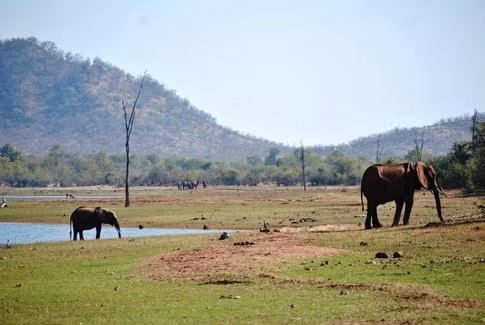

## Introdução

A recente aposentadoria de James Gosling, o lendário criador do Java, acendeu
um debate crucial: qual o verdadeiro destino dos profissionais técnicos após
décadas de carreira? Será que a única saída é virar gerente ou existe vida - e
reconhecimento - para quem escolhe permanecer na linha de frente do código?

Nesta jornada, vamos explorar:

1. 🏛️ O mito do cemitério de elefantes - uma metáfora poderosa para nossa carreira
2. 👨💻 A trajetória de Gosling e o que ela revela sobre valorização técnica
3. 🛤️ Os caminhos (muitas vezes ocultos) além do título de "Sênior"
4. 💎 Por que sua experiência vale mais do que você imagina

Prepare-se para desafiar crenças limitantes e descobrir que, ao contrário dos
elefantes da lenda, profissionais experientes não precisam desaparecer.

## A lenda

Sob o manto prateado da lua, a savana se transformava, e as sombras da noite
dançavam sobre a terra silenciosa. Simba, ainda um jovem príncipe, sentia seu
coração pulando no peito, movido por uma curiosidade incontrolável e uma
centelha de ousadia juvenil. Ele ouvira sussurros sobre um certo _"Cemitério de
Elefantes"_, um lugar que adultos tratavam com relutante respeito e temor. Com
passos incertos, todavia, determinados, Simba cruzou a fronteira invisível, onde
a grama macia dava lugar a um solo árido e coberto de ossadas antigas: o temido
cemitério de elefantes.

Quem já viu o filme _O Rei Leão_ certamente se lembra do temeroso Cemitério de
Elefantes, um lugar envolto em mistério e temor. É lá que o jovem Simba, movido
por uma curiosidade irresistível, decide explorar além das fronteiras seguras
que sempre conheceu[^2]. À medida que ele se aventura nesse reino de sombras,
um ambiente nascido de silêncio e magia, onde grandes ossadas de elefantes se
erguem como monumentos de uma era há muito passada.

O cemitério, mais do que um mero destino, transforma-se em um campo de provas
pessoal, onde coragem e introspecção se misturam. É nesse lugar inóspito que
Simba começa sua transformação, entre a poeira dos antepassados e o céu amplo
da savana, em um espaço onde cada ossada conta uma história, cada sombra guarda
uma lição.

## O Mito

Caso você nunca tenha ouvido falar, o Cemitério de Elefantes é uma lenda que
sugere que os elefantes quando percebem que estão chegando ao fim de suas
vidas, afastam-se do grupo e procuram um lugar isolado para morrer. O mito foi
popularizado pela primeira vez em filmes como Trader Horn (1931) e nos filmes
da MGM sobre Tarzan (1932-1948). Nessas histórias, grupos de exploradores
gananciosos tentam encontrar um cemitério de elefantes, localizado na fictícia
_Escarpa Mutia_, para coletar as valiosas presas de marfim[^3].

Mas sejamos sinceros, a ideia de que elefantes viajam para um local específico
para morrer _não é nem de longe verdadeira_. Na realidade, os grandes acúmulos
de ossos podem ser explicados mais por mortes em massa causadas por doenças do
que por um hábito da espécie. No entanto, os elefantes demonstram um interesse
genuíno por restos mortais da própria espécie, comportamento raro no reino
animal. Estudos demonstraram que esse comportamento indica uma forte conexão
social e emocional com seus mortos, contudo, não há evidências de que eles
escolham um local específico para morrer, descartando a ideia de um "cemitério
de elefantes"[^4].

## Motivação

Seria de fato fascinante que elefantes idosos, ao perceberem a aproximação da
morte, procurassem um lugar isolado, longe dos olhos dos outros animais, para
repousar em paz. Embora a história não passe de um mito, ela carrega uma forte
carga simbólica: a busca por um lugar onde se possa encerrar um ciclo de forma
digna e significativa.

O meu interesse nessa história não é em vão. Surgiu quando no chat da empresa
que eu trabalho foi anunciada a aposentadoria de James Gosling[^1], conhecido
como o "pai do Java", um dos autores da classe
[Date](https://github.com/AdoptOpenJDK/jdk20u/blob/master/src/java.base/share/classes/java/util/Date.java#L120).

Nessa thread, quando todos falavam das reais contribuições de Gosling, a minha
reposta ao post foi “Feliz em saber que desenvolvedor aposenta. Achava que
todos virariam gerentes.” Essa frase, que muitos diriam em tom de alívio ou
ironia, ecoa um sentimento comum no universo da tecnologia: a percepção de que
a única alternativa para o crescimento na carreira seria a transição para a
gestão.

A frase pode ser interpretada de diferentes maneiras. Alguns podem enxergar
como uma ironia, já que a maioria dos profissionais de TI, ao atingir uma certa
idade, são incentivados a deixar de lado a atuação técnica e assumir cargos de
liderança. No entanto, essa frase também pode ser vista como uma crítica ao
fato de que muitos profissionais de desenvolvimento acabam deixando de lado sua
paixão pela programação para se tornarem gestores. Isso nos leva à reflexão:
**desenvolvedores podem realmente se aposentar enquanto permanecem em sua
essência técnica, ou a progressão natural é migrar para a gestão?**

## Para o Sênior e Além

A verdade é que a carreira de desenvolvimento oferece diversas oportunidades
para aqueles que desejam continuar atuando de forma técnica, mesmo com o passar
dos anos. O conceito de carreira em Y possibilita que profissionais sêniores
escolham entre duas trajetórias principais: a gestão de pessoas e processos ou
a excelência técnica. Essas duas perspectivas complementares ajudam a entender
as próximas etapas na carreira de desenvolvimento.

As discussões sobre carreiras em engenharia de software revelam um consenso: a
posição de Sênior não é um ponto final, mas sim o início de múltiplas jornadas
profissionais[^7]. Como destacado por Will Larson no livro Staff Engineer[^6] e
Mai-Lan Bukovec[^5], profissionais em níveis como _Principal Engineer_
enfrentam o desafio de priorizar seu impacto. Ambos apresentam frameworks de
papéis para posições para além de sênior. Larson propõe arquétipos como _Tech
Lead_, _Architect_, _Solver_ e _Right Hand_.  Por outro lado, Bukovec descreve
funções como _Sponsor_, _Catalyst_ e _Tie Breaker_. Essas estruturas não são
rígidas, mas servem como guias para reflexão sobre gestão de tempo e evolução
técnica.

Muitos desenvolvedores sentem-se pressionados a abandonar a atuação técnica,
como se o único caminho possível fosse migrar para a gestão. Mas será que essa
é a única opção? Para quem busca crescimento para além do nível sênior, existem
três trilhas principais:

- _IC (Individual Contributor)_: Ideal para quem ama detalhes técnicos,
    mentoria e especialização (ex.: Staff/Principal Engineer)  
- _Gestão_: Para generalistas focados em alinhamento de equipes, processos e
    comunicação (ex.: Engineering Manager).
- _Arquitetura_: Combina visão macro com profundidade técnica, planejando
    soluções de longo prazo (ex.: Software Architect).

Por que isso importa? Como relatado por Bukovec, a falta de clareza sobre esses
caminhos pode levar à estagnação. Essa situação pode ser comparada à lenda do
cemitério de elefantes, onde, sem uma direção ou propósito claro, profissionais
podem acabar se isolando em suas carreiras, como um elefante que procura um
local solitário para morrer. Assim como o elefante que se afasta do grupo por
medo, por um sentimento de defasagem, etc., um profissional sem clareza pode
tomar decisões que o deixem estagnado ou mesmo o levem ao declínio
profissional, sem contribuir para o crescimento pessoal ou para a evolução de
sua carreira.

## Conclusão

A lenda do cemitério de elefantes nos serve como uma metáfora poderosa, mas não
como um destino inevitável. O mercado de tecnologia está evoluindo, e oferece
um leque de opções que permitem aos profissionais se manterem ativos,
influentes e realizados, seja como gestores ou técnicos. A história de James
Gosling é um lembrete poderoso de que há vida (e impacto) além da transição
para a gestão. Sob esse prisma, as diferentes possibilidades de carreira nos
ensinam que:

1. **Escolhas conscientes são fundamentais:** Cada profissional deve refletir
   sobre o que realmente o motiva e o faz feliz
2. **A experiência técnica tem valor:** Empresas precisam criar estruturas que
   valorizem e recompensem a excelência técnica
3. **A paixão pela programação não tem idade:** É possível continuar
   aprendendo, criando e impactando em qualquer fase da carreira
4. **Diversidade de caminhos é essencial:** O mercado precisa de bons gestores,
   mas também de excelentes técnicos

Por fim, definir uma direção — mesmo que provisória — aumenta motivação e
chances de sucesso. **A mensagem central é: explore, experimente e adapte-se**.
Sua trajetória não precisa ser linear, mas consciente.  E você? Já refletiu
sobre esses papéis ou caminhos? Compartilhe suas experiências nos comentários!

[^1]:
    James Gosling retirement announcement.
    <https://www.linkedin.com/posts/jamesgosling_ive-finally-retired-after-a-crazy-number-activity-7213740307538956289-26YU/>
[^2]:
    Cemitério de Elefantes.
    <https://disney.fandom.com/pt-br/wiki/Cemit%C3%A9rio_de_Elefantes>
[^3]:
    Elephant Graveyard.
    <https://jenmansafaris.com/elephant-graveyard-fact-fiction>
[^4]:
    Elephants never forget.
    <https://www.theguardian.com/education/2006/jan/10/workinprogress.highereducation>
[^5]:
    Principal Engineer Roles Framework.
    <https://www.linkedin.com/pulse/principal-engineer-roles-framework-mai-lan-tomsen-bukovec-142df>
[^6]:
    Staff Engineer: Leadership Beyond the Management Track
    <https://goodreads.com/book/show/56481725.Staff_Engineer_Leadership_Beyond_the_Management_Track>
[^7]:
    Sobre arquétipos e papéis
    <https://maisquesenior.substack.com/p/sobre-arquetipos-e-papeis>
