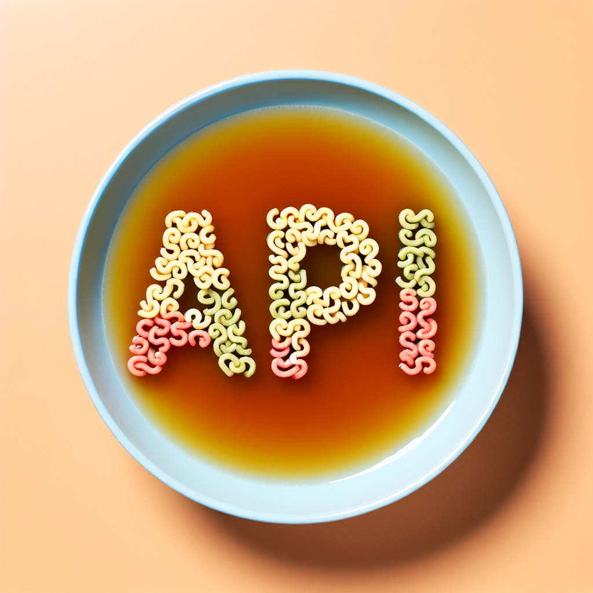
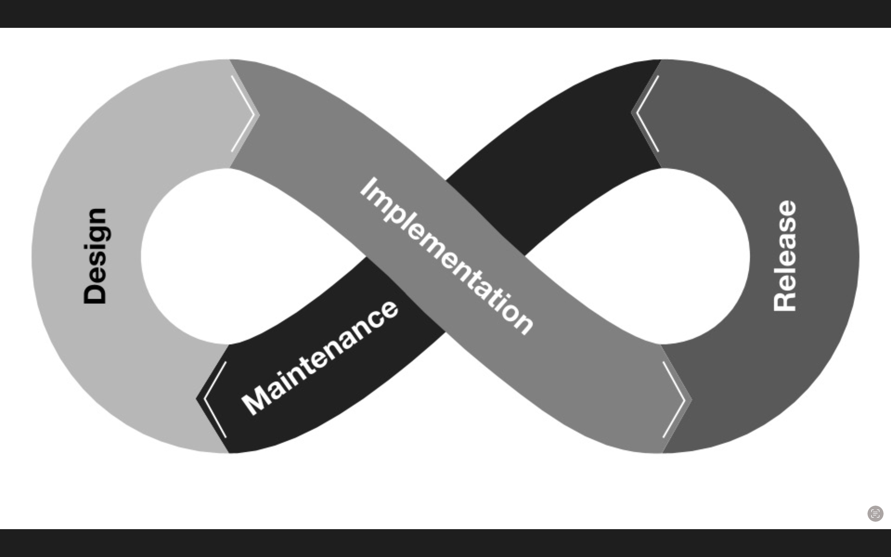
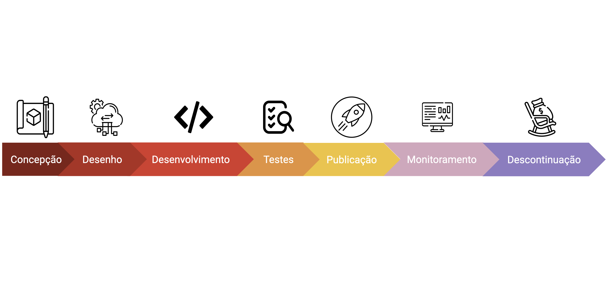

## Introdução

As APIs (Application Programming Interfaces) desempenham um papel crucial no
desenvolvimento de software moderno. Elas permitem a comunicação entre
diferentes sistemas, possibilitando a integração e a interoperabilidade. No
entanto, para que uma API tenha sucesso, ela deve ser tratada como um produto.
Este artigo explora como projetar uma API como produto, partindo da premissa de
que uma API deve ser pensada para resolver um determinado problema, assim como
qualquer produto. Portanto, a disponibilização de uma API deve seguir um ciclo
de vida. Apresentamos algumas bibliotecas, frameworks e ferramentas que podem
ajudá-lo durante esse processo.

## Os acrônimos e suas limitações

Não é novidade que trabalhar com o desenvolvimento de software é conviver com
uma constante "sopa de letrinhas". Quando se fala de desenho, implementação e
manutenção de APIs, termos como _REST_, _SOAP_, _HTTP_, _JSON_, _XML_, entre
outros, são comuns e fazem parte do dia a dia de quem trabalha com tecnologia.

Por um lado, o uso de acrônimos facilita a comunicação, mas por outro lado, seu
excesso pode nos afastar da definição do conceito. Em uma definição "formal",
uma API "é uma maneira para dois ou mais programas de computador ou
Componentes se comunicarem entre si."[^1]. Contudo, em uma definição mais
ampla, uma API seria um código capaz de resolver um determinado problema,
entregue por meio de uma abstração simplificada e utilizável de forma
programável.

Uma API (Application Programming Interface) é um conjunto de definições e
protocolos que permite a comunicação entre diferentes sistemas de software. As
APIs permitem que os desenvolvedores acessem as funcionalidades de um serviço
ou aplicação sem precisar entender sua implementação interna. 

As APIs são a tecnologia mais poderosa disponível atualmente, sendo mais
relevantes do que ferramentas derivadas da Inteligência Artificial (IA). Não dá
para ser um "terraplanista" tecnológico e duvidar dos impactos atuais e futuros
das soluções que utilizam IA. Aliás, grande parte das imagens utilizadas neste
artigo foram geradas usando uma ferramenta de IA, porém através de uma API.
Nesse sentido, entendemos que uma API é uma tecnologia complementar e
fundamental para o uso e adoção das soluções de inteligência artificial.

As APIs são poderosas, e isso é um fato. Elas são fundamentais na tecnologia
moderna por vários motivos:

 - **Interoperabilidade**: Elas permitem que diferentes sistemas se comuniquem
   e funcionem juntos de forma eficiente.
 - **Reutilização**: Desenvolvedores podem reutilizar funcionalidades
   existentes sem precisar reescrever código.
 - **Escalabilidade**: Facilitam a expansão de serviços e a adição de novas
    funcionalidades de forma modular.
 - **Inovação**: Abrem portas para novas integrações e serviços que podem ser
   construídos sobre as APIs existentes.

Seja na comunicação do sistema operacional com a tela do seu celular, seja nas
assinaturas dos métodos de uma biblioteca ou ainda em uma API REST que gere uma
imagem, todas são aplicações do conceito de API. De forma geral, podemos ter
dois tipos de API: **locais e remotas**. Podem ser consideradas como APIs
locais:

 - **POSIX (Portable Operating System Interface)**: Um padrão para manter
   compatibilidade entre sistemas operacionais UNIX. Fornece uma API que
   permite a interação com o sistema operacional de maneira uniforme.
 - **Java APIs**: Conjunto de APIs oferecidas pela linguagem de programação
   Java, como `java.util`, `java.io`, e `java.net`, que fornecem
   funcionalidades essenciais para manipulação de dados, entrada/saída e
   comunicação de rede.

Por outro lado, são exemplos de APIs Remotas:

 - **REST (Representational State Transfer)**: Arquitetura amplamente utilizada
   para desenvolver APIs que permitem a comunicação entre cliente e servidor
   usando HTTP.
 - **SOAP (Simple Object Access Protocol)**: Protocolo para troca de
   informações estruturadas em ambientes descentralizados e distribuídos.
 - **gRPC (gRPC Remote Procedure Call)**: Framework de RPC de alta performance
   desenvolvido pelo Google, que usa HTTP/2 para transporte e Protobuf para
   serialização.

Os exemplos descritos anteriormente demonstram a versatilidade e a ubiquidade
das APIs na tecnologia atual. Contudo, para esta apresentação, podemos
considerar API como sinônimo de APIs remotas. Segundo um relatório da empresa
responsável pela ferramenta _Postman_, cerca de 86% dos desenvolvedores utilizam
APIs REST[^2].

Nesse ponto, espero que você esteja se questionando por que desenhar uma API
como Produto?! De forma geral, desenhar uma API como produto significa tratá-la
com a mesma atenção aos detalhes e ao ciclo de vida que qualquer outro produto
de software. Isso envolve:

 - **Entendimento do Usuário**: Compreender quem são os usuários da API e quais
   são suas necessidades.
 - **Qualidade e Segurança**: Garantir que a API seja robusta, segura e de alta
   performance.
 - **Documentação e Suporte**: Fornecer documentação clara e suporte contínuo
   para os desenvolvedores que utilizarão a API.
 - **Evolução Contínua**: Planejar para melhorias e atualizações constantes com
   base no feedback dos usuários.

Um produto é algo que pode ser oferecido em um mercado para satisfazer uma
necessidade ou desejo. Produtos são projetados cuidadosamente, evoluem com a
tecnologia e simplificam a vida dos usuários. Da mesma forma, uma API deve ser
projetada para resolver problemas reais, ser fácil de usar, segura e eficiente.
Ao tratar uma API como um produto, você assegura que ela agrega valor tanto
para sua empresa quanto para seus usuários.

## O Ciclo de Vida de uma API

Para criar uma API bem-sucedida, é essencial seguir um ciclo de vida
estruturado que inclui design, desenvolvimento, testes, publicação,
monitoramento e descontinuação. Cada etapa tem suas próprias ferramentas que
podem ajudar a garantir que a API atenda às expectativas dos usuários e dos
stakeholders.

#### 1. Design

O design de uma API começa com a concepção, onde identificamos os benefícios
para os usuários e para a empresa. Nesta fase, definimos o comportamento e o
estilo arquitetural da API e documentamos tudo.

**Ferramentas para Design:**
 - **OpenAPI Specification**: Uma especificação padrão para descrever APIs
   RESTful. Ferramentas como Swagger Editor ajudam a criar e documentar APIs
   usando a especificação OpenAPI.
 - **GraphQL Designer**: Ferramenta para projetar e documentar APIs GraphQL.
 - **Prism**: Ferramenta para fazer o "_mocking_" de APIs baseadas em
   OpenAPI/Swagger, útil para testes e validação inicial.
 - **ReDoc**: Gera documentação interativa a partir de arquivos
   OpenAPI/Swagger.

#### 2. Desenvolvimento

No desenvolvimento, adotamos uma abordagem API First, criamos protótipos e
seguimos padrões organizacionais. A segurança deve ser uma prioridade desde o
início.

**Ferramentas para Desenvolvimento:**

 - **Postman**: Uma ferramenta popular para testar APIs e gerar documentação.
 - **Insomnia**: Outra ferramenta robusta para design, teste e depuração de
   APIs.
 - **OpenAPI Generator**: Gera código automaticamente a partir de
   especificações OpenAPI.
 - **Ngrok**: Permite expor localmente uma API para teste e desenvolvimento
   remoto.

#### 3. Testes

Os testes garantem a correta execução e a integridade da API. Incluem testes de
contrato, carga, aceitação e penetração.

**Ferramentas para Testes:**

 - **Pacts**: Biblioteca para testes de contrato, garantindo que diferentes
   serviços interajam corretamente.
 - **K6s**: Ferramenta de teste de carga para APIs.
 - **Vegeta**: Outra ferramenta para testes de carga.
 - **SOAPUI**: Ferramenta completa para testar serviços web SOAP e REST.

#### 4. Publicação

Na publicação, documentamos a API e fornecemos suporte adequado. Estratégias de
deploy, como Canary Release e Feature Toggle, ajudam na transição suave para os
usuários.

**Ferramentas para Publicação:**
 - **SwaggerHub**: Plataforma para colaboração e gerenciamento de APIs usando a
   especificação OpenAPI.
 - **Apigee** e **AWS API Gateway**: Plataformas para publicar, proteger e
   monitorar APIs.
 - **Kong API Gateway**: Gateway de API open-source para gerenciar o tráfego de
   microsserviços.
 - **Portal de Desenvolvimento do Spotify e Hotmart**: Exemplos de portais bem
   projetados para desenvolvedores.

####  5. Monitoramento e Manutenção

O monitoramento contínuo é essencial para garantir a performance e a segurança
da API. Além disso, o registro de métricas de uso pode ajudar nas decisões
futuras.

**Ferramentas para Monitoramento:**

 - **Prometheus**: Ferramenta open-source para monitoramento e alerta.
 - **Grafana**: Plataforma para analisar e visualizar métricas.
 - **API.Guru**: Coleta e padroniza especificações de APIs públicas.
 - **Stainless**: Ferramenta para monitoramento de integridade de API.

#### 6. Descontinuação

Quando uma versão da API precisa ser descontinuada, a comunicação clara e a
oferta de alternativas são cruciais. Utilize cabeçalhos _HTTP_ como Sunset[^4]
para notificar sobre a descontinuação e planeje a migração.

**Ferramentas para Descontinuação:**
 - **Sunset HTTP Header**: Cabeçalho HTTP para indicar a descontinuação de uma
   API.
 - **Temporary Resources**: Recursos temporários para facilitar a migração dos
   usuários.

## Conclusão 

Para que uma API seja bem-sucedida, ela deve ser desenhada e gerida como um
produto. Isso inclui entender as necessidades dos usuários, garantir a
qualidade e a segurança, e fornecer suporte contínuo. Ao seguir o ciclo de vida
de uma API e utilizar as ferramentas certas em cada etapa, você pode criar APIs
que realmente agregam valor ao seu negócio e aos seus usuários.

As APIs devem ser pensadas como ferramentas para resolver problemas reais.
Sempre comece identificando a dor do usuário e desenvolva a API com o objetivo
claro de solucionar essa necessidade. Nunca perca de vista as necessidades do
seu usuário final, pois são eles que determinarão o sucesso da sua API. Uma API
que não resolve um problema de maneira eficaz ou que é difícil de usar,
dificilmente será adotada, independentemente de sua qualidade técnica.

Priorize a comunicação e o suporte acima da tecnologia. Uma documentação clara
e acessível, um portal de desenvolvedores bem projetado e um suporte eficiente
são tão importantes quanto a tecnologia por trás da API. Eles são fundamentais
para garantir que os desenvolvedores possam utilizar sua API com facilidade e
eficácia.

Se importe com a adoção das suas APIs. Monitore o uso, peça feedback, e esteja
disposto a fazer melhorias contínuas. A adoção bem-sucedida de uma API é um
indicador claro de seu valor e relevância para os usuários.

Lembre-se, APIs como produto podem se tornar um grande negócio para sua
empresa. Elas não apenas habilitam novas funcionalidades e integrações, mas
também podem abrir novas fontes de receita e oportunidades de mercado. Ao
tratar sua API como um produto, você está investindo no crescimento e no
sucesso da sua empresa a longo prazo.

Por fim, siga um ciclo de vida estruturado, utilize as ferramentas certas em
cada etapa e mantenha o foco nas necessidades do usuário. Dessa forma, você
criará APIs que não apenas funcionam, mas que também proporcionam uma excelente
experiência aos desenvolvedores, impulsionando a inovação e o crescimento de
seu negócio.

## Agradecimentos

Este artigo foi escrito em conjunto com [Gabriella
Mara](https://linktr.ee/gmarap). Agradecemos muito pela parceria de sempre.
Também gostaríamos de agradecer a [Marcelo
Lima](https://www.linkedin.com/in/mgdlima/), um dos principais promotores da
ideia de um portal de APIs públicas na Hotmart, que nos ajudou com o
desenvolvimento de software. Por fim, gostaríamos de agradecer ao [Danilo
Amaral](https://www.linkedin.com/in/it0dan/), cuja apresentação sobre o ciclo
de vida de APIs foi utilizada como base para o ciclo descrito neste artigo.

[^1]:
    API.
    https://en.wikipedia.org/wiki/API
[^2]:
    2023 State of the API Report
    https://www.postman.com/state-of-api
[^3]:
    Building an API Product: Design, implement, release, and maintain API products that meet user needs
    https://books.google.com.br/books/about/Building_an_API_Product.html
[^4]:
    RFC 8594: The Sunset HTTP Header Field 
    https://www.rfc-editor.org/rfc/rfc8594.html
[^5]:
    Intro to APIs: History of APIs
    https://blog.postman.com/intro-to-apis-history-of-apis/

## Apêndice: Ferramentas, Bibliotecas e Frameworks

Nessa seção listamos algumas ferramentas, bibliotecas e frameworks que podem te
ajudar no processo de desenho, implementação e publicação de APIs. Elas foram
organizadas conforme as etapas do Ciclo de Vida de uma API descritas nesse
artigo. Essa lista não se esgota em si mesma. Por favor, utilize os comentários
para sugerir outras ferramentas que você conhece ou utilizada. 

| Nome | Etapa | Link |
|------|------------------------|------|
| OpenAPI Specification | Design | https://swagger.io/specification/ |
| Swagger Editor | Design | https://editor.swagger.io/ |
| GraphQL Designer | Design | http://www.graphqldesigner.com/ |
| Prism | Design | https://stoplight.io/open-source/prism/ |
| ReDoc | Design | https://github.com/Redocly/redoc |
| Postman | Desenvolvimento | https://www.postman.com/ |
| Newman | Testes | https://learning.postman.com/docs/collections/using-newman-cli/command-line-integration-with-newman/ |
| Insomnia | Desenvolvimento | https://insomnia.rest/ |
| OpenAPI Generator | Desenvolvimento | https://openapi-generator.tech/ |
| Ngrok | Desenvolvimento | https://ngrok.com/ |
| Stainless | Desenvolvimento | https://stainlessapi.com/ |
| Pacts | Testes | https://pact.io/ |
| K6s | Testes | https://k6.io/ |
| Vegeta | Testes | https://github.com/tsenart/vegeta |
| SOAPUI | Testes | https://www.soapui.org/ |
| Apigee | Publicação | https://cloud.google.com/apigee |
| AWS API Gateway | Publicação | https://aws.amazon.com/api-gateway/ |
| Kong API Gateway | Publicação | https://konghq.com/kong/ |
| Azure API Management | Publicação | https://azure.microsoft.com/en-us/products/api-management/|
| SwaggerHub | Publicação | https://swagger.io/tools/swaggerhub/ |
| Spotify Developer Portal | Publicação | https://developer.spotify.com/ |
| Hotmart Developer Portal | Publicação | https://developers.hotmart.com/ |
| Apiary | Publicação | https://apiary.io/|
| API.Guru | Publicação | https://api.guru/ |
| Prometheus | Monitoramento | https://prometheus.io/ |
| Grafana | Monitoramento | https://grafana.com/ |
| Stainless | Monitoramento | https://stainlessapi.com/ |
| Uptime Robot | Monitoramento | https://uptimerobot.com/ |
| API Blueprint | Design | https://apiblueprint.org |
| Runscope            | Monitoramento                  | https://www.runscope.com/ |
| Pingdom             | Monitoramento                  | https://www.pingdom.com/ |
| New Relic           | Monitoramento                  | https://newrelic.com/|
| RAML | Design de APIs | https://raml.org/ |
| API Blueprint | Design de APIs | https://apiblueprint.org/ |
| Stoplight | Design, documentação e testes de APIs | https://stoplight.io/ |
| Lucybot | Teste e documentação de APIs | https://lucybot.com/ |
| Mulesoft Anypoint Platform | Design, documentação e testes de APIs | https://www.mulesoft.com/platform/api |
| Apicurio | Design, documentação e testes de APIs | https://www.apicur.io/ |
| Express | Implementação de APIs | https://expressjs.com/ |
| Spring Boot | Implementação de APIs | https://spring.io/projects/spring-boot|
| Django | Implementação de APIs | https://www.djangoproject.com/ |
| Ruby on Rails | Implementação de APIs | https://rubyonrails.org/ |
| ASP.NET Core | Implementação de APIs | https://dotnet.microsoft.com/apps/aspnet |
| LoopBack | Implementação de APIs | https://loopback.io/ |
| Restify | Implementação de APIs | http://restify.com/ |
| Hapi | Implementação de APIs | https://hapi.dev/ |
| Koa | Implementação de APIs | https://koajs.com/ |
| NestJS | Implementação de APIs | https://nestjs.com/ |
| LoopBack 4 | Implementação de APIs | https://loopback.io/ |
