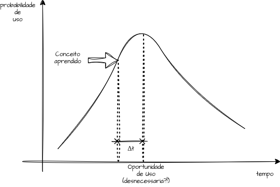

--
title: "Evitando Complexidade Desnecessária"
date: "2026-06-01"
description: "Reflexões de como identificar complexidade em desenho de software"
featuredImage: feature.png
---

 - Manequeismo da Complexidade é um erro, mas devemos pensar em gradação
 - Exemplo do "Leap Year" com TDD
 - Inclusão de novos campos um DAP
 - Complexidade Geral do Sistema
 - Exemplo de um WebClient

## Motivação

Estou especialmente interessado em como identificar complexidade
(desnecessária) no desenvolvimento de software. 

### Automoderação

Para encapsular esse fenômeno comportamental frequentemente observado na
engenharia de software, este artigo propõe a formulação da chamada _Lei de
Clements_. Nascida da observação empírica de desenvolvedores que, ao dominarem
novos padrões arquiteturais ou ferramentas avançadas, tendem a forçar sua
utilidade em cenários que exigem apenas simplicidade, essa máxima ilustra
a origem de grande parte da complexidade acidental nos sistemas modernos.
O princípio é formalmente definido da seguinte maneira:

> "A **Lei de Clements** postula que a probabilidade de um conceito complexo
> ser aplicado de maneira desnecessária atinge seu pico absoluto na exata
> primeira oportunidade de uso após o seu aprendizado."

O gráfico a seguir tem uma representação da _Lei de Clements_. Veja que no
pronto máximo da probabilidade de uso do conceito aprendido ele foi aplicado.
A questão é se havia a necessidade de ser aplicado.

### Revisão de Código
