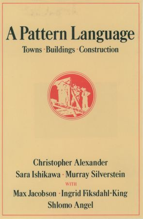
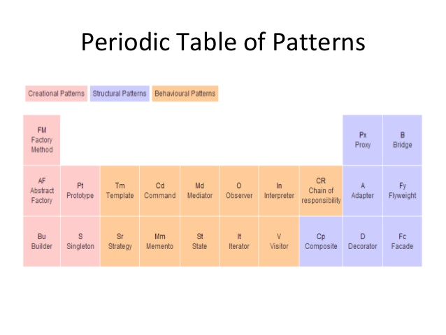

## Um pouco de história

Em diferentes áreas do conhecimento não é raro a existência de publicações com o
objetivo de documentar práticas ou processos que poderiam ou deveriam ser
reaproveitados. Seja um livro de receitas, um compêndio de soluções para
arquitetura (não de software) ou um livro de padrões de projeto. Esse tipo de
literatura é fundamental para qualquer profissional tendo em vista que provê um
catálogo de soluções, muitas das quais previamente testadas.


Em 1977, o arquiteto _Christopher W. Alexander_ lançou o livro [A Pattern
Language](https://www.goodreads.com/book/show/79766.A_Pattern_Language), no qual
documentava diversos padrões que solucionam problemas relacionados com a
construção de cidades e/ou prédios [^Valente,2020]. 



Algum tempo depois, na década de 90 do século passado, os autores _Erich Gamma_,
_Richard Helm_, _Ralph Johnson_ e _John Vlissides_, conhecidos como Gang of Four
(não a banda), seguiram os passos de  _Christopher W. Alexander_ ao escreverem
um [catálogo com
soluções](https://www.goodreads.com/book/show/85009.Design_Patterns) para
problemas recorrentes em projetos de software [^Gamma,1995]. As soluções
mapeadas no livro ficaram conhecidas na literatura como _Padrões de Projeto_. Na
realidade, existem outros “padrões de projeto”, entretanto, convencionou-se
utilizar o termo para as soluções documentadas no livro. 


Apesar do livro ser um clássico na literatura do gênero, pessoalmente, entendo
que a forma como os padrões são apresentados é um tanto quanto complexa. Um
outro ponto negativo é que, ao usar a linguagem C++ no exemplos, pode trazer a
mensagem que os Padrões de Projeto são um ferramental exclusivo para linguagens
orientadas a objeto. Nesse ponto, gosto bastante da abordagem feita pelo
[refactoring.guru](https://refactoring.guru/) que descreve os padrões partindo
de um problema concreto e utiliza uma linguagem mais simples. Além do mais,
apresenta exemplos em diferente linguagens de programação.

## Mas afinal o que são esses Padrões de Projeto?!

Os Padrões de Projeto são soluções no nível de código, ou seja, não estão
relacionadas com a adoção de uma arquitetura de software em específico. Do ponto
de vista histórico, podemos afirmar que os padrões de projeto são inspirados nas
ideias de _Christopher Alexander_ [^VALENTE,2020]: 

> Cada padrão descreve um problema que sempre ocorre em nosso contexto e uma
solução para ele, de forma que possamos usá-la um milhão de vezes.

Na prática um padrão descreve objetos e classes que se relacionam para resolver
um problema de projeto genérico dado um contexto particular. Cada padrão é
estruturado com as seguintes propriedades: 

 - O problema que o padrão pretende resolver. 

 - O contexto em que esse problema ocorre. 

 - A solução proposta. 

O conceito de Padrão de Projeto surgiu da necessidade de documentar soluções
amplamente utilizadas. A partir da sua aplicabilidade, os padrões visam aumentar
a flexibilidade do projeto de software com o objetivo de deixá-lo mais
organizado.

## Benefícios dos Padrões de Projeto 

### Comunicar e viver não são precisos

Comunicar de forma efetiva é uma habilidade fundamental pelos envolvidos no
processo de construção de um software. A tendência é que tenhamos um
desenvolvimento de software está cada vez mais distribuído (a primeira versão
desse texto foi escrita antes de 2019 e toda mudança ocorrida na forma de
trabalho ao redor do mundo).

Nesse contexto, surge a necessidade de comunicar
ideias mais complexas a um grupo maior de pessoas. Por essa razão,  o
conhecimento de padrões de projeto é fundamental, especialmente porque os
padrões transformaram-se em um vocabulário largamente adotado. Ademais, conhecer
os padrões permite que adotemos uma solução testada e validada, algo que em
longo prazo traz consigo a possibilidade de que entender o comportamento e a
estrutura do código que esta sendo desenvolvido. 

No domínio de comunicação de uma idea, gostaria de recomendar os diagramas
criados _Rafael Kuebler_. Usando a ferramenta [PlantUML](https://plantuml.com)
ele documenta diferentes padrões de projeto no repositório Os digramas foram
baseados nos exemplos disponibilizados no repositório
[PlantUMLDesignPatterns](https://github.com/RafaelKuebler/PlantUMLDesignPatterns).

### Então, vamos logo utilizar os Padrões

O uso indiscriminado de padrões de projeto é questionável. Em muitos sistemas
observa-se um uso exagerado de padrões de projeto em situações em que o ganho de
flexibilidade e extensibilidade não é percebível. Para esses cenários, foi
cunhado o termo _Paternite_, que representa uma "inflamação" associada ao uso
precipitado de Padrões de Projeto. Conforme as palavras de  _John Ousterhout_:

> O maior risco de padrões de projetos é a sua aplicação em excesso
(over-application). Nem todo problema precisa ser resolvido por meio dos padrões
de projeto; por isso, não tente forçar um problema a caber em um padrão quando
uma abordagem tradicional funcionaria melhor. O uso de padrões de projeto não
necessariamente melhora o projeto de um sistema de software; isso só acontece se
esse uso for justificado. Assim como ocorre com outros conceitos, a noção de que
padrões de projetos são uma boa coisa não significa que quanto mais padrões de
projeto usarmos, melhor será nosso sistema.  

O texto de John Ousterhout vem reforçar que nem todo o problema precisa ser
resolvido com a adoção de um determinado padrão de projeto. Muitas das vezes
seguir a mentalidade proposta pelo principio KISS (Keep It Simple - Mantenha
Simples) poderia ser o mais adequado. Estando na dúvida se deve aplicar algum
Padrão de Projeto, abra um terminal Python e execute o seguinte comando:

```bash
Python 3.9.7 (default, Oct 13 2021, 06:45:31)
[Clang 13.0.0 (clang-1300.0.29.3)] on darwin
Type "help", "copyright", "credits" or "license" for more information.
>>> import this
```

## Organização dos Padrões de Projeto 

Em ultima instância o livro de Padrões de Projeto é um catálogo (de soluções).
Uma das características de um catálogo é permitir o fácil acesso ao conteúdo que
foi organizado. Os Padrões de Projeto diferem por sua complexidade, nível de
detalhamento e escala de aplicabilidade. No livro são propostos 23 padrões que
são categorizados como _criacionais, estruturais e comportamentais_. 

Os padrões criacionais propõem soluções flexíveis para criação de objetos, que
aumentam a flexibilidade e o reuso de código. Por outro lado, os padrões
estruturais facilitam a composição de objetos e classes em estruturas maiores,
contudo, sem perda de flexibilidade e eficiência. Por fim, os padrões
comportamentais são voltados para o melhor uso de algoritmos e para facilitar a
interação e a divisão de responsabilidades entre classes e objetos. 

Em uma apresentação sobre [Design Patterns em
Javascript](https://www.slideshare.net/yinyang581525/javascript-common-design-patterns),
reforçando que esse tipo ferramental não é exclusivo de linguagens que adotam
exclusivamente o paradigma orientado ao objeto, _Pham Huy Tung_ apresenta uma
tabela periódica dos Padrões de Projeto.

 

### O Padrão Decorator

Para ilustrar o que é um  Padrão de Projeto apresento brevemente o _Decorator_.
É um padrão de projeto estrutural que permite acoplar novos comportamentos para
objetos ao colocá-los dentro de invólucros que já contém aqueles comportamentos.
Para ilustrar vamos imaginar um sistema que calcula o preço de um pedido de
açaí, após a inclusão de todos os acompanhamentos que o cliente desejar. O código
a seguir representa a classe `Acai``

```java
package me.clementino.v1.acai;

public abstract class Acai {

    protected String descricao = "Açai do tipo desconhecido";
    protected Tamanho tamanho = Tamanho.PEQUENO;

    public String getDescricao() {
        return descricao;
    }

    public Tamanho getTamanho() {
        return tamanho;
    }

    @Override
    public String toString() {
        return descricao +
            " do tamanho " +
            tamanho.getDescricao() +
            " custa R$" + String.format("%.2f", this.getPreco());
    }

    public abstract double getPreco();
}
```

Essa classe pode ser "decorada" com diferentes ingredientes como a classe
`LeiteEmPo`:

```java
package me.clementino.solution.acompanhamentos;

import me.clementino.v1.acai.Acai;

public class LeiteEmPo extends PadraoDeProjeto {

    private final double preco;

    public LeiteEmPo(Acai acai) {
        this.acai = acai;
        preco = 1.99;
    }

    @Override
    public String getDescricao() {
        return this.acai.getDescricao() + " com leite em pó";
    }

    @Override
    public double getPreco() {
        return acai.getPreco() + preco;
    }
}
```

Veja que a classe `LeiteEmPo` é uma especialização de `PadraoDeProjeto`, que é
exibida a seguir:'

```java
package me.clementino.solution.acompanhamentos;

import me.clementino.v1.acai.Acai;
import me.clementino.v1.acai.Tamanho;

public abstract class PadraoDeProjeto extends Acai {

    protected Acai acai;

    public Tamanho getTamanho() {
        return acai.getTamanho();
    }

    @Override
    public String toString() {
        return this.getDescricao() +
            " do tamanho " +
            this.getTamanho().getDescricao() +
            " custa R$" + String.format("%.2f", this.getPreco());
    }

    public abstract String getDescricao();
    public abstract double getPreco();
}
```

Para maiores detalhes sobre essa implementação do padrão _Decorator_ acesse o
repositório [asaideira](https://github.com/vagnerclementino/asaideira).


[^Valente,2020]:
    Marco Tulio Valente. Engenharia de Software Moderna: Princípios e Práticas
    para Desenvolvimento de Software com Produtividade, 2020.

[^Gamma,1995]:
    Gamma, Erich, Richard Helm, Ralph Johnson, Ralph E. Johnson, and John
    Vlissides. Design patterns: elements of reusable object-oriented software.
    Pearson Deutschland GmbH, 1995.

