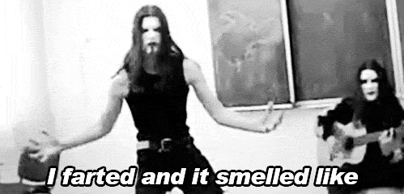

## Medos
Desde a adolescência eu flertava com um cabelo diferente. Eu era fã de rock,
achava sensacional ver os roqueiros rodando os seus cabelos. Era estiloso. Era
rebeldia. 

Contudo, aquele jeito de ser se mostrava um tanto quanto distante
para mim. Nascido no subúrbio, família de 5 filhos, todos homens (negros), não
dava para se descuidar: os piolhos ou a polícia eram ameaças certas para um
cabelo grande.

## Rebeldia

Mas como qualquer adolescente, a vontade de se diferenciar entre os demais
falava mais alto. Eu desafiava o status quo adiando ao máximo o dia de cortar o
cabelo. Era em vão. As pessoas me questionavam se estava tudo bem comigo, se
era por falta de tempo ou de dinheiro que cabelo não era cortado. Não foram
poucas as vezes em que, em um tom até de compaixão, as pessoas se ofereciam
para pagar o corte do cabelo. E sem falar nos apelidos: impossíveis de serem
repetidos, mas difíceis de serem esquecidos. O tal do racismo recreativo. Mas
que fique dito, racismo é racismo (e crime) e não existem adjetivos, como
recreativo, que mitiga os danos que ele provoca.

## Liberdade

E nos sombrios e longínquos dias da Pandemia, isolado, também dos olhares
julgadores, tomei a decisão de deixar o cabelo crescer. Transições são
complexas, exigem resiliência, mudança e criação de novos hábitos. Não seria
diferente para uma transição capilar. Usando algumas “câmeras fechadas” aqui,
uns dias sem sair de casa acolá, vieram um novo corte, um black power e os
dreads. Como é bom descobrir um outro de você que nem se imaginava que existia.
Hoje balanço o meu cabelo nos rocks e sambas da vida. Me diferencio por ser
quem eu sou. E os meus cabelos, em suas distintas formas, texturas e cores, são
parte dessa história.

 
