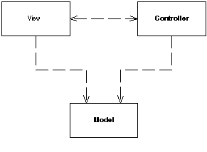
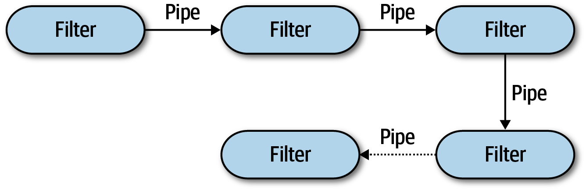

## Padrões e Estilos Arquiteturais

No estudo de arquitetura de software é possível identificar o uso dos termos
estilo e padrão arquitetural. Em alguns textos[^Richards,2020] os termos são
utilizados de forma intercambiáveis, apesar de outros fazem questão de
diferencia-los[^Tailor,2009]. Para além de uma questão etimológica, a nítida
identificação da finalidade de cada um desses conceitos, tem por objetivo
facilitar a escolha da solução mais adequada para o um dado problema.

Nesse sentido, podemos dizer que _padrões_ focam em soluções para problemas
específicos de arquitetura, enquanto _estilos_ propõem como os módulos de um
sistema devem ser organizados[^Valente,2020]. Para exemplificar as diferenças
vamos utilizar o _Model-View-Controller (MVC)_ e o _Pipes & Filtros_.

### Model View Controller (MVC)

O padrão _Model View Controller (MVC)_ divide a interação da interface do usuário
em três funções distintas. O _MVC_ considera três papéis:

- o **modelo** (_model_) é um objeto que representa informações sobre o
domínio;  
- a **visão** (_view_), representa a exibição do modelo na interface gráfica;  
- o **controlador** (_controller_), responsável por tratar quaisquer mudanças nas
informações.



O _MVC_ pode ser pensado como padrão com dois objetivos principais: separar a
apresentação do modelo e separar o controlador da visão. A segunda divisão, a
separação da visão e do controlador, é menos importante, contudo, a separação da
apresentação do modelo é uma das características de um bom projeto de software.
Esta separação é importante por várias razões:

- a apresentação e o modelo são preocupações diferentes;
- dependendo do contexto, os usuários querem ver a mesma informação de
diferentes maneiras;
- objetos não visuais são geralmente mais fáceis de testar do que os visuais.

O valor do **padrão** MVC está em suas duas separações. Dessa maneira seu uso é
sempre recomendado, exceto em sistemas muito simples, onde o modelo não altera o
comportamento visual do sistema.

### Pipes & Filtros

Caso algum dia você tenha utilizado o operador `|` (pipe) em terminais de
sistemas operacionais _"Unix-like"_, você já tirou proveito do estilo
arquitetural _Pipes & Filtros_. Por exemplo, execute o comando descrito a seguir
em um terminal:

``` bash
echo unix | tr a-z A-Z
```

Na prática o resultado do primeiro comando `echo unix` será passado para o
segundo ( `tr a-z A-Z`). Dessa maneira, é possível fazer o encadeamento de
comandos potencializando o que pode ser feito pelo sistema operacional. Esse é
um exemplo de uso de um dos estilos fundamentais na arquitetura de software
chamado _Pipes & Filtros_.

Esse estilo arquitetural consiste em dividir as funcionalidades em partes
discretas. A topologia da arquitetura consiste basicamente em dutos (pipe) e
filtros (filters) conforme ilustrado na figura a seguir.



Os _pipes_ formam o canal de comunicação entre os _filtros_. Cada duto é
tipicamente unidirecional e ponta-a-ponta, ou seja, ele aceita uma carga de
trabalho (_payload_) de uma fonte e tem como função direcionar a saída para
outra fonte distinta. O _payload_ pode ser qualquer formato de dados, mas o
ideal é um utilizar um formato de menor tamanho - _JSON_ ao invés de _XML_, por
exemplo - visando um alto desempenho.

Os _filtros_ são autocontidos, independentes uns dos outros e em geral sem
estado.  Os filtros deveriam realizar apenas uma tarefa, de modo que, tarefas
mais complexas deveriam ser organizadas como uma sequência de filtros.

### Captei a vossa mensagem (...)


Só que não. Em um primeiro momento não é fácil diferenciar os dois conceitos.
Por hora, entenda que o _MVC_ é um padrão que resolve o **problema** de _separar
a apresentação do modelo_.  Por outro lado, _Pipes & Filtros_ constituem um
estilo arquitetural dado que propõe **como** os módulos de um sistema devem ser
organizados. Vamos então trazer uma descrição sobre cada um dos conceitos.

Um _padrão arquitetural_ é uma coleção nomeada de decisões arquiteturais que são
aplicáveis para um problema de desenho recorrente, no qual deve ser
parametrizado para responder diferentes contextos de desenvolvimento de software
no qual o problema aparece[^Tailor,2009]. Com base nessa definição, podemos
notar que o foco de um padrão arquitetural está na _solução de um problema
específico_, algo que não necessariamente existe ao se propor um estilo
arquitetural.

Por sua vez, os _estilos de arquiteturais_ descrevem uma relação nomeada de
componentes cobrindo uma variedade de características de
arquitetura[^Richards,2020]. Trata-se de um conjunto de regras que devem ser
seguidas.

O conhecimento de diferentes estilos arquiteturais permite criar um vocabulário
único que atua como abreviação, facilitando a comunicação entre arquitetos,
desenvolvedores, pessoas de infraestrutura e etc. O conjunto de estilos
arquiteturais podem ser classificados dado a forma que o sistema será implantado
(_deployment_), ou seja, estilos arquiteturais para sistemas _monolíticos e
distribuídos_.

## Classificação dos Estilos Arquiteturais

Os estilos de arquitetura podem ser classificados em dois tipos principais:
_monolíticos_ em que é possível identificar um único deployment (unidade de
implantação) de todo o código fonte; e _distribuídos_ onde o processo de
deployment resulta em dois ou mais _"executáveis"_ que estão conectados por meio
de protocolos de acesso remoto, seja uma requisição _HTTP_ ou mesmo uma chamada
remota de métodos(_RPC_).

Embora nenhum esquema de classificação seja perfeito, todas as arquiteturas
distribuídas compartilham um conjunto comum de desafios e problemas não
encontrados nos estilos de arquitetura monolítica, tornando este esquema de
classificação uma boa separação entre os vários estilos de arquitetura.

|     **Monolítico**    |         **Distribuído**         |
|:---------------------:|:-------------------------------:|
| Arquitetura em Camada | Arquitetura Orientada à Eventos |
|      Pipes & Filters  | Arquitetura Orientada à Serviço |
|      Microkernel      |          Microsserviços         |

## Saber Usar >>> Nomear

A minha expectativa, para aqueles que chegaram até aqui nesse texto, é que
entendam que essa discussão é estritamente sobre _saber quando usar_ um padrão
ou estilo arquitetural. Utilizar os termos de forma intercambiáveis não é um
problema. No final das contas, a discussão que queremos suscitar aqui, é que
estilos são um conjunto de regras, do que qual você tem (ou deveria ter) a
liberdade de escolher qual seguir. Um padrão arquitetural é solução previamente
provada para determinado problema, até mesmo por isso, tem um escopo limitado
por definição. Conheça todos (estilos ou padrões). Suas vantagens e limitações.
Esse é o principal conselho desse texto.

[^Richards,2020]:
    Richards, Mark, and Neal Ford. Fundamentals of Software Architecture: An
    Engineering Approach. O'Reilly Media, 2020.

[^Tailor,2009]:
    Tailor, R. N.; Medvidovic, N.; Dashofy, E. M. Software Architecture:
    Foundations, Theory, and Practice. Wiley Publishing. 2009.

[^Valente,2020]:
    Marco Tulio Valente. Engenharia de Software Moderna: Princípios e Práticas
    para Desenvolvimento de Software com Produtividade, 2020.
