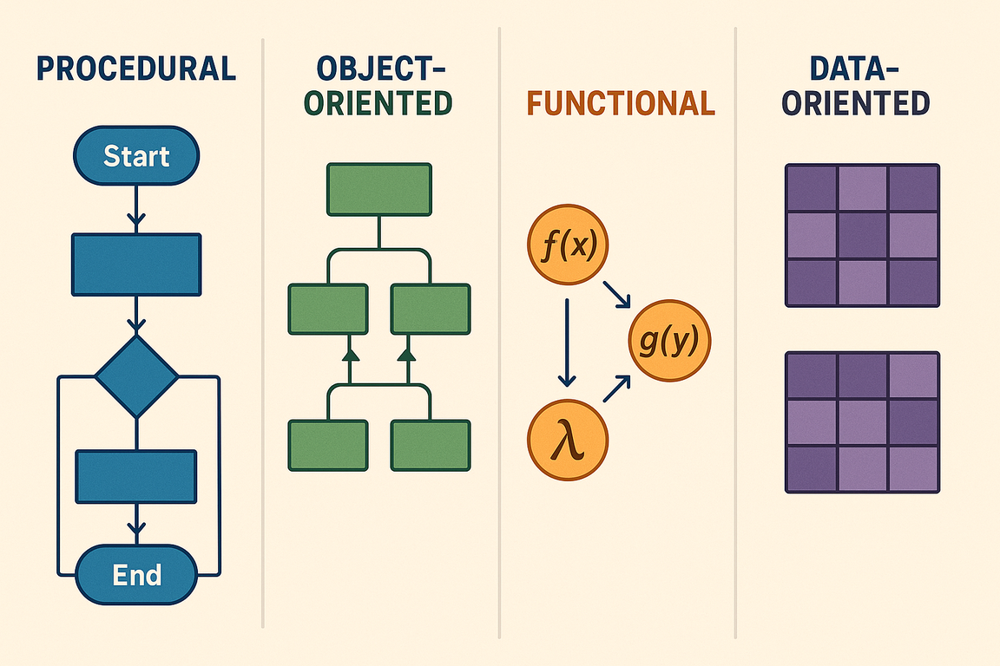

## A Arte de Simplificar a Complexidade

Imagine um artista de origami criando um cisne a partir de uma simples folha de
papel. O resultado final captura a essência elegante da ave — seu pescoço
curvado, suas asas dobradas, sua postura graciosa — mas deixa de lado detalhes
desnecessários como a textura das penas ou a cor dos olhos. O origami não busca
replicar perfeitamente a realidade, mas sim extrair e representar apenas os
aspectos mais importantes e reconhecíveis.

Os paradigmas de programação funcionam de maneira similar. Eles foram criados
para nos ajudar a reduzir a complexidade do mundo real e mapeá-la em sistemas de
software compreensíveis e funcionais. Assim como o origami, cada paradigma
oferece uma forma específica de "dobrar" a realidade em código, capturando os
aspectos essenciais do domínio que estamos modelando enquanto abstrai detalhes
desnecessários.


Quando desenvolvemos software, não estamos tentando recriar o mundo real em sua
totalidade — isso seria impossível e improdutivo. Em vez disso, utilizamos
paradigmas como ferramentas conceituais que nos permitem focar nos elementos
mais relevantes para resolver problemas específicos, criando representações
elegantes e funcionais da complexidade que nos cerca.

## Panorama dos Paradigmas de Programação

Ao longo da evolução da computação, diferentes paradigmas emergiram para abordar
distintos tipos de problemas e formas de pensar sobre software. Cada um oferece
uma perspectiva única sobre como organizar código, gerenciar estado e estruturar
soluções.



### Comparação dos Principais Paradigmas

| Aspecto | Procedural | Orientado a Objetos | Funcional | Orientado a Dados |
|---------|------------|-------------------|-----------|------------------|
| **Foco Principal** | Sequência de procedimentos | Objetos e suas interações | Funções e transformações | Estrutura e fluxo de dados |
| **Gerenciamento de Estado** | Estado global/local mutável | Estado encapsulado em objetos | Estado imutável | Dados imutáveis |
| **Reutilização** | Funções e módulos | Herança e composição | Funções puras | Estruturas de dados |
| **Testabilidade** | Moderada (dependências) | Boa (isolamento) | Excelente (pureza) | Excelente (imutabilidade) |
| **Tratamento de Complexidade** | Decomposição em funções | Abstração e encapsulamento | Composição de funções | Separação dados/comportamento |

## Programação Orientada a Objetos em Java

A Programação Orientada a Objetos (POO) tem sido o paradigma dominante em Java
desde sua criação. Seus princípios fundamentais incluem:

### Princípios Fundamentais da POO

**Encapsulamento**: Agrupa dados e métodos que operam sobre esses dados em uma única unidade (classe), controlando o acesso através de modificadores de visibilidade.

**Herança**: Permite que classes derivem características de outras classes, promovendo reutilização de código.

**Abstração**: Oculta detalhes de implementação complexos, expondo apenas interfaces necessárias.

**Polimorfismo**: Permite que objetos de diferentes tipos sejam tratados através de uma interface comum.

### Exemplo Prático em Java

```java
// Traditional OOP modeling
public class BankAccount {
    private String accountNumber;
    private BigDecimal balance;
    private String accountHolder;
    
    public BankAccount(String accountNumber, String accountHolder) {
        this.accountNumber = accountNumber;
        this.accountHolder = accountHolder;
        this.balance = BigDecimal.ZERO;
    }
    
    public void deposit(BigDecimal amount) {
        if (amount.compareTo(BigDecimal.ZERO) <= 0) {
            throw new IllegalArgumentException("Amount must be positive");
        }
        this.balance = this.balance.add(amount);
    }
    
    public void withdraw(BigDecimal amount) {
        if (amount.compareTo(balance) > 0) {
            throw new IllegalStateException("Insufficient balance");
        }
        this.balance = this.balance.subtract(amount);
    }
    
    // getters...
}
```

## Programação Orientada a Dados: Uma Nova Perspectiva

A Programação Orientada a Dados (Data-Oriented Programming) representa uma
mudança fundamental na forma como pensamos sobre software. Em vez de focar em
objetos que encapsulam dados e comportamento, este paradigma prioriza a
estrutura e o fluxo dos dados, separando claramente informação de processamento.


### Os Quatro Princípios Fundamentais

#### 1. Dados são Imutáveis

A imutabilidade elimina uma classe inteira de bugs relacionados a modificações
inesperadas de estado. Em Java, podemos usar records para criar estruturas
imutáveis de forma concisa:

```java
// Immutable data with records
public record AccountInfo(
    String accountNumber,
    String accountHolder,
    BigDecimal balance
) {
    public AccountInfo {
        if (accountNumber == null || accountNumber.isBlank()) {
            throw new IllegalArgumentException("Account number is required");
        }
        if (balance.compareTo(BigDecimal.ZERO) < 0) {
            throw new IllegalArgumentException("Balance cannot be negative");
        }
    }
}

// Operations as pure functions
public class BankingOperations {
    public static AccountInfo deposit(AccountInfo account, BigDecimal amount) {
        if (amount.compareTo(BigDecimal.ZERO) <= 0) {
            throw new IllegalArgumentException("Amount must be positive");
        }
        return new AccountInfo(
            account.accountNumber(),
            account.accountHolder(),
            account.balance().add(amount)
        );
    }
    
    public static AccountInfo withdraw(AccountInfo account, BigDecimal amount) {
        if (amount.compareTo(account.balance()) > 0) {
            throw new IllegalStateException("Insufficient balance");
        }
        return new AccountInfo(
            account.accountNumber(),
            account.accountHolder(),
            account.balance().subtract(amount)
        );
    }
}
```

#### 2. Modele os Dados, Todos os Dados, e Nada Além dos Dados

Este princípio enfatiza que nossas estruturas de dados devem representar
fielmente o domínio, sem adicionar complexidade desnecessária ou omitir
informações importantes:

```java
// Precise domain modeling
public record Address(
    String street,
    String number,
    String complement,
    String neighborhood,
    String city,
    String state,
    String zipCode
) {}

public record Customer(
    String cpf,
    String name,
    LocalDate birthDate,
    Address address,
    List<String> phoneNumbers
) {
    public Customer {
        // Validations in constructor
        phoneNumbers = List.copyOf(phoneNumbers); // Immutability
    }
}
```

#### 3. Torne Estados Ilegais Irrepresentáveis

Use o sistema de tipos para prevenir estados inválidos em tempo de compilação:

```java
// Mutually exclusive states
public sealed interface OrderStatus 
    permits Pending, Processing, Shipped, Delivered, Cancelled {
}

public record Pending(LocalDateTime createdAt) implements OrderStatus {}
public record Processing(LocalDateTime startedAt) implements OrderStatus {}
public record Shipped(LocalDateTime shippedAt, String trackingCode) implements OrderStatus {}
public record Delivered(LocalDateTime deliveredAt, String signature) implements OrderStatus {}
public record Cancelled(LocalDateTime cancelledAt, String reason) implements OrderStatus {}

public record Order(
    String id,
    String customerId,
    List<OrderItem> items,
    OrderStatus status
) {}
```

#### 4. Valide nas Fronteiras

Mantenha validações nas bordas do sistema, permitindo que o núcleo trabalhe com
dados já validados:

```java
// Boundary validation
public class OrderValidator {
    public static ValidationResult validate(OrderRequest request) {
        var errors = new ArrayList<String>();
        
        if (request.customerId() == null || request.customerId().isBlank()) {
            errors.add("Customer is required");
        }
        
        if (request.items() == null || request.items().isEmpty()) {
            errors.add("Order must have at least one item");
        }
        
        return errors.isEmpty() 
            ? ValidationResult.success()
            : ValidationResult.failure(errors);
    }
}

// Core works with validated data
public class OrderService {
    public Order createOrder(OrderRequest request) {
        // Assumes data has already been validated
        return new Order(
            UUID.randomUUID().toString(),
            request.customerId(),
            request.items(),
            new Pending(LocalDateTime.now())
        );
    }
}
```

## Exemplo Prático: API de Feriados Públicos

Para demonstrar todos os conceitos da programação orientada a dados na prática, desenvolvemos uma API REST completa para gerenciar feriados públicos. O projeto completo está disponível no GitHub e pode ser executado localmente usando Docker Compose com LocalStack e Terraform.

> 📁 **Código Fonte Completo**: [github.com/vagnerclementino/odp-api-holiday](https://github.com/vagnerclementino/odp-api-holiday)

### Configuração e Execução

O projeto foi estruturado para demonstrar as melhores práticas de desenvolvimento moderno, incluindo infraestrutura como código, testes automatizados e ambiente de desenvolvimento local:

```bash
# Clone o repositório
git clone https://github.com/vagnerclementino/odp-api-holiday.git
cd odp-api-holiday

# Setup completo com um comando
make setup

# Teste a API
make test
```

### Estruturas de Dados

```java
// Immutable domain model
public record Location(
    String country,
    Optional<String> state,
    Optional<String> city
) {
    public Location {
        if (country == null || country.isBlank()) {
            throw new IllegalArgumentException("Country is required");
        }
    }
}

public enum HolidayType {
    NATIONAL, STATE, MUNICIPAL, RELIGIOUS, COMMERCIAL
}

public record Holiday(
    String id,
    String name,
    LocalDate date,
    Location location,
    HolidayType type,
    boolean recurring,
    Optional<String> description
) {
    public Holiday {
        if (id == null || id.isBlank()) {
            throw new IllegalArgumentException("ID is required");
        }
        if (name == null || name.isBlank()) {
            throw new IllegalArgumentException("Name is required");
        }
        if (date == null) {
            throw new IllegalArgumentException("Date is required");
        }
    }
}
```

### DTOs para API Gateway

```java
// Request/Response DTOs
public record CreateHolidayRequest(
    String name,
    String date, // ISO format
    String country,
    String state,
    String city,
    String type,
    boolean recurring,
    String description
) {}

public record HolidayResponse(
    String id,
    String name,
    String date,
    LocationResponse location,
    String type,
    boolean recurring,
    String description
) {}

public record LocationResponse(
    String country,
    String state,
    String city
) {}

public record HolidayFilter(
    Optional<String> country,
    Optional<String> state,
    Optional<String> city,
    Optional<LocalDate> startDate,
    Optional<LocalDate> endDate,
    Optional<HolidayType> type
) {}
```

### Validação nas Fronteiras

```java
public class HolidayValidator {
    public static ValidationResult validateCreation(CreateHolidayRequest request) {
        var errors = new ArrayList<String>();
        
        if (request.name() == null || request.name().isBlank()) {
            errors.add("Name is required");
        }
        
        if (request.country() == null || request.country().isBlank()) {
            errors.add("Country is required");
        }
        
        try {
            LocalDate.parse(request.date());
        } catch (DateTimeParseException e) {
            errors.add("Date must be in ISO format (YYYY-MM-DD)");
        }
        
        try {
            HolidayType.valueOf(request.type().toUpperCase());
        } catch (IllegalArgumentException e) {
            errors.add("Invalid type: " + request.type());
        }
        
        return errors.isEmpty() 
            ? ValidationResult.success()
            : ValidationResult.failure(errors);
    }
}

public sealed interface ValidationResult 
    permits ValidationResult.Success, ValidationResult.Failure {
    
    record Success() implements ValidationResult {}
    record Failure(List<String> errors) implements ValidationResult {}
    
    static ValidationResult success() { return new Success(); }
    static ValidationResult failure(List<String> errors) { return new Failure(errors); }
}
```

### Mapeadores de Dados

```java
public class HolidayMapper {
    public static Holiday fromRequest(CreateHolidayRequest request) {
        return new Holiday(
            UUID.randomUUID().toString(),
            request.name(),
            LocalDate.parse(request.date()),
            new Location(
                request.country(),
                Optional.ofNullable(request.state()),
                Optional.ofNullable(request.city())
            ),
            HolidayType.valueOf(request.type().toUpperCase()),
            request.recurring(),
            Optional.ofNullable(request.description())
        );
    }
    
    public static HolidayResponse toResponse(Holiday holiday) {
        return new HolidayResponse(
            holiday.id(),
            holiday.name(),
            holiday.date().toString(),
            new LocationResponse(
                holiday.location().country(),
                holiday.location().state().orElse(null),
                holiday.location().city().orElse(null)
            ),
            holiday.type().name(),
            holiday.recurring(),
            holiday.description().orElse(null)
        );
    }
}
```

### Serviço de Domínio

```java
public class HolidayService {
    private final HolidayRepository repository;
    
    public HolidayService(HolidayRepository repository) {
        this.repository = repository;
    }
    
    public List<Holiday> findHolidays(HolidayFilter filter) {
        return repository.find(filter);
    }
    
    public Optional<Holiday> findById(String id) {
        return repository.findById(id);
    }
    
    public Holiday save(Holiday holiday) {
        return repository.save(holiday);
    }
    
    public boolean delete(String id) {
        return repository.delete(id);
    }
    
    public Optional<Holiday> update(String id, Holiday updatedHoliday) {
        return repository.findById(id)
            .map(existing -> {
                var updated = new Holiday(
                    id, // Keep original ID
                    updatedHoliday.name(),
                    updatedHoliday.date(),
                    updatedHoliday.location(),
                    updatedHoliday.type(),
                    updatedHoliday.recurring(),
                    updatedHoliday.description()
                );
                return repository.save(updated);
            });
    }
}
```

### Configuração do Projeto Maven

**pom.xml**

```xml
<?xml version="1.0" encoding="UTF-8"?>
<project xmlns="http://maven.apache.org/POM/4.0.0"
         xmlns:xsi="http://www.w3.org/2001/XMLSchema-instance"
         xsi:schemaLocation="http://maven.apache.org/POM/4.0.0 
         http://maven.apache.org/xsd/maven-4.0.0.xsd">
    <modelVersion>4.0.0</modelVersion>

    <groupId>com.example</groupId>
    <artifactId>holidays-api</artifactId>
    <version>1.0</version>
    <packaging>jar</packaging>

    <properties>
        <maven.compiler.source>17</maven.compiler.source>
        <maven.compiler.target>17</maven.compiler.target>
        <project.build.sourceEncoding>UTF-8</project.build.sourceEncoding>
        <aws.sdk.version>2.21.29</aws.sdk.version>
        <jackson.version>2.15.2</jackson.version>
    </properties>

    <dependencies>
        <!-- AWS Lambda Core -->
        <dependency>
            <groupId>com.amazonaws</groupId>
            <artifactId>aws-lambda-java-core</artifactId>
            <version>1.2.3</version>
        </dependency>

        <!-- AWS Lambda Events -->
        <dependency>
            <groupId>com.amazonaws</groupId>
            <artifactId>aws-lambda-java-events</artifactId>
            <version>3.11.3</version>
        </dependency>

        <!-- AWS SDK v2 -->
        <dependency>
            <groupId>software.amazon.awssdk</groupId>
            <artifactId>dynamodb</artifactId>
            <version>${aws.sdk.version}</version>
        </dependency>

        <!-- Jackson for JSON processing -->
        <dependency>
            <groupId>com.fasterxml.jackson.core</groupId>
            <artifactId>jackson-databind</artifactId>
            <version>${jackson.version}</version>
        </dependency>

        <dependency>
            <groupId>com.fasterxml.jackson.datatype</groupId>
            <artifactId>jackson-datatype-jsr310</artifactId>
            <version>${jackson.version}</version>
        </dependency>

        <!-- Test Dependencies -->
        <dependency>
            <groupId>org.junit.jupiter</groupId>
            <artifactId>junit-jupiter</artifactId>
            <version>5.10.0</version>
            <scope>test</scope>
        </dependency>

        <dependency>
            <groupId>org.mockito</groupId>
            <artifactId>mockito-core</artifactId>
            <version>5.5.0</version>
            <scope>test</scope>
        </dependency>

        <dependency>
            <groupId>org.testcontainers</groupId>
            <artifactId>localstack</artifactId>
            <version>1.19.0</version>
            <scope>test</scope>
        </dependency>
    </dependencies>

    <build>
        <plugins>
            <plugin>
                <groupId>org.apache.maven.plugins</groupId>
                <artifactId>maven-compiler-plugin</artifactId>
                <version>3.11.0</version>
                <configuration>
                    <source>17</source>
                    <target>17</target>
                </configuration>
            </plugin>

            <plugin>
                <groupId>org.apache.maven.plugins</groupId>
                <artifactId>maven-shade-plugin</artifactId>
                <version>3.5.0</version>
                <executions>
                    <execution>
                        <phase>package</phase>
                        <goals>
                            <goal>shade</goal>
                        </goals>
                        <configuration>
                            <createDependencyReducedPom>false</createDependencyReducedPom>
                            <transformers>
                                <transformer implementation="org.apache.maven.plugins.shade.resource.ManifestResourceTransformer">
                                    <mainClass>com.example.HolidayLambdaHandler</mainClass>
                                </transformer>
                            </transformers>
                        </configuration>
                    </execution>
                </executions>
            </plugin>

            <plugin>
                <groupId>org.apache.maven.plugins</groupId>
                <artifactId>maven-surefire-plugin</artifactId>
                <version>3.1.2</version>
            </plugin>
        </plugins>
    </build>
</project>
```

### Handler do AWS Lambda

```java
public interface HolidayRepository {
    List<Holiday> find(HolidayFilter filter);
    Optional<Holiday> findById(String id);
    Holiday save(Holiday holiday);
    boolean delete(String id);
}

@Component
public class DynamoDBHolidayRepository implements HolidayRepository {
    
    private final DynamoDbClient dynamoDbClient;
    private final String tableName;
    
    public DynamoDBHolidayRepository() {
        this.tableName = System.getenv().getOrDefault("DYNAMODB_TABLE", "holidays");
        
        // Configure DynamoDB client for LocalStack
        String endpointUrl = System.getenv("AWS_ENDPOINT_URL");
        
        DynamoDbClientBuilder clientBuilder = DynamoDbClient.builder()
            .region(Region.US_EAST_1)
            .credentialsProvider(StaticCredentialsProvider.create(
                AwsBasicCredentials.create("test", "test")
            ));
            
        if (endpointUrl != null && !endpointUrl.isEmpty()) {
            clientBuilder.endpointOverride(URI.create(endpointUrl));
        }
        
        this.dynamoDbClient = clientBuilder.build();
    }
    
    @Override
    public List<Holiday> find(HolidayFilter filter) {
        try {
            ScanRequest.Builder scanBuilder = ScanRequest.builder()
                .tableName(tableName);
            
            // Apply filters
            List<String> filterExpressions = new ArrayList<>();
            Map<String, AttributeValue> expressionValues = new HashMap<>();
            
            filter.country().ifPresent(country -> {
                filterExpressions.add("contains(#location, :country)");
                expressionValues.put(":country", AttributeValue.builder().s(country).build());
            });
            
            filter.type().ifPresent(type -> {
                filterExpressions.add("#type = :type");
                expressionValues.put(":type", AttributeValue.builder().s(type.name()).build());
            });
            
            filter.startDate().ifPresent(startDate -> {
                filterExpressions.add("#date >= :startDate");
                expressionValues.put(":startDate", AttributeValue.builder().s(startDate.toString()).build());
            });
            
            filter.endDate().ifPresent(endDate -> {
                filterExpressions.add("#date <= :endDate");
                expressionValues.put(":endDate", AttributeValue.builder().s(endDate.toString()).build());
            });
            
            if (!filterExpressions.isEmpty()) {
                scanBuilder.filterExpression(String.join(" AND ", filterExpressions))
                    .expressionAttributeValues(expressionValues)
                    .expressionAttributeNames(Map.of(
                        "#location", "location",
                        "#type", "type",
                        "#date", "date"
                    ));
            }
            
            ScanResponse response = dynamoDbClient.scan(scanBuilder.build());
            
            return response.items().stream()
                .map(this::mapToHoliday)
                .collect(Collectors.toList());
                
        } catch (Exception e) {
            throw new RuntimeException("Error scanning holidays", e);
        }
    }
    
    @Override
    public Optional<Holiday> findById(String id) {
        try {
            GetItemResponse response = dynamoDbClient.getItem(GetItemRequest.builder()
                .tableName(tableName)
                .key(Map.of("id", AttributeValue.builder().s(id).build()))
                .build());
            
            return response.hasItem() 
                ? Optional.of(mapToHoliday(response.item()))
                : Optional.empty();
                
        } catch (Exception e) {
            throw new RuntimeException("Error finding holiday by id: " + id, e);
        }
    }
    
    @Override
    public Holiday save(Holiday holiday) {
        try {
            Map<String, AttributeValue> item = mapToAttributeValues(holiday);
            
            dynamoDbClient.putItem(PutItemRequest.builder()
                .tableName(tableName)
                .item(item)
                .build());
            
            return holiday;
            
        } catch (Exception e) {
            throw new RuntimeException("Error saving holiday", e);
        }
    }
    
    @Override
    public boolean delete(String id) {
        try {
            DeleteItemResponse response = dynamoDbClient.deleteItem(DeleteItemRequest.builder()
                .tableName(tableName)
                .key(Map.of("id", AttributeValue.builder().s(id).build()))
                .returnValues(ReturnValue.ALL_OLD)
                .build());
            
            return response.hasAttributes();
            
        } catch (Exception e) {
            throw new RuntimeException("Error deleting holiday: " + id, e);
        }
    }
    
    private Holiday mapToHoliday(Map<String, AttributeValue> item) {
        // Parse location from JSON string
        String locationJson = item.get("location").s();
        Location location = parseLocation(locationJson);
        
        return new Holiday(
            item.get("id").s(),
            item.get("name").s(),
            LocalDate.parse(item.get("date").s()),
            location,
            HolidayType.valueOf(item.get("type").s()),
            Boolean.parseBoolean(item.get("recurring").s()),
            Optional.ofNullable(item.get("description"))
                .map(AttributeValue::s)
                .filter(s -> !s.isEmpty())
        );
    }
    
    private Map<String, AttributeValue> mapToAttributeValues(Holiday holiday) {
        Map<String, AttributeValue> item = new HashMap<>();
        
        item.put("id", AttributeValue.builder().s(holiday.id()).build());
        item.put("name", AttributeValue.builder().s(holiday.name()).build());
        item.put("date", AttributeValue.builder().s(holiday.date().toString()).build());
        item.put("location", AttributeValue.builder().s(locationToJson(holiday.location())).build());
        item.put("type", AttributeValue.builder().s(holiday.type().name()).build());
        item.put("recurring", AttributeValue.builder().s(String.valueOf(holiday.recurring())).build());
        
        holiday.description().ifPresent(desc -> 
            item.put("description", AttributeValue.builder().s(desc).build())
        );
        
        return item;
    }
    
    private String locationToJson(Location location) {
        return String.format(
            "{\"country\":\"%s\",\"state\":%s,\"city\":%s}",
            location.country(),
            location.state().map(s -> "\"" + s + "\"").orElse("null"),
            location.city().map(c -> "\"" + c + "\"").orElse("null")
        );
    }
    
    private Location parseLocation(String json) {
        // Simple JSON parsing for this example
        // In production, use a proper JSON library
        String country = extractJsonValue(json, "country");
        String state = extractJsonValue(json, "state");
        String city = extractJsonValue(json, "city");
        
        return new Location(
            country,
            "null".equals(state) ? Optional.empty() : Optional.of(state),
            "null".equals(city) ? Optional.empty() : Optional.of(city)
        );
    }
    
    private String extractJsonValue(String json, String key) {
        String pattern = "\"" + key + "\":\"([^\"]+)\"";
        java.util.regex.Pattern p = java.util.regex.Pattern.compile(pattern);
        java.util.regex.Matcher m = p.matcher(json);
        return m.find() ? m.group(1) : null;
    }
}

```java
public class HolidayLambdaHandler implements RequestHandler<APIGatewayProxyRequestEvent, APIGatewayProxyResponseEvent> {
    
    private final HolidayService holidayService;
    private final ObjectMapper objectMapper;
    
    public HolidayLambdaHandler() {
        this.holidayService = new HolidayService(new DynamoDBHolidayRepository());
        this.objectMapper = new ObjectMapper()
            .registerModule(new JavaTimeModule())
            .disable(SerializationFeature.WRITE_DATES_AS_TIMESTAMPS);
    }
    
    @Override
    public APIGatewayProxyResponseEvent handleRequest(APIGatewayProxyRequestEvent request, Context context) {
        try {
            return switch (request.getHttpMethod()) {
                case "GET" -> handleGet(request);
                case "POST" -> handlePost(request);
                case "PUT" -> handlePut(request);
                case "DELETE" -> handleDelete(request);
                default -> createResponse(405, Map.of("error", "Method not allowed"));
            };
        } catch (Exception e) {
            context.getLogger().log("Error: " + e.getMessage());
            return createResponse(500, Map.of("error", "Internal server error"));
        }
    }
    
    private APIGatewayProxyResponseEvent handleGet(APIGatewayProxyRequestEvent request) throws Exception {
        var pathParameters = request.getPathParameters();
        
        if (pathParameters != null && pathParameters.containsKey("id")) {
            // GET /holidays/{id}
            var id = pathParameters.get("id");
            var holiday = holidayService.findById(id);
            
            return holiday
                .map(h -> createResponse(200, HolidayMapper.toResponse(h)))
                .orElse(createResponse(404, Map.of("error", "Holiday not found")));
        } else {
            // GET /holidays with filters
            var filter = extractFilters(request.getQueryStringParameters());
            var holidays = holidayService.findHolidays(filter);
            var responses = holidays.stream()
                .map(HolidayMapper::toResponse)
                .toList();
            
            return createResponse(200, responses);
        }
    }
    
    private APIGatewayProxyResponseEvent handlePost(APIGatewayProxyRequestEvent request) throws Exception {
        var holidayRequest = objectMapper.readValue(request.getBody(), CreateHolidayRequest.class);
        
        var validation = HolidayValidator.validateCreation(holidayRequest);
        if (validation instanceof ValidationResult.Failure failure) {
            return createResponse(400, Map.of("errors", failure.errors()));
        }
        
        var holiday = HolidayMapper.fromRequest(holidayRequest);
        var savedHoliday = holidayService.save(holiday);
        
        return createResponse(201, HolidayMapper.toResponse(savedHoliday));
    }
    
    private APIGatewayProxyResponseEvent handlePut(APIGatewayProxyRequestEvent request) throws Exception {
        var pathParameters = request.getPathParameters();
        if (pathParameters == null || !pathParameters.containsKey("id")) {
            return createResponse(400, Map.of("error", "ID is required"));
        }
        
        var id = pathParameters.get("id");
        var holidayRequest = objectMapper.readValue(request.getBody(), CreateHolidayRequest.class);
        
        var validation = HolidayValidator.validateCreation(holidayRequest);
        if (validation instanceof ValidationResult.Failure failure) {
            return createResponse(400, Map.of("errors", failure.errors()));
        }
        
        var updatedHoliday = HolidayMapper.fromRequest(holidayRequest);
        var result = holidayService.update(id, updatedHoliday);
        
        return result
            .map(h -> createResponse(200, HolidayMapper.toResponse(h)))
            .orElse(createResponse(404, Map.of("error", "Holiday not found")));
    }
    
    private APIGatewayProxyResponseEvent handleDelete(APIGatewayProxyRequestEvent request) {
        var pathParameters = request.getPathParameters();
        if (pathParameters == null || !pathParameters.containsKey("id")) {
            return createResponse(400, Map.of("error", "ID is required"));
        }
        
        var id = pathParameters.get("id");
        var deleted = holidayService.delete(id);
        
        return deleted 
            ? createResponse(204, null)
            : createResponse(404, Map.of("error", "Holiday not found"));
    }
    
    private HolidayFilter extractFilters(Map<String, String> queryParams) {
        if (queryParams == null) {
            return new HolidayFilter(
                Optional.empty(), Optional.empty(), Optional.empty(),
                Optional.empty(), Optional.empty(), Optional.empty()
            );
        }
        
        return new HolidayFilter(
            Optional.ofNullable(queryParams.get("country")),
            Optional.ofNullable(queryParams.get("state")),
            Optional.ofNullable(queryParams.get("city")),
            Optional.ofNullable(queryParams.get("startDate")).map(LocalDate::parse),
            Optional.ofNullable(queryParams.get("endDate")).map(LocalDate::parse),
            Optional.ofNullable(queryParams.get("type")).map(t -> HolidayType.valueOf(t.toUpperCase()))
        );
    }
    
    private APIGatewayProxyResponseEvent createResponse(int statusCode, Object body) {
        var response = new APIGatewayProxyResponseEvent();
        response.setStatusCode(statusCode);
        response.setHeaders(Map.of(
            "Content-Type", "application/json",
            "Access-Control-Allow-Origin", "*"
        ));
        
        if (body != null) {
            try {
                response.setBody(objectMapper.writeValueAsString(body));
            } catch (Exception e) {
                response.setStatusCode(500);
                response.setBody("{\"error\":\"Serialization error\"}");
            }
        }
        
        return response;
    }
}
```

### Configuração do Ambiente Local com Docker Compose e LocalStack

Para desenvolvimento e testes locais, utilizaremos LocalStack com Docker Compose e Terraform para provisionar a infraestrutura:

#### docker-compose.yml

```yaml
version: '3.8'

services:
  localstack:
    container_name: localstack-holidays-api
    image: localstack/localstack:latest
    ports:
      - "4566:4566"
      - "4510-4559:4510-4559"
    environment:
      - SERVICES=lambda,apigateway,dynamodb,iam,logs
      - DEBUG=1
      - DATA_DIR=/tmp/localstack/data
      - LAMBDA_EXECUTOR=docker
      - DOCKER_HOST=unix:///var/run/docker.sock
      - HOST_TMP_FOLDER=${TMPDIR:-/tmp/}localstack
    volumes:
      - "${TMPDIR:-/tmp}/localstack:/tmp/localstack"
      - "/var/run/docker.sock:/var/run/docker.sock"
      - "./target:/opt/code/localstack/target"
    networks:
      - holidays-network

  terraform:
    container_name: terraform-holidays
    image: hashicorp/terraform:latest
    working_dir: /workspace
    volumes:
      - "./terraform:/workspace"
      - "./target:/workspace/target"
    environment:
      - AWS_ACCESS_KEY_ID=test
      - AWS_SECRET_ACCESS_KEY=test
      - AWS_DEFAULT_REGION=us-east-1
      - AWS_ENDPOINT_URL=http://localstack:4566
    depends_on:
      - localstack
    networks:
      - holidays-network
    command: ["tail", "-f", "/dev/null"]

networks:
  holidays-network:
    driver: bridge
```

#### Configuração Terraform

**terraform/main.tf**

```hcl
terraform {
  required_providers {
    aws = {
      source  = "hashicorp/aws"
      version = "~> 5.0"
    }
  }
}

provider "aws" {
  access_key                  = "test"
  secret_key                  = "test"
  region                     = "us-east-1"
  s3_use_path_style          = true
  skip_credentials_validation = true
  skip_metadata_api_check    = true
  skip_requesting_account_id = true

  endpoints {
    apigateway = "http://localstack:4566"
    dynamodb   = "http://localstack:4566"
    lambda     = "http://localstack:4566"
    iam        = "http://localstack:4566"
    logs       = "http://localstack:4566"
  }
}

# DynamoDB Table
resource "aws_dynamodb_table" "holidays_table" {
  name           = "holidays"
  billing_mode   = "PAY_PER_REQUEST"
  hash_key       = "id"

  attribute {
    name = "id"
    type = "S"
  }

  tags = {
    Name        = "HolidaysTable"
    Environment = "local"
  }
}

# IAM Role for Lambda
resource "aws_iam_role" "lambda_role" {
  name = "holidays-lambda-role"

  assume_role_policy = jsonencode({
    Version = "2012-10-17"
    Statement = [
      {
        Action = "sts:AssumeRole"
        Effect = "Allow"
        Principal = {
          Service = "lambda.amazonaws.com"
        }
      }
    ]
  })
}

# IAM Policy for Lambda
resource "aws_iam_role_policy" "lambda_policy" {
  name = "holidays-lambda-policy"
  role = aws_iam_role.lambda_role.id

  policy = jsonencode({
    Version = "2012-10-17"
    Statement = [
      {
        Effect = "Allow"
        Action = [
          "logs:CreateLogGroup",
          "logs:CreateLogStream",
          "logs:PutLogEvents"
        ]
        Resource = "arn:aws:logs:*:*:*"
      },
      {
        Effect = "Allow"
        Action = [
          "dynamodb:GetItem",
          "dynamodb:PutItem",
          "dynamodb:UpdateItem",
          "dynamodb:DeleteItem",
          "dynamodb:Scan",
          "dynamodb:Query"
        ]
        Resource = aws_dynamodb_table.holidays_table.arn
      }
    ]
  })
}

# Lambda Function
resource "aws_lambda_function" "holidays_function" {
  filename         = "target/holidays-api-1.0.jar"
  function_name    = "holidays-api"
  role            = aws_iam_role.lambda_role.arn
  handler         = "com.example.HolidayLambdaHandler::handleRequest"
  runtime         = "java17"
  memory_size     = 512
  timeout         = 30

  environment {
    variables = {
      DYNAMODB_TABLE = aws_dynamodb_table.holidays_table.name
      AWS_ENDPOINT_URL = "http://localstack:4566"
    }
  }

  depends_on = [aws_dynamodb_table.holidays_table]
}

# API Gateway
resource "aws_api_gateway_rest_api" "holidays_api" {
  name        = "holidays-api"
  description = "API for managing public holidays"

  endpoint_configuration {
    types = ["REGIONAL"]
  }
}

# API Gateway Resource
resource "aws_api_gateway_resource" "holidays_resource" {
  rest_api_id = aws_api_gateway_rest_api.holidays_api.id
  parent_id   = aws_api_gateway_rest_api.holidays_api.root_resource_id
  path_part   = "holidays"
}

# API Gateway Resource with ID
resource "aws_api_gateway_resource" "holiday_id_resource" {
  rest_api_id = aws_api_gateway_rest_api.holidays_api.id
  parent_id   = aws_api_gateway_resource.holidays_resource.id
  path_part   = "{id}"
}

# API Gateway Methods
resource "aws_api_gateway_method" "get_holidays" {
  rest_api_id   = aws_api_gateway_rest_api.holidays_api.id
  resource_id   = aws_api_gateway_resource.holidays_resource.id
  http_method   = "GET"
  authorization = "NONE"
}

resource "aws_api_gateway_method" "post_holiday" {
  rest_api_id   = aws_api_gateway_rest_api.holidays_api.id
  resource_id   = aws_api_gateway_resource.holidays_resource.id
  http_method   = "POST"
  authorization = "NONE"
}

resource "aws_api_gateway_method" "get_holiday" {
  rest_api_id   = aws_api_gateway_rest_api.holidays_api.id
  resource_id   = aws_api_gateway_resource.holiday_id_resource.id
  http_method   = "GET"
  authorization = "NONE"
}

resource "aws_api_gateway_method" "put_holiday" {
  rest_api_id   = aws_api_gateway_rest_api.holidays_api.id
  resource_id   = aws_api_gateway_resource.holiday_id_resource.id
  http_method   = "PUT"
  authorization = "NONE"
}

resource "aws_api_gateway_method" "delete_holiday" {
  rest_api_id   = aws_api_gateway_rest_api.holidays_api.id
  resource_id   = aws_api_gateway_resource.holiday_id_resource.id
  http_method   = "DELETE"
  authorization = "NONE"
}

# API Gateway Integrations
resource "aws_api_gateway_integration" "lambda_integration_get_holidays" {
  rest_api_id = aws_api_gateway_rest_api.holidays_api.id
  resource_id = aws_api_gateway_resource.holidays_resource.id
  http_method = aws_api_gateway_method.get_holidays.http_method

  integration_http_method = "POST"
  type                   = "AWS_PROXY"
  uri                    = aws_lambda_function.holidays_function.invoke_arn
}

resource "aws_api_gateway_integration" "lambda_integration_post_holiday" {
  rest_api_id = aws_api_gateway_rest_api.holidays_api.id
  resource_id = aws_api_gateway_resource.holidays_resource.id
  http_method = aws_api_gateway_method.post_holiday.http_method

  integration_http_method = "POST"
  type                   = "AWS_PROXY"
  uri                    = aws_lambda_function.holidays_function.invoke_arn
}

resource "aws_api_gateway_integration" "lambda_integration_get_holiday" {
  rest_api_id = aws_api_gateway_rest_api.holidays_api.id
  resource_id = aws_api_gateway_resource.holiday_id_resource.id
  http_method = aws_api_gateway_method.get_holiday.http_method

  integration_http_method = "POST"
  type                   = "AWS_PROXY"
  uri                    = aws_lambda_function.holidays_function.invoke_arn
}

resource "aws_api_gateway_integration" "lambda_integration_put_holiday" {
  rest_api_id = aws_api_gateway_rest_api.holidays_api.id
  resource_id = aws_api_gateway_resource.holiday_id_resource.id
  http_method = aws_api_gateway_method.put_holiday.http_method

  integration_http_method = "POST"
  type                   = "AWS_PROXY"
  uri                    = aws_lambda_function.holidays_function.invoke_arn
}

resource "aws_api_gateway_integration" "lambda_integration_delete_holiday" {
  rest_api_id = aws_api_gateway_rest_api.holidays_api.id
  resource_id = aws_api_gateway_resource.holiday_id_resource.id
  http_method = aws_api_gateway_method.delete_holiday.http_method

  integration_http_method = "POST"
  type                   = "AWS_PROXY"
  uri                    = aws_lambda_function.holidays_function.invoke_arn
}

# Lambda Permissions
resource "aws_lambda_permission" "api_gateway_lambda" {
  statement_id  = "AllowExecutionFromAPIGateway"
  action        = "lambda:InvokeFunction"
  function_name = aws_lambda_function.holidays_function.function_name
  principal     = "apigateway.amazonaws.com"
  source_arn    = "${aws_api_gateway_rest_api.holidays_api.execution_arn}/*/*"
}

# API Gateway Deployment
resource "aws_api_gateway_deployment" "holidays_deployment" {
  depends_on = [
    aws_api_gateway_integration.lambda_integration_get_holidays,
    aws_api_gateway_integration.lambda_integration_post_holiday,
    aws_api_gateway_integration.lambda_integration_get_holiday,
    aws_api_gateway_integration.lambda_integration_put_holiday,
    aws_api_gateway_integration.lambda_integration_delete_holiday,
  ]

  rest_api_id = aws_api_gateway_rest_api.holidays_api.id
  stage_name  = "prod"
}

# CORS Configuration
resource "aws_api_gateway_method" "options_holidays" {
  rest_api_id   = aws_api_gateway_rest_api.holidays_api.id
  resource_id   = aws_api_gateway_resource.holidays_resource.id
  http_method   = "OPTIONS"
  authorization = "NONE"
}

resource "aws_api_gateway_method" "options_holiday_id" {
  rest_api_id   = aws_api_gateway_rest_api.holidays_api.id
  resource_id   = aws_api_gateway_resource.holiday_id_resource.id
  http_method   = "OPTIONS"
  authorization = "NONE"
}

resource "aws_api_gateway_integration" "options_integration_holidays" {
  rest_api_id = aws_api_gateway_rest_api.holidays_api.id
  resource_id = aws_api_gateway_resource.holidays_resource.id
  http_method = aws_api_gateway_method.options_holidays.http_method
  type        = "MOCK"

  request_templates = {
    "application/json" = "{\"statusCode\": 200}"
  }
}

resource "aws_api_gateway_integration" "options_integration_holiday_id" {
  rest_api_id = aws_api_gateway_rest_api.holidays_api.id
  resource_id = aws_api_gateway_resource.holiday_id_resource.id
  http_method = aws_api_gateway_method.options_holiday_id.http_method
  type        = "MOCK"

  request_templates = {
    "application/json" = "{\"statusCode\": 200}"
  }
}

# Method Responses for CORS
resource "aws_api_gateway_method_response" "options_200_holidays" {
  rest_api_id = aws_api_gateway_rest_api.holidays_api.id
  resource_id = aws_api_gateway_resource.holidays_resource.id
  http_method = aws_api_gateway_method.options_holidays.http_method
  status_code = "200"

  response_parameters = {
    "method.response.header.Access-Control-Allow-Headers" = true
    "method.response.header.Access-Control-Allow-Methods" = true
    "method.response.header.Access-Control-Allow-Origin"  = true
  }
}

resource "aws_api_gateway_method_response" "options_200_holiday_id" {
  rest_api_id = aws_api_gateway_rest_api.holidays_api.id
  resource_id = aws_api_gateway_resource.holiday_id_resource.id
  http_method = aws_api_gateway_method.options_holiday_id.http_method
  status_code = "200"

  response_parameters = {
    "method.response.header.Access-Control-Allow-Headers" = true
    "method.response.header.Access-Control-Allow-Methods" = true
    "method.response.header.Access-Control-Allow-Origin"  = true
  }
}

# Integration Responses for CORS
resource "aws_api_gateway_integration_response" "options_integration_response_holidays" {
  rest_api_id = aws_api_gateway_rest_api.holidays_api.id
  resource_id = aws_api_gateway_resource.holidays_resource.id
  http_method = aws_api_gateway_method.options_holidays.http_method
  status_code = aws_api_gateway_method_response.options_200_holidays.status_code

  response_parameters = {
    "method.response.header.Access-Control-Allow-Headers" = "'Content-Type,X-Amz-Date,Authorization,X-Api-Key,X-Amz-Security-Token'"
    "method.response.header.Access-Control-Allow-Methods" = "'GET,POST,OPTIONS'"
    "method.response.header.Access-Control-Allow-Origin"  = "'*'"
  }
}

resource "aws_api_gateway_integration_response" "options_integration_response_holiday_id" {
  rest_api_id = aws_api_gateway_rest_api.holidays_api.id
  resource_id = aws_api_gateway_resource.holiday_id_resource.id
  http_method = aws_api_gateway_method.options_holiday_id.http_method
  status_code = aws_api_gateway_method_response.options_200_holiday_id.status_code

  response_parameters = {
    "method.response.header.Access-Control-Allow-Headers" = "'Content-Type,X-Amz-Date,Authorization,X-Api-Key,X-Amz-Security-Token'"
    "method.response.header.Access-Control-Allow-Methods" = "'GET,PUT,DELETE,OPTIONS'"
    "method.response.header.Access-Control-Allow-Origin"  = "'*'"
  }
}
```

**terraform/outputs.tf**

```hcl
output "api_url" {
  description = "URL of the API Gateway"
  value       = "http://localhost:4566/restapis/${aws_api_gateway_rest_api.holidays_api.id}/prod/_user_request_/holidays"
}

output "dynamodb_table_name" {
  description = "Name of the DynamoDB table"
  value       = aws_dynamodb_table.holidays_table.name
}

output "lambda_function_name" {
  description = "Name of the Lambda function"
  value       = aws_lambda_function.holidays_function.function_name
}
```

#### Scripts de Automação

**scripts/setup.sh**

```bash
#!/bin/bash

echo "🚀 Setting up Holidays API with LocalStack..."

# Start LocalStack
echo "📦 Starting LocalStack..."
docker-compose up -d localstack

# Wait for LocalStack to be ready
echo "⏳ Waiting for LocalStack to be ready..."
sleep 10

# Build Java application
echo "🔨 Building Java application..."
mvn clean package -DskipTests

# Initialize and apply Terraform
echo "🏗️ Deploying infrastructure with Terraform..."
docker-compose exec terraform terraform init
docker-compose exec terraform terraform plan
docker-compose exec terraform terraform apply -auto-approve

echo "✅ Setup complete!"
echo "🌐 API URL: http://localhost:4566/restapis/$(docker-compose exec terraform terraform output -raw api_url | cut -d'/' -f5)/prod/_user_request_/holidays"
```

**scripts/test-api.sh**

```bash
#!/bin/bash

API_BASE_URL="http://localhost:4566/restapis"
API_ID=$(docker-compose exec terraform terraform output -raw api_url | cut -d'/' -f5)
FULL_URL="${API_BASE_URL}/${API_ID}/prod/_user_request_/holidays"

echo "🧪 Testing Holidays API..."
echo "📍 API URL: $FULL_URL"

# Test POST - Create holiday
echo "➕ Creating a new holiday..."
curl -X POST "$FULL_URL" \
  -H "Content-Type: application/json" \
  -d '{
    "name": "New Year",
    "date": "2024-01-01",
    "country": "Brazil",
    "state": "SP",
    "city": "São Paulo",
    "type": "NATIONAL",
    "recurring": true,
    "description": "New Year celebration"
  }' | jq .

echo -e "\n"

# Test GET - List all holidays
echo "📋 Listing all holidays..."
curl -X GET "$FULL_URL" | jq .

echo -e "\n"

# Test GET with filters
echo "🔍 Filtering holidays by country..."
curl -X GET "$FULL_URL?country=Brazil" | jq .

echo -e "\n✅ API tests completed!"
```

**scripts/cleanup.sh**

```bash
#!/bin/bash

echo "🧹 Cleaning up..."

# Destroy Terraform resources
docker-compose exec terraform terraform destroy -auto-approve

# Stop and remove containers
docker-compose down -v

# Remove generated files
rm -rf .terraform/
rm -f terraform.tfstate*

echo "✅ Cleanup completed!"
```

#### Makefile para Automação

**Makefile**

```makefile
.PHONY: setup build deploy test clean logs

# Setup complete environment
setup:
	@echo "🚀 Setting up development environment..."
	@chmod +x scripts/*.sh
	@./scripts/setup.sh

# Build Java application
build:
	@echo "🔨 Building Java application..."
	@mvn clean package -DskipTests

# Deploy infrastructure
deploy: build
	@echo "🏗️ Deploying infrastructure..."
	@docker-compose exec terraform terraform apply -auto-approve

# Test API endpoints
test:
	@echo "🧪 Testing API..."
	@./scripts/test-api.sh

# View logs
logs:
	@echo "📋 Viewing LocalStack logs..."
	@docker-compose logs -f localstack

# Clean up everything
clean:
	@echo "🧹 Cleaning up..."
	@./scripts/cleanup.sh

# Start services
start:
	@echo "▶️ Starting services..."
	@docker-compose up -d

# Stop services
stop:
	@echo "⏹️ Stopping services..."
	@docker-compose stop

# Restart services
restart: stop start

# Show API URL
url:
	@echo "🌐 API URL:"
	@docker-compose exec terraform terraform output api_url
```

#### Instruções de Uso

Para executar o projeto localmente:

```bash
# 1. Clone o repositório e navegue até o diretório
cd holidays-api

# 2. Configure o ambiente completo
make setup

# 3. Teste a API
make test

# 4. Para desenvolvimento contínuo
make build && make deploy

# 5. Visualizar logs
make logs

# 6. Limpar ambiente
make clean
```

### Testes de Integração com Testcontainers

```java
@TestMethodOrder(OrderAnnotation.class)
class HolidayApiIntegrationTest {
    
    @Container
    static LocalStackContainer localstack = new LocalStackContainer(DockerImageName.parse("localstack/localstack:latest"))
        .withServices(LocalStackContainer.Service.DYNAMODB, LocalStackContainer.Service.LAMBDA)
        .withEnv("DEBUG", "1");
    
    private static HolidayService holidayService;
    private static final ObjectMapper objectMapper = new ObjectMapper()
        .registerModule(new JavaTimeModule())
        .disable(SerializationFeature.WRITE_DATES_AS_TIMESTAMPS);
    
    @BeforeAll
    static void setUp() {
        // Configure AWS SDK to use LocalStack
        System.setProperty("aws.accessKeyId", "test");
        System.setProperty("aws.secretAccessKey", "test");
        System.setProperty("aws.region", "us-east-1");
        
        DynamoDbClient dynamoDbClient = DynamoDbClient.builder()
            .endpointOverride(localstack.getEndpointOverride(LocalStackContainer.Service.DYNAMODB))
            .credentialsProvider(StaticCredentialsProvider.create(
                AwsBasicCredentials.create("test", "test")
            ))
            .region(Region.US_EAST_1)
            .build();
        
        // Create table
        createHolidaysTable(dynamoDbClient);
        
        // Initialize service
        HolidayRepository repository = new DynamoDBHolidayRepository(dynamoDbClient, "holidays-test");
        holidayService = new HolidayService(repository);
    }
    
    private static void createHolidaysTable(DynamoDbClient client) {
        try {
            client.createTable(CreateTableRequest.builder()
                .tableName("holidays-test")
                .keySchema(KeySchemaElement.builder()
                    .attributeName("id")
                    .keyType(KeyType.HASH)
                    .build())
                .attributeDefinitions(AttributeDefinition.builder()
                    .attributeName("id")
                    .attributeType(ScalarAttributeType.S)
                    .build())
                .billingMode(BillingMode.PAY_PER_REQUEST)
                .build());
                
            // Wait for table to be active
            Thread.sleep(2000);
        } catch (Exception e) {
            throw new RuntimeException("Failed to create test table", e);
        }
    }
    
    @Test
    @Order(1)
    void shouldCreateHoliday() {
        // Given
        var holiday = new Holiday(
            UUID.randomUUID().toString(),
            "New Year",
            LocalDate.of(2024, 1, 1),
            new Location("Brazil", Optional.of("SP"), Optional.of("São Paulo")),
            HolidayType.NATIONAL,
            true,
            Optional.of("New Year celebration")
        );
        
        // When
        var savedHoliday = holidayService.save(holiday);
        
        // Then
        assertThat(savedHoliday).isNotNull();
        assertThat(savedHoliday.id()).isEqualTo(holiday.id());
        assertThat(savedHoliday.name()).isEqualTo("New Year");
    }
    
    @Test
    @Order(2)
    void shouldFindHolidayById() {
        // Given
        var holiday = createTestHoliday("Christmas", LocalDate.of(2024, 12, 25));
        var savedHoliday = holidayService.save(holiday);
        
        // When
        var foundHoliday = holidayService.findById(savedHoliday.id());
        
        // Then
        assertThat(foundHoliday).isPresent();
        assertThat(foundHoliday.get().name()).isEqualTo("Christmas");
    }
    
    @Test
    @Order(3)
    void shouldFilterHolidaysByCountry() {
        // Given
        var brazilHoliday = createTestHoliday("Independence Day", LocalDate.of(2024, 9, 7));
        brazilHoliday = new Holiday(
            brazilHoliday.id(),
            brazilHoliday.name(),
            brazilHoliday.date(),
            new Location("Brazil", Optional.empty(), Optional.empty()),
            brazilHoliday.type(),
            brazilHoliday.recurring(),
            brazilHoliday.description()
        );
        
        var usHoliday = createTestHoliday("Independence Day", LocalDate.of(2024, 7, 4));
        usHoliday = new Holiday(
            usHoliday.id(),
            usHoliday.name(),
            usHoliday.date(),
            new Location("USA", Optional.empty(), Optional.empty()),
            usHoliday.type(),
            usHoliday.recurring(),
            usHoliday.description()
        );
        
        holidayService.save(brazilHoliday);
        holidayService.save(usHoliday);
        
        // When
        var filter = new HolidayFilter(
            Optional.of("Brazil"),
            Optional.empty(),
            Optional.empty(),
            Optional.empty(),
            Optional.empty(),
            Optional.empty()
        );
        var holidays = holidayService.findHolidays(filter);
        
        // Then
        assertThat(holidays).hasSize(1);
        assertThat(holidays.get(0).location().country()).isEqualTo("Brazil");
    }
    
    @Test
    @Order(4)
    void shouldUpdateHoliday() {
        // Given
        var holiday = createTestHoliday("Labor Day", LocalDate.of(2024, 5, 1));
        var savedHoliday = holidayService.save(holiday);
        
        var updatedHoliday = new Holiday(
            savedHoliday.id(),
            "International Workers' Day",
            savedHoliday.date(),
            savedHoliday.location(),
            savedHoliday.type(),
            savedHoliday.recurring(),
            Optional.of("Updated description")
        );
        
        // When
        var result = holidayService.update(savedHoliday.id(), updatedHoliday);
        
        // Then
        assertThat(result).isPresent();
        assertThat(result.get().name()).isEqualTo("International Workers' Day");
        assertThat(result.get().description()).contains("Updated description");
    }
    
    @Test
    @Order(5)
    void shouldDeleteHoliday() {
        // Given
        var holiday = createTestHoliday("Test Holiday", LocalDate.of(2024, 6, 1));
        var savedHoliday = holidayService.save(holiday);
        
        // When
        var deleted = holidayService.delete(savedHoliday.id());
        
        // Then
        assertThat(deleted).isTrue();
        assertThat(holidayService.findById(savedHoliday.id())).isEmpty();
    }
    
    @Test
    void shouldValidateHolidayCreation() {
        // Given
        var invalidRequest = new CreateHolidayRequest(
            "", // Invalid empty name
            "invalid-date", // Invalid date format
            "", // Invalid empty country
            null,
            null,
            "INVALID_TYPE", // Invalid type
            false,
            null
        );
        
        // When
        var result = HolidayValidator.validateCreation(invalidRequest);
        
        // Then
        assertThat(result).isInstanceOf(ValidationResult.Failure.class);
        var failure = (ValidationResult.Failure) result;
        assertThat(failure.errors()).hasSize(4);
    }
    
    private Holiday createTestHoliday(String name, LocalDate date) {
        return new Holiday(
            UUID.randomUUID().toString(),
            name,
            date,
            new Location("Brazil", Optional.of("SP"), Optional.of("São Paulo")),
            HolidayType.NATIONAL,
            true,
            Optional.of("Test holiday")
        );
    }
}
```

### Exemplo de Uso Completo

Com toda a infraestrutura configurada, o fluxo de desenvolvimento fica extremamente simples e eficiente:

```bash
# 1. Inicializar o projeto
git clone https://github.com/vagnerclementino/odp-api-holiday.git
cd odp-api-holiday

# 2. Configurar ambiente de desenvolvimento
make setup

# 3. Executar testes
make unit-test

# 4. Testar API localmente
make test

# 5. Desenvolver com hot reload
# Em um terminal: make logs
# Em outro terminal: make build && make deploy

# 6. Exemplo de uso da API
curl -X POST "http://localhost:4566/restapis/<api-id>/prod/_user_request_/holidays" \
  -H "Content-Type: application/json" \
  -d '{
    "name": "Carnival",
    "date": "2024-02-13",
    "country": "Brazil",
    "state": "RJ",
    "city": "Rio de Janeiro",
    "type": "MUNICIPAL",
    "recurring": true,
    "description": "Rio Carnival celebration"
  }'
```

### Benefícios da Abordagem Data-Oriented

O projeto demonstra como a programação orientada a dados oferece:

- **Previsibilidade**: Funções puras produzem sempre o mesmo resultado
- **Testabilidade**: Dados imutáveis facilitam testes unitários e de integração
- **Manutenibilidade**: Separação clara entre dados e comportamento
- **Performance**: Estruturas imutáveis podem ser otimizadas pela JVM
- **Concorrência**: Dados imutáveis são thread-safe por design

Esta configuração oferece um ambiente de desenvolvimento completo e isolado, permitindo testar todos os aspectos da programação orientada a dados sem custos de infraestrutura na nuvem.
```

## Conclusão

A Programação Orientada a Dados oferece uma perspectiva valiosa para o desenvolvimento de software moderno, especialmente em contextos onde a clareza dos dados, a imutabilidade e a testabilidade são prioritárias. Ao separar dados de comportamento e focar na estrutura das informações, conseguimos criar sistemas mais previsíveis, fáceis de testar e menos propensos a bugs relacionados a estado mutável.

O exemplo da API de feriados demonstra como esses princípios podem ser aplicados na prática, resultando em código mais limpo, estruturas de dados bem definidas e uma arquitetura que facilita tanto a manutenção quanto a evolução do sistema. Embora a Programação Orientada a Objetos continue sendo fundamental em Java, a incorporação de conceitos orientados a dados pode significativamente melhorar a qualidade e robustez de nossas aplicações.

A chave está em reconhecer que, assim como no origami, diferentes técnicas de "dobrar" o código podem revelar aspectos distintos da solução, e a escolha do paradigma adequado pode fazer toda a diferença na elegância e eficácia do resultado final.
