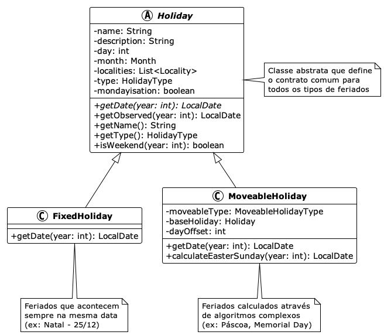

> **📖 Esta é uma série em 3 partes sobre paradigmas de programação:**
> - **Parte 1** (você está aqui): A Arte de Lidar com a Complexidade
> - **[Parte 2](https://notes.clementino.me/nem-tudo-eh-objeto-parte-2)**: Programação Orientada a Dados  
> - **[Parte 3](https://notes.clementino.me/nem-tudo-eh-objeto-parte-3)**: Aplicando Programação Orientada a Dados na Prática

## A Arte de Lidar com a Complexidade

Detalhes importam! É assim na vida ou no desenvolvimento de software. O
processo de projetar e construir sistemas de software está condicionado
indubitavelmente ao uso de linguagens: de software ou natural. Esta última é,
por essência, ambígua. Ambiguidade, por sua natureza, gera complexidade.

O ser humano utiliza diferentes estratégias para lidar com a complexidade:
matemáticos usam notações e fórmulas para expressar conceitos complexos,
médicos utilizam classificações como a Classificação Internacional de Doenças
(CID-10) para categorizar doenças, arquitetos criam plantas e blueprints para
representar estruturas tridimensionais em duas dimensões e gestores utilizam
organogramas e fluxogramas para mapear processos e hierarquias organizacionais.

Em seu livro *A Philosophy of Software Design*[^30], John Ousterhout propõe
duas abordagens para lidar com a complexidade no desenvolvimento de software. A
primeira consiste em *simplificar e tornar o código mais claro* por meio da
remoção de casos especiais e da utilização de identificadores consistentes. A
segunda abordagem é *encapsular a complexidade por meio de um design modular*,
no qual um sistema de software é dividido em módulos, como classes em uma
linguagem orientada a objetos, permitindo que os programadores trabalhem no
sistema sem se sentirem sobrecarregados com toda a sua complexidade de uma só
vez.

As abordagens propostas por Ousterhout estão intrinsecamente relacionadas com o
momento da escrita do código. Contudo, se considerarmos a fase de design,
podemos acrescentar uma terceira abordagem para lidar com a complexidade: os
modelos.

Modelos são uma representação abstrata de um sistema (de software) que nos
auxilia a compreender e simplificar a complexidade inerente. Eles nos permitem
visualizar e comunicar as diferentes partes e interações da aplicação,
facilitando o processo de planejamento e construção. Ao fornecer uma estrutura
clara e organizada, os modelos ajudam a reduzir a ambiguidade e a tornar a
solução mais compreensível.

Engana-se quem pensa que o uso de modelos é uma abordagem exclusiva do
desenvolvimento de software. Imagine um artista criando um origami de cisne. O
resultado final captura a essência elegante da ave — seu pescoço curvo, suas
asas dobradas, sua postura graciosa — mas deixa de lado detalhes desnecessários
como a textura das penas ou a cor dos olhos. Um origami não busca replicar
perfeitamente a realidade, mas sim extrair e representar apenas os aspectos
mais importantes e reconhecíveis.


Nas linguagens de programação os paradigmas são uma das ferramentas para lidar
com a complexidade. Eles foram pensados para capturar as nuances do "mundo real"
e mapeá-las em sistemas de software compreensíveis e funcionais. Assim como o
origami, cada paradigma oferece uma forma específica de "transformar" a
realidade em código, capturando os aspectos essenciais do domínio que estamos
modelando enquanto abstrai detalhes desnecessários.

Quando desenvolvemos software, não estamos tentando recriar a realidade em sua
totalidade — isso seria impossível e improdutivo. Em vez disso, utilizamos
paradigmas como ferramentas conceituais que nos permitem focar nos elementos
mais relevantes para resolver determinado problema, como um artista do origami.

## Panorama dos Paradigmas de Programação

Ao longo do tempo, diferentes paradigmas de programação surgiram para abordar
distintos tipos de problemas e formas de pensar sobre software. Cada um oferece
uma perspectiva única sobre como organizar código e estruturar soluções.

Um paradigma de programação influencia significativamente o design de uma
linguagem, embora linguagens modernas possam suportar múltiplos paradigmas. Em
outras palavras, um paradigma de programação define como os problemas são
resolvidos com código. Por outro lado, uma linguagem de programação é a
ferramenta que permite a implementação dessas soluções. Dado que uma linguagem
pode suportar um ou mais paradigmas, a partir da análise da adoção das
linguagens[^22], é possível inferir quais são os paradigmas mais utilizados.
Independente da metodologia adotada, acredito que o resultado dos paradigmas
mais utilizados seria *procedural, orientado a objetos e funcional*. Entretanto,
não necessariamente nessa ordem.


Os principais paradigmas de programação adotam diferentes abordagens para
resolver problemas, diferindo em aspectos como gerenciamento de estado,
estruturação de código e tratamento de complexidade. Mais adiante, apresentarei
também uma nova abordagem: uma *programação orientada a dados*.

🔧 **Procedural** → "Como fazer passo a passo"

- Divide o problema em funções menores
- Controle explícito do fluxo de execução
- Exemplos: C, Pascal, COBOL

🧬 **Orientado a Objetos** → "Quem faz o quê"  

- Modela entidades do mundo real como objetos
- Encapsula dados e comportamentos juntos
- Exemplos: Java, C#, Python

λ **Funcional** → "O que transformar"

- Trata computação como avaliação de funções
- Evita mudanças de estado e efeitos colaterais  
- Exemplos: Haskell, Lisp, Erlang

Existem diferentes formas para descrever e avaliar os diferentes paradigmas.
Todavia, muitas vezes basta uma sentença: seja *"tudo é objeto"* ao falarmos do
paradigma orientado a objetos ou *"tudo é função"* ao tratar o paradigma
funcional. Por outro lado, quando apresentarmos o paradigma da
*Programação Orientada a Dados (Data-Oriented Programming - DOP)*,
você observará que a DOP também bebe da fonte dos paradigmas funcional e
**orientado a objetos**.

## Fundamentos da Programação Orientada a Objetos

A Programação Orientada a Objetos (Object-Oriented Programming - OOP) deve a sua
ampla adoção a linguagens como *Java* e *C++*. Cabe ressaltar que Java não é uma
linguagem puramente orientada a objetos principalmente por conta de seus tipos
primitivos e os métodos estáticos (*static*) que pertencem à classe e não a um
objeto. Apesar de não ser uma linguagem estritamente orientada a objetos, o seu
uso extensivo na indústria de software contribuiu para popularizar os princípios
da OOP. Um exemplo de uma linguagem puramente orientada a objetos é o
Smalltalk[^25], onde tudo é tratado como objeto.

A OOP enfatiza a modelagem de sistemas por meio de objetos que possuem
propriedades e comportamentos, promovendo a reutilização de código e o
encapsulamento de dados. Dentre os seus princípios fundamentais podemos citar:

- **Encapsulamento**: Agrupa dados e métodos que operam sobre essas informações em uma única unidade (classe), controlando o acesso através de modificadores de visibilidade.
- **Herança**: Permite que classes derivem características de outras classes, promovendo reutilização de código.
- **Abstração**: Oculta detalhes de implementação complexos, expondo apenas interfaces necessárias.
- **Polimorfismo**: Permite que objetos de diferentes tipos sejam tratados através de uma interface comum.

Esses princípios permitem fazer uma analogia entre uma classe na OOP e um
organismo, onde o encapsulamento atua como a membrana celular que controla o que
entra e sai, a herança funciona como a transmissão genética de características
e o polimorfismo se assemelha à capacidade de diferentes organismos responderem
de forma especializada aos mesmos estímulos ambientais.

## Feriados: uma modelagem orientada a objetos

Para exemplificar o uso dos princípios da OOP vamos modelar um sistema
responsável por gerenciar feriados (`Holiday`). Acredito que o leitor saiba o que
é um feriado, contudo, existem certas especificidades sobre o domínio que
entendo importante explicitar:

- **Existem diferentes tipos de feriados**: Nacionais (Independência), religiosos (Natal, Ramadan), regionais (São João) e comerciais (Dia das mães/pais)[^1]

- **Os feriados podem ser fixos ou móveis**: Fixos acontecem sempre na mesma data (25/12) e os móveis são calculados através do calendário lunar (Páscoa), dia da semana (Memorial Day) ou baseado em outras celebrações (Sexta-Feira Santa)[^4]

- **Os feriados dependem de quais sistemas de calendário adotados**: Gregoriano (celebrações ocidentais), lunar islâmico (Ramadan "roda" 11 dias/ano), luni-solar judaico (Rosh Hashanah varia mas mantém sazonalidade)[^7]

- **Data agendada diferente da observada**: Feriado pode ter data oficial diferente da celebrada, como por exemplo, na estratégia de *"Mondayisation"* que move feriados de fim de semana para a segunda-feira[^10]

- **Diferentes regras de observância**: Alguns começam no pôr do sol anterior (judaicos/islâmicos), têm duração variável (Chanukah 8 dias), só aplicam em dias úteis e não duplicam benefícios[^15]

Para simplificar vamos considerar feriados segundo o calendário Gregoriano e com
uma duração fixa, ou seja, o feriado inicia e finaliza em uma data específica.

A modelagem da classe `Holiday` adota uma abordagem
hierárquica típica da OOP, onde uma classe abstrata define o contrato comum e as
características compartilhadas por todos os demais tipos de feriados. A classe
base encapsula propriedades essenciais como nome, descrição, localidades onde é
observado, tipo de feriado e regras de *"Mondayisation"* (transferência de feriados de fim de semana para segunda-feira), além de comportamentos comuns como o cálculo de data observada.

Um aspecto fundamental da OOP é que a classe `Holiday` encapsula seu estado
através da propriedade `date`, mantendo as regras de cálculo da data como
responsabilidade interna - a própria classe gerencia como calcular a data de um
feriado para cada ano, ocultando essa complexidade do código cliente. As
subclasses `FixedHoliday` e `MoveableHoliday` especializam a implementação do
método abstrato `getDate()`, onde feriados fixos simplesmente retornam a mesma
data anual, enquanto feriados móveis executam algoritmos complexos - desde
cálculos astronômicos para a Páscoa até regras baseadas em dias da semana ou
dependências de outros feriados.



A modelagem adota os princípios da programação orientada a objetos. O
**encapsulamento** é evidenciado pela classe abstrata `Holiday` que agrupa dados
(nome, descrição, localidades) e comportamentos (cálculo de datas, verificação
de fim de semana) em uma única unidade coesa, controlando o acesso através de
métodos públicos. A **herança** permite que `FixedHoliday` e `MoveableHoliday`
compartilhem características comuns da classe herdada, evitando duplicação de
código e estabelecendo uma hierarquia lógica entre os conceitos.

O **polimorfismo** é implementado através do método abstrato `getDate(int
year)`, onde cada subclasse fornece sua própria implementação específica -
feriados fixos retornam sempre a mesma data, enquanto os móveis executam
cálculos complexos, como o algoritmo astronômico para definir a data da Páscoa.
A **abstração** oculta a complexidade dos diferentes tipos de cálculo de datas
atrás de uma interface uniforme, permitindo que o código cliente trate todas essas celebrações de forma consistente, independentemente de serem fixas ou móveis. A
seguir temos um código explicitando o uso de cada um dos princípios da OOP.

```java
// Classe abstrata demonstrando encapsulamento e abstração
public abstract class Holiday {
    private String name;
    private String description;
    private List<Locality> localities;
    private HolidayType type;
    private boolean mondayisation;
    
    // Método abstrato para polimorfismo
    public abstract LocalDate getDate(int year);
    
    // Comportamento comum encapsulado
    public LocalDate getObserved(int year) {
        LocalDate actualDate = getDate(year);
        return mondayisation ? applyMondayisationRules(actualDate) : actualDate;
    }
    
    public boolean isWeekend(int year) {
        DayOfWeek dayOfWeek = getDate(year).getDayOfWeek();
        return dayOfWeek == DayOfWeek.SATURDAY || dayOfWeek == DayOfWeek.SUNDAY;
    }
}

// Herança: FixedHoliday especializa Holiday
public class FixedHoliday extends Holiday {
    private final int day;
    private final Month month;
    
    // Getters/setters removidos para melhorar legibilidade
    
    public int getDay() { return day; }
    public Month getMonth() { return month; }
    
    @Override
    public LocalDate getDate(int year) {
        return LocalDate.of(year, getMonth(), getDay());
    }
}

// Herança: MoveableHoliday com lógica complexa
public class MoveableHoliday extends Holiday {
    private final MoveableHolidayType moveableType;
    private final Holiday baseHoliday;
    private final int dayOffset;
    
    @Override
    public LocalDate getDate(int year) {
        return switch (moveableType) {
            case LUNAR_BASED -> calculateEasterSunday(year);
            case RELATIVE_TO_HOLIDAY -> baseHoliday.getDate(year).plusDays(dayOffset);
            case WEEKDAY_BASED -> calculateWeekdayBasedDate(year);
        };
    }
}

// Uso polimórfico - mesmo código para diferentes tipos
List<Holiday> holidays = List.of(
    new FixedHoliday("Christmas", "Birth of Christ", 25, Month.DECEMBER, 
                     localities, HolidayType.RELIGIOUS, false),
    new MoveableHoliday("Easter", "Resurrection of Christ", 
                        localities, HolidayType.RELIGIOUS, 
                        MoveableHolidayType.LUNAR_BASED, false)
);

// Polimorfismo em ação
for (Holiday holiday : holidays) {
    LocalDate date = holiday.getDate(2024); // Cada tipo calcula diferentemente
    System.out.println(holiday.getName() + ": " + date);
}
```

Apesar dos benefícios da modelagem orientada a objetos, a implementação
apresenta limitações inerentes ao paradigma e que podem comprometer a
integridade dos dados e a previsibilidade do sistema:

- **Lista mutável exposta:** O método `getLocalities()` retorna uma referência
direta à lista interna, permitindo que código externo modifique o estado do
objeto sem o controle da classe, o que pode levar a problemas difíceis de
rastrear

- **Estado mutável:** Os campos podem ser alterados após a criação do objeto
através de métodos *"setter"*, violando a expectativa de imutabilidade de um
feriado

- **Herança frágil:** Mudanças na classe base podem quebrar classes filhas de
forma inesperada, criando dependências implícitas e dificultando a manutenção do
código

- **Acoplamento temporal:** Métodos podem depender da ordem de chamada (ex:
`setDate()` antes de `calculateObserved()`), criando contratos implícitos que
não são expressos no sistema de tipos

- **Estados ilegais representáveis:** O sistema de tipos permite criar objetos
em estados inconsistentes, como um feriado observado (conceito que exploraremos no Artigo 2) onde a data observada é
anterior à data oficial

- **Concorrência problemática:** Objetos mutáveis compartilhados entre threads
requerem sincronização complexa, aumentando a possibilidade de deadlocks e
condições de corrida

Essas limitações são inerentes à OOP, onde o foco no encapsulamento de dados e
comportamento (métodos) pode inadvertidamente criar pontos de mutabilidade não
controladas. A Programação Orientada a Dados emerge como uma alternativa que
aborda diretamente esses problemas, priorizando a imutabilidade, a transparência
e a separação clara entre dados e operações.

---

> **🔗 Continue a leitura:**
> 
> Na **[Parte 2](https://notes.clementino.me/nem-tudo-eh-objeto-parte-2)** desta série, descobriremos como a Programação Orientada a Dados oferece uma alternativa elegante aos problemas identificados na OOP, apresentando quatro princípios fundamentais que tornam o código mais seguro e previsível.

[^1]: [Holiday](https://en.wikipedia.org/wiki/Holiday)
[^4]: [Moveable feast](https://en.wikipedia.org/wiki/Moveable_feast)
[^7]: [Islamic calendar](https://en.wikipedia.org/wiki/Islamic_calendar)
[^10]: [When a public holiday falls on a weekend](https://www.employment.govt.nz/leave-and-holidays/public-holidays/when-a-public-holiday-falls-on-a-weekend)
[^15]: [Religious Holidays](https://scl.cornell.edu/religiousholidays)
[^22]: [Stack Overflow Developer Survey 2025 - Most Popular Technologies](https://survey.stackoverflow.co/2025/technology#most-popular-technologies)
[^25]: [GNU Smalltalk](https://www.gnu.org/software/smalltalk/)
[^30]: [A Philosophy of Software Design - Book Review](https://blog.pragmaticengineer.com/a-philosophy-of-software-design-review/)
