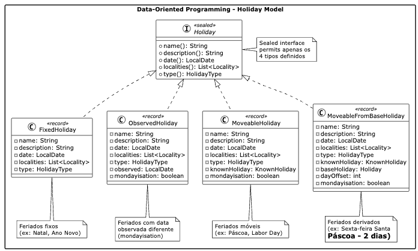

> **📖 Esta é uma série em 3 partes sobre paradigmas de programação:**
> - **[Parte 1](https://notes.clementino.me/nem-tudo-eh-objeto-parte-1)**: A Arte de Lidar com a Complexidade
> - **Parte 2** (você está aqui): Programação Orientada a Dados
> - **[Parte 3](https://notes.clementino.me/nem-tudo-eh-objeto-parte-3)**: Aplicando Programação Orientada a Dados na Prática
> 
> *Na Parte 1, exploramos como diferentes paradigmas lidam com complexidade e identificamos limitações da OOP. Agora vamos descobrir uma nova abordagem.*

## Programação Orientada a Dados: Uma Nova Perspectiva

A *Programação Orientada a Dados (Data-Oriented Programming)* - DOP representa
uma nova perspectiva de como pensamos a modelagem de software. Em vez de focar
em objetos que encapsulam dados e comportamento, o paradigma prioriza a
estrutura e o fluxo dos dados, separando *a informação do seu processamento*.

A ideia de uma programação orientada a dados foi proposta originalmente por
Brian Goetz[^16], posteriormente, Nicolai Parlog[^17] refinou o conceito,
organizando melhor os princípios fundamentais. Este artigo apresenta uma visão
prática dos conceitos propostos por Parlog.

### Princípios Fundamentais

A Programação Orientada a Dados se baseia em quatro princípios fundamentais[^18]
que, quando aplicados em conjunto, criam sistemas robustos, previsíveis e
mais fáceis de manter. A figura abaixo ilustra esses quatro princípios fundamentais. Exploraremos cada um usando como
exemplo a nossa implementação do sistema de gerenciamento de feriados.


#### 1. Dados são Imutáveis

A imutabilidade mitiga uma fonte comum de bugs: objetos modificados por
diferentes subsistemas sem comunicação adequada[^18]. Um exemplo é quando
armazenamos um objeto em um `HashSet` e depois alteramos um campo usado no cálculo
do hash code. Essa alteração torna o objeto "inalcançável" na estrutura, ou
seja, não será possível recuperar o objeto pelo seu *hash*. Este problema surge
quando dois subsistemas (o `HashSet` e o código que modifica o objeto) têm
acesso ao mesmo objeto, mas têm diferentes requisitos para modificá-lo e nenhuma
forma de comunicar essas necessidades. O exemplo a seguir apresenta o problema.

```java
// Problema conceitual: objeto mutável em HashSet
// Imagine uma classe Holiday mutável com método setDate()
var holidays = new HashSet<Holiday>();
var christmas = createMutableHoliday("Christmas", LocalDate.of(2024, 12, 25));
holidays.add(christmas);
// Se christmas.setDate(LocalDate.of(2024, 12, 24)) fosse chamado aqui:
// holidays.contains(christmas) retornaria false - objeto "perdido"
```

O remédio é simples: se nada pode mudar, tais erros não podem ocorrer. Quando
subsistemas se comunicam apenas com dados imutáveis, essa fonte comum de erros
desaparece. Todavia, a necessidade de representar mudanças de estado é inevitável.
Para mitigar esse tipo de problema, o primeiro princípio da DOP define que os
objetos sejam **transparentes** - seu estado interno deve ser acessível e
construível por meio de uma interface bem definida. Na prática, ser transparente
significa que a classe deve ter um método de acesso para cada campo e um
construtor que aceita valores para todos os campos, permitindo recriar uma
instância indistinguível da original. A seguir temos um exemplo de código
imutável e transparente.

```java
// Solução: record imutável e transparente
public record FixedHoliday(
    String name, String description, LocalDate date, 
    List<Locality> localities, HolidayType type
) implements Holiday {
    
    public FixedHoliday {
        Objects.requireNonNull(name, "Holiday name cannot be null");
        if (name.isBlank()) {
            throw new IllegalArgumentException("Holiday name cannot be blank");
        }
        // Defensive copying para imutabilidade profunda
        localities = List.copyOf(localities);
    }
}
```

Em Java, *Records[^32]* foram projetados para serem portadores transparentes e
imutáveis de dados. Eles atendem automaticamente aos requisitos de
transparência: campos final para cada componente, construtor que aceita e
atribui valores, métodos de acesso que os retornam, e implementações de `equals`
e `hashCode` baseadas nos dados. Além disso, o uso da técnica de *defensive
copying* (ex. `List.copyOf()`) previne modificações através de referências a
objetos mutáveis. Por fim, alterações no estado devem retornar novas instâncias,
mantendo a imutabilidade. A seguir temos um exemplo seguro do uso de um
`HashSet`.

```java
// Transformações retornam novas instâncias
public FixedHoliday withDate(LocalDate newDate) {
    return new FixedHoliday(name, description, newDate, localities, type);
}

public FixedHoliday withYear(int year) {
    return new FixedHoliday(name, description, date.withYear(year), localities, type);
}

// Uso seguro - impossível quebrar o HashSet
var holidays = new HashSet<Holiday>();
var christmas = new FixedHoliday("Christmas", "...", 25, Month.DECEMBER, LocalDate.of(2024, 12, 25), localities, type);
holidays.add(christmas);
var christmasEve = christmas.withDate(LocalDate.of(2024, 12, 24)); // Nova instância
holidays.contains(christmas); // Sempre true - objeto original inalterado
holidays.contains(christmasEve); // false - nova instância não está no set
```

#### 2. Modele os Dados, Todos os Dados, e Nada Além dos Dados

Este princípio enfatiza a criação de tipos específicos que representem fielmente
cada variação do domínio, evitando tipos genéricos com campos opcionais[^19].
Por exemplo, ao modelar feriados, poderíamos ter a tentação de criar um tipo
genérico que tente acomodar todas as variações:

- Feriados fixos têm uma data definida
- Feriados móveis têm um algoritmo de cálculo
- Feriados observados podem ter datas diferentes da oficial

Se usarmos um tipo genérico `GenericHoliday` para todos os casos, como realizado
na modelagem orientada a objetos, acabamos com campos que podem ser nulos e
regras implícitas sobre quais campos devem ou não estar preenchidos para cada
tipo de feriado. Isso torna o código frágil e propenso a erros, especialmente
pelo fato de não ser possível usar o compilador para nos ajudar a garantir que as
combinações de campos estejam corretas.

```java
// ANTES - Tipo genérico problemático
public record GenericHoliday(
    String name, LocalDate date,
    LocalDate observed,        // null para feriados fixos
    KnownHoliday knownHoliday, // null para feriados fixos  
    Holiday baseHoliday,       // null para não-derivados
    int dayOffset,             // irrelevante para feriados fixos
    boolean mondayisation      // nem sempre aplicável
) {}
```

Em um sistema (verdadeiramente) orientado a dados a modelagem deveria focar em
permitir estados válidos. Se um feriado fixo não precisa de algoritmo de
cálculo, o construtor deve garantir que isso seja o caso. Se nenhum feriado pode
ter tanto uma data fixa quanto um algoritmo móvel, isso deve ser prevenido.
Tipos precisos como esses não só simplificam o trabalho do desenvolvedor ao
eliminar a necessidade de validações complexas, mas também tornam o código mais
seguro e simples.

```java
// DEPOIS - Sealed interface com tipos específicos
public sealed interface Holiday permits FixedHoliday, MoveableHoliday, ObservedHoliday {

  String name();
  String description();
  LocalDate date();
  List<Locality> localities();
  HolidayType type();

  // Funcionalidade compartilhada
  default boolean isWeekend() {
    DayOfWeek dayOfWeek = date().getDayOfWeek();
    return dayOfWeek == DayOfWeek.SATURDAY || dayOfWeek == DayOfWeek.SUNDAY;
  }
}
```

Uma alternativa para alcançar o segundo princípio é por meio de *sealed
interfaces*[^26] para modelar alternativas e criar
*records* específicos para cada variação. Em vez de múltiplos campos com
requisitos mutuamente exclusivos ou condicionais, criamos uma *sealed interface*
para modelar as alternativas e a usamos como tipo para um campo obrigatório.
Cada record implementa exatamente os dados necessários para seu tipo específico,
eliminando campos irrelevantes, melhorando a legibilidade e tornando o código
mais fácil de manter. As funcionalidades compartilhadas podem ser implementadas
através de métodos *default* na interface, evitando repetição entre
implementações.

```java
// Cada tipo contém exatamente os dados necessários
public record FixedHoliday(
    String name, String description, int day, Month month, LocalDate date,
    List<Locality> localities, HolidayType type
) implements Holiday { }

public record MoveableHoliday(
    String name, String description, LocalDate date,
    List<Locality> localities, HolidayType type,
    KnownHoliday knownHoliday,    // Específico para feriados móveis
    boolean mondayisation         // Específico para feriados móveis
) implements Holiday { }
```

#### 3. Torne Estados Ilegais Irrepresentáveis

Este princípio garante que apenas combinações legais de dados possam ser
representadas no sistema[^20]. O mundo é caótico e toda regra parece ter uma
exceção - "todo feriado tem uma data fixa" rapidamente se torna "todo feriado
fixo tem uma data fixa, mas os móveis dependem de cálculos complexos, e
os observados podem ter datas diferentes da oficial". Quando modelamos isso de forma inadequada, podemos ficar
presos com estruturas que permitem estados inconsistentes.

Considere uma modelagem problemática para feriados que tenta acomodar todos os
tipos em uma única classe genérica. Esta abordagem apresenta vários problemas
fundamentais: campos opcionais desnecessários - um feriado fixo como o Natal não
precisa de feriado base (`baseHoliday`) ou uma quantidade de dias entre os
feriados (`dayOffset`) como para calcular a Sexta Feira Santa a partir da
Páscoa. Esse cuidado simples de tornar estados inconsistentes impossíveis evita
que:

- regras implícitas não sejam expressas no código
- validações fiquem espalhadas e precisem ser repetidas em vários pontos
- desenvolvedores fiquem confusos sobre quais campos são relevantes para cada situação

```java
// PROBLEMA: Estados ilegais são representáveis
public class BadHoliday {
    private String name;
    private LocalDate actualDate;
    private LocalDate observedDate;    // pode ser null
    private KnownHoliday knownType;    // pode ser null  
    private Holiday baseHoliday;       // pode ser null
    private int dayOffset;             // irrelevante para feriados fixos
    private boolean mondayisation;     // nem sempre aplicável
    
    // Permite criar: feriado fixo COM baseHoliday e dayOffset
    // Permite criar: feriado móvel SEM knownType  
    // Permite criar: feriado observado com observedDate anterior à actualDate
}
```

Um sistema focado em dados deve assegurar que apenas combinações legais dos
dados possam ser representadas. A estratégia segue três níveis progressivos de
proteção:

- primeiro, use tipos precisos (sealed interfaces e records) para que o
compilador impeça a criação de tipos inválidos;
- segundo, em situações onde dados são mutuamente exclusivos, evite múltiplos
campos opcionais criando records específicos para cada variação; 
- terceiro, quando uma propriedade não pode ser expressa pelo sistema de tipos,
valide no construtor o mais cedo possível, idealmente na fronteira entre o mundo
externo e seu sistema.

O código a seguir detalha os três níveis de proteção que podem ser usados para
evitar estados inválidos.

```java
// Exemplo completo dos 3 níveis de proteção
public sealed interface Holiday  // Nível 1: Tipos precisos
    permits FixedHoliday, ObservedHoliday, MoveableHoliday {
    String name();
    LocalDate date();
    List<Locality> localities();
}

// Nível 2: Records específicos para cada variação
public record FixedHoliday(String name, LocalDate date, List<Locality> localities) 
    implements Holiday { }

// Nível 3: Validação runtime para regras complexas
public record ObservedHoliday(
    String name, LocalDate date, List<Locality> localities,
    LocalDate observed, boolean mondayisation
) implements Holiday {
    
    public ObservedHoliday {
        Objects.requireNonNull(name, "Holiday name cannot be null");
        if (name.isBlank()) {
            throw new IllegalArgumentException("Holiday name cannot be blank");
        }
        
        // Regra complexa: mondayisation em fim de semana deve ajustar a data
        if (mondayisation) {
            DayOfWeek dayOfWeek = date.getDayOfWeek();
            boolean isWeekend = DayOfWeek.SATURDAY.equals(dayOfWeek) || DayOfWeek.SUNDAY.equals(dayOfWeek);
            boolean dateWasAdjusted = !date.equals(observed);
            
            if (isWeekend && !dateWasAdjusted) {
                throw new IllegalArgumentException(
                    "Weekend holiday must have adjusted observed date when mondayisation is enabled");
            }
        }
        
        localities = List.copyOf(localities); // Defensive copying
    }
}

// RESULTADO: Apenas estados legais são representáveis
var christmas = new FixedHoliday("Natal", "Nascimento de Cristo", 
                                25, Month.DECEMBER, LocalDate.of(2024, 12, 25),
                                List.of(Locality.NATIONAL), HolidayType.RELIGIOUS);
var easter = new MoveableHoliday("Páscoa", "Ressurreição de Cristo", 
                                LocalDate.of(2024, 3, 31), List.of(Locality.NATIONAL), 
                                HolidayType.RELIGIOUS, KnownHoliday.EASTER);
var newYear = new ObservedHoliday("Ano Novo", "Primeiro dia do ano", 
                                 LocalDate.of(2024, 1, 1), List.of(Locality.NATIONAL), 
                                 HolidayType.NATIONAL, LocalDate.of(2024, 1, 1), false);

// Estes são IMPOSSÍVEIS de criar:
// - FixedHoliday com knownHoliday
// - MoveableHoliday sem knownHoliday  
// - ObservedHoliday com observed anterior ao actual em fim de semana com mondayisation
```

#### 4. Separe Operações dos Dados

Este princípio mantém dados e comportamentos separados[^21], com records
contendo apenas estrutura e operações implementadas como funções puras em
classes dedicadas. Para manter os records livres de lógica de domínio não
trivial, as operações não devem ser implementadas neles, mas sim em subsistemas
dedicados. Esta abordagem previne classes com muitas responsabilidades e evita
que tipos centrais do domínio atraiam funcionalidades excessivas e se tornem
difíceis de manter, um problema comum na programação orientada a objetos onde
classes como `Holiday` acabariam acumulando dezenas de métodos para cálculo de
datas, formatação, validação, comparação e processamento.

```java
// Dados puros - apenas estrutura
public record FixedHoliday(String name, String description, int day, Month month, LocalDate date, 
                          List<Locality> localities, HolidayType type) implements Holiday { 
    
    public FixedHoliday {
        Objects.requireNonNull(month, "Month cannot be null");
        if (day < 1 || day > month.maxLength()) {
            throw new IllegalArgumentException("Invalid day for month: " + day);
        }
        if (date != null && (date.getDayOfMonth() != day || date.getMonth() != month)) {
            throw new IllegalArgumentException("Date must be consistent with day and month");
        }
        localities = List.copyOf(localities);
    }
}
public record MoveableHoliday(String name, String description, LocalDate date, 
                             List<Locality> localities, HolidayType type, 
                             KnownHoliday knownHoliday) implements Holiday { }

// Operações separadas - funções puras
public final class HolidayOperations {
    
    public static Holiday calculateDate(Holiday holiday, int year) {
        return switch (holiday) {
            case FixedHoliday fixed -> new FixedHoliday(
                fixed.name(), 
                fixed.description(), 
                LocalDate.of(year, fixed.month(), fixed.day()), 
                fixed.localities(), 
                fixed.type()
            );
            case MoveableHoliday moveable -> new MoveableHoliday(
                moveable.name(), 
                moveable.description(), 
                calculateMoveableDate(moveable, year), 
                moveable.localities(), 
                moveable.type(), 
                moveable.knownHoliday()
            );
            case ObservedHoliday observed -> calculateObservedDate(observed, year);
        };
    }
    
    // Pattern matching com record patterns
    public static String formatInfo(Holiday holiday) {
        return switch (holiday) {
            case FixedHoliday(var name, _, var day, var month, _, _, _) -> 
                "Fixo: " + name + " em " + day + "/" + month.getValue();
            case MoveableHoliday(var name, _, var date, _, _, var known) -> 
                "Móvel: " + name + " (" + known + ")";
            case ObservedHoliday(var name, _, _, _, _, var observed, _) -> 
                "Observado: " + name + " em " + observed;
        };
    }
    
    public static List<Holiday> getHolidaysForYear(List<Holiday> holidays, int year) {
        return holidays.stream()
            .map(holiday -> calculateDate(holiday, year))
            .toList();
    }
}

// Uso: operações como funções puras
var christmas = new FixedHoliday("Natal", date, RELIGIOUS);
var christmasIn2025 = HolidayOperations.calculateDate(christmas, 2025);
var info = HolidayOperations.formatInfo(christmas);
var allHolidays2025 = HolidayOperations.getHolidaysForYear(holidays, 2025);
```

A implementação dessas operações utiliza *pattern matching* com `switch`. O
switch implementa a seleção de qual código deve ser executado para um
determinado tipo: se tivéssemos definido `calculateDate` na interface `Holiday`
e chamado `holiday.calculateDate(year)`, o runtime decidiria qual implementação
executar.  Com `switch` fazemos isso manualmente, permitindo não definir métodos
na interface e mantendo os dados puros. O uso de *Pattern matching* com *record
patterns* (Java 21+) torna o código ainda mais expressivo, permitindo
desconstruir records diretamente durante a correspondência de padrões, como por
exemplo, `case FixedHoliday(var name, var date, ...)` ao invés de ser necessário
fazer *casting* manual.

Agora que detalhamos os quatro princípios fundamentais da DOP vamos analisar
como eles podem ser utilizados para modelar o nosso sistema de gestão de
feriados.

### Feriados: uma modelagem orientada a dados

A modelagem DOP apresenta uma estrutura fundamentalmente diferente da OOP. A
*sealed interface* `Holiday` define apenas o contrato de dados (métodos de
acesso), enquanto cada record implementa exatamente os dados necessários para
seu tipo específico. Observe como não há herança de implementação - cada record
é independente e contém apenas os dados relevantes para seu contexto,
eliminando campos desnecessários e garantindo que estados ilegais sejam
representáveis pelo sistema de tipos.



Assim como fizemos uma analogia de uma classe na OOP com um organismo vivo,
podemos comparar a DOP com uma linha de montagem industrial moderna. Nesta
analogia, os dados imutáveis são como peças padronizadas que fluem pela linha
sem serem alteradas em sua essência, as operações funcionam como estações de
trabalho especializadas que processam essas peças de forma previsível. Por
outro lado, o *pattern matching* atua como um sistema de classificação
automática que direciona cada peça para a estação correta. Por fim, a separação
entre dados e operações espelha a divisão clara entre matéria-prima e processos
de fabricação. Esta analogia faz sentido porque, tanto a DOP quanto uma linha
de montagem, priorizam eficiência, previsibilidade, especialização de funções e
fluxo controlado de informação, onde cada componente tem uma responsabilidade
bem definida e o resultado final é construído através da composição ordenada de
operações simples e confiáveis.

### Programação orientada a dados em Java

A linguagem Java evoluiu com algumas funcionalidades que isoladas podem não ser
percebidas como relevantes, porém, em conjunto, servem para suportar os
princípios da Programação Orientada a Dados. A seguir listamos algumas
funcionalidades da linguagem que facilitam a implementação dos quatro princípios
fundamentais:

| Funcionalidade | Versão Java | Descrição | Uso em DOP |
|---|---|---|---|
| **Records**[^32] | Java 14 (Preview) Java 16 (Final) | Classes imutáveis concisas com equals, hashCode e toString automáticos | Modelagem de dados imutáveis |
| **Sealed Classes/Interfaces**[^26] | Java 15 (Preview) Java 17 (Final) | Controle sobre quais classes podem estender/implementar | Estados ilegais irrepresentáveis |
| **Pattern Matching (instanceof)**[^27] | Java 14 (Preview) Java 16 (Final) | Verificação de tipo e cast em uma operação | Operações sobre dados |
| **Pattern Matching (switch)**[^28] | Java 17 (Preview) Java 21 (Final) | Switch expressions com pattern matching | Processamento de tipos selados |
| **Text Blocks**[^29] | Java 13 (Preview) Java 15 (Final) | Strings multilinha mais legíveis | Documentação e exemplos |

---

> **🔗 Continue a leitura:**
> 
> Na **[Parte 3](https://notes.clementino.me/nem-tudo-eh-objeto-parte-3)** desta série, veremos quando aplicar a DOP na prática, com exemplos reais incluindo APIs REST e funções AWS Lambda, além de orientações para escolher o paradigma adequado para cada situação.

[^16]: [Data-Oriented Programming in Java](https://www.infoq.com/articles/data-oriented-programming-java/)
[^17]: [Data-Oriented Programming in Java - Version 1.1](https://inside.java/2024/05/23/dop-v1-1-introduction/)
[^18]: [Model data immutably and transparently - DOP v1.1](https://inside.java/2024/05/27/dop-v1-1-immutable-transparent-data/)
[^19]: [Model the data, the whole data, and nothing but the data - DOP v1.1](https://inside.java/2024/05/29/dop-v1-1-model-data/)
[^20]: [Make illegal states unrepresentable - DOP v1.1](https://inside.java/2024/06/03/dop-v1-1-illegal-states/)
[^21]: [Separate operations from data - DOP v1.1](https://inside.java/2024/06/05/dop-v1-1-separate-operations/)
[^26]: [JEP 409: Sealed Classes](https://openjdk.org/jeps/409)
[^27]: [JEP 394: Pattern Matching for instanceof](https://openjdk.org/jeps/394)
[^28]: [JEP 441: Pattern Matching for switch](https://openjdk.org/jeps/441)
[^29]: [JEP 378: Text Blocks](https://openjdk.org/jeps/378)
[^32]: [JEP 395: Records](https://openjdk.org/jeps/395)
