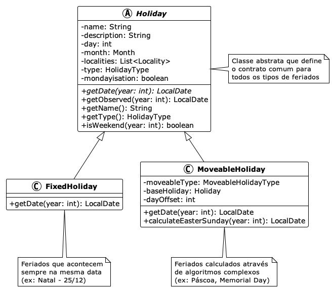

## A arte de Lidar com a Complexidade

Detalhes importam! É assim na vida ou no desenvolvimento de software. O processo
de projetar e construir sistemas de software está condicionado indubitavelmente
ao uso de linguagens: de software ou natural. Essa última é, por essência,
ambígua. Ambiguidade, por sua natureza, gera complexidade.

Em diferentes áreas do conhecimento o ser humano utiliza diferentes
ferramentas para lidar com a complexidade, por exemplo: matemáticos usam
notações e fórmulas para expressar conceitos complexos de forma concisa, médicos
empregam classificações diagnósticas como CID-10 para categorizar doenças,
arquitetos criam plantas e blueprints para representar estruturas
tridimensionais em duas dimensões, e gestores utilizam organogramas e
fluxogramas para mapear processos e hierarquias organizacionais.

Em seu livro *A Philosophy of Software Design*[^24], John Ousterhout discute
duas maneiras principais de lidar com a complexidade no desenvolvimento de
software. A primeira consiste em *simplificar e tornar o código mais claro* por
meio da remoção de casos especiais e da utilização de identificadores
consistentes.

A segunda abordagem é *encapsular a complexidade por meio de um design modular*,
no qual um sistema de software é dividido em módulos, como classes em uma
linguagem orientada a objetos, permitindo que os programadores trabalhem no
sistema sem se sentirem sobrecarregados com toda a sua complexidade de uma só
vez. As abordagens propostas por Ousterhout estão relacionadas intrinsecamente
com o momento da escrita do código, contudo, se considerarmos a fase de
design, eu acrescentaria uma terceira abordagem para lidar com a complexidade:
os modelos.

Modelos são uma representação abstrata de um sistema (de software) que nos
auxilia a compreender e simplificar a complexidade inerente. Eles nos permitem
visualizar e comunicar as diferentes partes e interações do sistema, facilitando
o processo de planejamento e construção. Ao fornecer uma estrutura clara e
organizada, os modelos ajudam a reduzir a ambiguidade e a tornar o sistema mais
compreensível.

Engana-se quem pensa que o uso de modelos é uma abordagem exclusiva do
desenvolvimento de software. Imagine um artista origami criando um origami de
cisne. O resultado final captura a essência elegante da ave — seu pescoço
curvado, suas asas dobradas, sua postura graciosa — mas deixa de lado detalhes
desnecessários como a textura das penas ou a cor dos olhos. Um origami não busca
replicar perfeitamente a realidade, mas sim extrair e representar apenas os
aspectos mais importantes e reconhecíveis.


Nas linguagens de programação uma das maneiras para lidar com a complexidade é
aderir a um ou mais paradigmas de programação. Os paradigmas foram pensados
para nos ajudar a reduzir a complexidade do mundo real e mapeá-la em sistemas de
software compreensíveis e funcionais. Assim como o origami, cada paradigma
oferece uma forma específica de "transformar" a realidade em código, capturando
os aspectos essenciais do domínio que estamos modelando enquanto abstrai
detalhes desnecessários.

Quando desenvolvemos software, não estamos tentando recriar o mundo real em sua
totalidade — isso seria impossível e improdutivo. Em vez disso, utilizamos
paradigmas como ferramentas conceituais que nos permitem focar nos elementos
mais relevantes para resolver determinado problema, como um artista do origami.

## Panorama dos Paradigmas de Programação

Ao longo do tempo diferentes paradigmas de programação emergiram para abordar
distintos tipos de problemas e formas de pensar sobre software. Cada um oferece
uma perspectiva única sobre como organizar código e estruturar soluções.

Um paradigma de programação influencia significativamente o design de uma linguagem, embora linguagens modernas possam suportar múltiplos paradigmas. Em outras palavras, um paradigma de programação define como os
problemas são resolvidos com código. Por outro lado, uma linguagem de
programação é a ferramenta que permite a implementação dessas soluções. Dado que
uma linguagem pode suportar um ou mais paradigmas, a partir da análise da adoção
das linguagens[^23], é possível inferir quais são os paradigmas mais utilizados.
Independente da metodologia adotada, acredito que o resultado dos paradigmas
mais utilizados seria *procedural, orientado a objetos e funcional*, entretanto,
não necessariamente nessa ordem.


A tabela a seguir faz uma breve comparação entre os principais paradigmas
adotados pelo mercado, ao mesmo tempo que os compara com uma nova abordagem, de
uma programação orientada a dados, que explicarei com mais detalhes um pouco
mais a frente.

| Aspecto | Procedural | Orientado a Objetos | Funcional | Orientado a Dados |
|---------|------------|-------------------|-----------|------------------|
| **Foco Principal** | Sequência de procedimentos | Objetos e suas interações | Funções e transformações | Estrutura e fluxo de dados |
| **Gerenciamento de Estado** | Estado global/local mutável | Estado encapsulado em objetos | Estado imutável | Dados imutáveis |
| **Reutilização** | Funções e módulos | Herança e composição | Funções puras | Estruturas de dados |
| **Testabilidade** | Moderada (dependências) | Boa (isolamento) | Excelente (pureza) | Excelente (imutabilidade) |
| **Tratamento de Complexidade** | Decomposição em funções | Abstração e encapsulamento | Composição de funções | Separação dados/comportamento |

Existem diferentes formas para descrever e avaliar os diferentes paradigmas.
Todavia, muitas vezes basta uma sentença: seja *"tudo é objeto"* ao falarmos
do paradigma orientado a objetos ou *"tudo é função"* ao tratar o paradigma
funcional. Por outro lado, quando apresentarmos o paradigma da *Programação Orientada a Dados (Data-Oriented Programming - DOP)*, você observará que a DOP também bebe da fonte dos paradigmas funcional e orientado a objetos.

## Fundamentos da Programação Orientada a Objetos

A Programação Orientada a Objetos (Object-Oriented Programming - OOP) deve a sua ampla adoção a linguagens
como *Java* e *C++*. Cabe ressaltar que Java não é uma linguagem puramente
orientada a objetos principalmente por conta de seus tipos primitivos e os
métodos estáticos (*static*) que pertencem à classe e não a um objeto. Apesar de
não ser uma linguagem estritamente orientada a objetos o seu uso extensivo na
indústria de software contribuiu para popularizar os princípios da OOP. Um
exemplo de uma linguagem puramente orientada a objetos é o Smalltalk[^25], onde
tudo é tratado como objeto.

A OOP enfatiza a modelagem de sistemas por meio de objetos que possuem
propriedades e comportamentos, promovendo a reutilização de código e o
encapsulamento de dados. Dentre os seus princípios fundamentais podemos citar:

- **Encapsulamento**: Agrupa dados e métodos que operam sobre esses dados em uma única unidade (classe), controlando o acesso através de modificadores de visibilidade.
- **Herança**: Permite que classes derivem características de outras classes, promovendo reutilização de código.
- **Abstração**: Oculta detalhes de implementação complexos, expondo apenas interfaces necessárias.
- **Polimorfismo**: Permite que objetos de diferentes tipos sejam tratados através de uma interface comum.

Esses princípios permitem fazer uma analogia entre uma classe na OOP e um
organismo, onde o encapsulamento atua como a membrana celular que controla o que
entra e sai, a herança funciona como a transmissão genética de características,
e o polimorfismo se assemelha à capacidade de diferentes organismos responderem
de forma especializada aos mesmos estímulos ambientais.

## Feriados: uma modelagem orientada a objetos

Para exemplificar o uso dos princípios da OOP vamos modelar um sistema
responsável por gerenciar feriados (`Holiday`). Acredito que o leitor saiba o que
é um feriado, contudo, existem certas especificidades sobre o domínio que
entendo importante explicitar:

- **Existem diferentes tipos de feriados**: Nacionais (Independência), religiosos (Natal, Ramadan), regionais (São João) e comerciais (Dia das mães/pais)[^1]

- **Os feriados podem ser fixos ou móveis**: Fixos acontecem sempre na mesma data (25/12) e os móveis são calculados através do calendário lunar (Páscoa), dia da semana (Memorial Day) ou baseado em outros feriados (Sexta-Feira Santa)[^4]

- **Os feriados dependem de quais sistemas de calendário adotados**: Gregoriano (feriados ocidentais), lunar islâmico (Ramadan "roda" 11 dias/ano), luni-solar judaico (Rosh Hashanah varia mas mantém sazonalidade)[^7]

- **Data agendada diferente da observada**: Feriado pode ter data oficial diferente da celebrada, como por exemplo, na estratégia de *"Mondayisation"* que move feriados de fim de semana para a segunda-feira[^10]

- **Diferentes regras de observância**: Alguns começam no pôr do sol anterior (judaicos/islâmicos), têm duração variável (Chanukah 8 dias), só aplicam em dias úteis e não duplicam benefícios[^15]

Para simplificar vamos considerar feriados segundo o calendário Gregoriano e com
uma duração fixa, ou seja, o feriado inicia e finaliza em uma data específica.

A modelagem da classe `Holiday` (veja diagrama abaixo) adota uma abordagem
hierárquica típica da OOP, onde uma classe abstrata define o contrato comum e as
características compartilhadas por todos os demais tipos de feriados. A classe
base encapsula propriedades essenciais como nome, descrição, localidades onde é
observado, tipo de feriado e regras de *"Mondayisation"* (transferência de feriados de fim de semana para segunda-feira), além de comportamentos comuns como o cálculo de data observada.

Um aspecto fundamental da OOP é que a classe `Holiday` encapsula seu estado
através da propriedade `date`, mantendo as regras de cálculo da data como
responsabilidade interna - a própria classe gerencia como calcular a data de um
feriado para cada ano, ocultando essa complexidade do código cliente. As
subclasses `FixedHoliday` e `MoveableHoliday` especializam a implementação do
método abstrato `getDate()`, onde feriados fixos simplesmente retornam a mesma
data anual, enquanto feriados móveis executam algoritmos complexos - desde
cálculos astronômicos para a Páscoa até regras baseadas em dias da semana ou
dependências de outros feriados.



A modelagem adota os princípios da programação orientada a objetos. O
**encapsulamento** é evidenciado pela classe abstrata `Holiday` que agrupa dados
(nome, descrição, localidades) e comportamentos (cálculo de datas, verificação
de fim de semana) em uma única unidade coesa, controlando o acesso através de
métodos públicos. A **herança** permite que `FixedHoliday` e `MoveableHoliday`
compartilhem características comuns da classe herdada, evitando duplicação de
código e estabelecendo uma hierarquia lógica entre os conceitos.

O **polimorfismo** é implementado através do método abstrato `getDate(int
year)`, onde cada subclasse fornece sua própria implementação específica -
feriados fixos retornam sempre a mesma data, enquanto feriados móveis executam
cálculos complexos, como o algoritmo astronômico para definir a data da Páscoa.
A **abstração** oculta a complexidade dos diferentes tipos de cálculo de datas
atrás de uma interface uniforme, permitindo que o código cliente trate todos os
feriados de forma consistente, independentemente de serem fixos ou móveis. A
seguir temos um código explicitando o uso de cada um dos princípios da OOP.

```java
// Classe abstrata demonstrando encapsulamento e abstração
public abstract class Holiday {
    private String name;
    private String description;
    private List<Locality> localities;
    private HolidayType type;
    private boolean mondayisation;
    
    // Método abstrato para polimorfismo
    public abstract LocalDate getDate(int year);
    
    // Comportamento comum encapsulado
    public LocalDate getObserved(int year) {
        LocalDate actualDate = getDate(year);
        return mondayisation ? applyMondayisationRules(actualDate) : actualDate;
    }
    
    public boolean isWeekend(int year) {
        DayOfWeek dayOfWeek = getDate(year).getDayOfWeek();
        return dayOfWeek == DayOfWeek.SATURDAY || dayOfWeek == DayOfWeek.SUNDAY;
    }
}

// Herança: FixedHoliday especializa Holiday
public class FixedHoliday extends Holiday {
    private final int day;
    private final Month month;
    
    // Getters/setters removidos para melhorar legibilidade
    
    public int getDay() { return day; }
    public Month getMonth() { return month; }
    
    @Override
    public LocalDate getDate(int year) {
        return LocalDate.of(year, getMonth(), getDay());
    }
}

// Herança: MoveableHoliday com lógica complexa
public class MoveableHoliday extends Holiday {
    private final MoveableHolidayType moveableType;
    private final Holiday baseHoliday;
    private final int dayOffset;
    
    @Override
    public LocalDate getDate(int year) {
        return switch (moveableType) {
            case LUNAR_BASED -> calculateEasterSunday(year);
            case RELATIVE_TO_HOLIDAY -> baseHoliday.getDate(year).plusDays(dayOffset);
            case WEEKDAY_BASED -> calculateWeekdayBasedDate(year);
        };
    }
}

// Uso polimórfico - mesmo código para diferentes tipos
List<Holiday> holidays = List.of(
    new FixedHoliday("Christmas", "Birth of Christ", 25, Month.DECEMBER, 
                     localities, HolidayType.RELIGIOUS, false),
    new MoveableHoliday("Easter", "Resurrection of Christ", 
                        localities, HolidayType.RELIGIOUS, 
                        MoveableHolidayType.LUNAR_BASED, false)
);

// Polimorfismo em ação
for (Holiday holiday : holidays) {
    LocalDate date = holiday.getDate(2024); // Cada tipo calcula diferentemente
    System.out.println(holiday.getName() + ": " + date);
}
```

Apesar dos benefícios da modelagem orientada a objetos, a implementação
apresenta limitações inerentes ao paradigma e que podem comprometer a
integridade dos dados e a previsibilidade do sistema:

- **Lista mutável exposta:** O método `getLocalities()` retorna uma referência
direta à lista interna, permitindo que código externo modifique o estado do
objeto sem o controle da classe, o que pode levar a problemas difíceis de
rastrear

- **Estado mutável:** Os campos podem ser alterados após a criação do objeto
através de métodos *"setter"*, violando a expectativa de imutabilidade de um
feriado

- **Herança frágil:** Mudanças na classe base podem quebrar classes filhas de
forma inesperada, criando dependências implícitas e dificultando a manutenção do
código

- **Acoplamento temporal:** Métodos podem depender da ordem de chamada (ex:
`setDate()` antes de `calculateObserved()`), criando contratos implícitos que
não são expressos no sistema de tipos

- **Estados ilegais representáveis:** O sistema de tipos permite criar objetos
em estados inconsistentes, como um `ObservedHoliday` onde a data observada é
anterior à data oficial

- **Concorrência problemática:** Objetos mutáveis compartilhados entre threads
requerem sincronização complexa, aumentando a possibilidade de deadlocks e
condições de corrida

Essas limitações são inerentes à OOP, onde o foco no encapsulamento de dados e
comportamento (métodos) pode inadvertidamente criar pontos de mutabilidade não
controladas. A Programação Orientada a Dados emerge como uma alternativa que
aborda diretamente esses problemas, priorizando a imutabilidade, a transparência
dos dados e a separação clara entre dados e operações.

## Programação Orientada a Dados: Uma Nova Perspectiva

A *Programação Orientada a Dados (Data-Oriented Programming)* - DOP representa
uma nova perspectiva de como pensamos a modelagem de software. Em vez de focar
em objetos que encapsulam dados e comportamento, o paradigma prioriza a
estrutura e o fluxo dos dados, separando *a informação do seu processamento*.

A ideia de uma programação orientada a dados foi proposta originalmente por
Brian Goetz[^16], posteriormente, Nicolai Parlog[^17] refinou o conceito,
organizando melhor os princípios fundamentais. Este artigo apresenta uma visão
prática dos conceitos propostos por Parlog.

## Princípios Fundamentais

A Programação Orientada a Dados se baseia em quatro princípios fundamentais[^18]
que, quando aplicados em conjunto, criam sistemas robustos, previsíveis e
potencialmente mais fáceis de manter. A figura abaixo ilustra esses quatro princípios fundamentais. Exploraremos cada um usando como
exemplo a nossa implementação do sistema de gerenciamento de feriados.


#### 1. Dados são Imutáveis

A imutabilidade mitiga uma fonte comum de bugs: objetos modificados por
diferentes subsistemas sem comunicação adequada[^19]. Um exemplo é quando
armazenamos um objeto em um `HashSet` e depois alteramos um campo usado no cálculo
do hash code. Essa alteração torna o objeto "inalcançável" na estrutura, ou
seja, não será possível recuperar o objeto pelo seu *hash*. Este problema surge
quando dois subsistemas (o `HashSet` e o código que modifica o objeto) têm
acesso ao mesmo objeto, mas têm diferentes requisitos para modificá-lo e nenhuma
forma de comunicar essas necessidades. O exemplo a seguir apresenta o problema.

```java
// Problema conceitual: objeto mutável em HashSet
// Imagine uma classe Holiday mutável com método setDate()
var holidays = new HashSet<Holiday>();
var christmas = createMutableHoliday("Christmas", LocalDate.of(2024, 12, 25));
holidays.add(christmas);
// Se christmas.setDate(LocalDate.of(2024, 12, 24)) fosse chamado aqui:
// holidays.contains(christmas) retornaria false - objeto "perdido"
```

O remédio é simples: se nada pode mudar, tais erros não podem ocorrer. Quando
subsistemas se comunicam apenas com dados imutáveis, essa fonte comum de erros
desaparece. Todavia, a necessidade de representar mudanças de estado é inevitável.
Para mitigar esse tipo de problema, o primeiro princípio da DOP define que os
objetos sejam **transparentes** - seu estado interno deve ser acessível e
construível por meio de uma interface bem definida. Na prática, ser transparente
significa que a classe deve ter um método de acesso para cada campo e um
construtor que aceita valores para todos os campos, permitindo recriar uma
instância indistinguível da original. A seguir temos um exemplo de código
imutável e transparente.

```java
// Solução: record imutável e transparente
public record FixedHoliday(
    String name, String description, LocalDate date, 
    List<Locality> localities, HolidayType type
) implements Holiday {
    
    public FixedHoliday {
        Objects.requireNonNull(name, "Holiday name cannot be null");
        if (name.isBlank()) {
            throw new IllegalArgumentException("Holiday name cannot be blank");
        }
        // Defensive copying para imutabilidade profunda
        localities = List.copyOf(localities);
    }
}
```

Em Java, *Records[^24]* foram projetados para serem portadores transparentes e
imutáveis de dados. Eles atendem automaticamente aos requisitos de
transparência: campos final para cada componente, construtor que aceita e
atribui valores, métodos de acesso que os retornam, e implementações de `equals`
e `hashCode` baseadas nos dados. Além disso, o uso da técnica de *defensive
copying* (ex. `List.copyOf()`) previne modificações através de referências a
objetos mutáveis. Por fim, alterações no estado devem retornar novas instâncias,
mantendo a imutabilidade. A seguir temos um exemplo seguro do uso de um
`HashSet`.

```java
// Transformações retornam novas instâncias
public FixedHoliday withDate(LocalDate newDate) {
    return new FixedHoliday(name, description, newDate, localities, type);
}

public FixedHoliday withYear(int year) {
    return new FixedHoliday(name, description, date.withYear(year), localities, type);
}

// Uso seguro - impossível quebrar o HashSet
var holidays = new HashSet<Holiday>();
var christmas = new FixedHoliday("Christmas", "...", 25, Month.DECEMBER, LocalDate.of(2024, 12, 25), localities, type);
holidays.add(christmas);
var christmasEve = christmas.withDate(LocalDate.of(2024, 12, 24)); // Nova instância
holidays.contains(christmas); // Sempre true - objeto original inalterado
holidays.contains(christmasEve); // false - nova instância não está no set
```

#### 2. Modele os Dados, Todos os Dados, e Nada Além dos Dados

Este princípio enfatiza a criação de tipos específicos que representem fielmente
cada variação do domínio, evitando tipos genéricos com campos opcionais[^20].
Por exemplo, ao modelar feriados, poderíamos ter a tentação de criar um tipo
genérico que tente acomodar todas as variações:

- Feriados fixos têm uma data definida
- Feriados móveis têm um algoritmo de cálculo
- Feriados observados podem ter datas diferentes da oficial

Se usarmos um tipo genérico `GenericHoliday` para todos os casos, como realizado
na modelagem orientada a objetos, acabamos com campos que podem ser nulos e
regras implícitas sobre quais campos devem ou não estar preenchidos para cada
tipo de feriado. Isso torna o código frágil e propenso a erros, especialmente
pelo fato de não ser possível usar o compilador para nos ajudar a garantir que as
combinações de campos estejam corretas.

```java
// ANTES - Tipo genérico problemático
public record GenericHoliday(
    String name, LocalDate date,
    LocalDate observed,        // null para feriados fixos
    KnownHoliday knownHoliday, // null para feriados fixos  
    Holiday baseHoliday,       // null para não-derivados
    int dayOffset,             // irrelevante para feriados fixos
    boolean mondayisation      // nem sempre aplicável
) {}
```

Em um sistema (verdadeiramente) orientado a dados a modelagem deveria focar em
permitir estados válidos. Se um feriado fixo não precisa de algoritmo de
cálculo, o construtor deve garantir que isso seja o caso. Se nenhum feriado pode
ter tanto uma data fixa quanto um algoritmo móvel, isso deve ser prevenido.
Tipos precisos como esses não só simplificam o trabalho do desenvolvedor ao
eliminar a necessidade de validações complexas, mas também tornam o código mais
seguro e simples.

```java
// DEPOIS - Sealed interface com tipos específicos
public sealed interface Holiday permits FixedHoliday, MoveableHoliday, ObservedHoliday {

  String name();
  String description();
  LocalDate date();
  List<Locality> localities();
  HolidayType type();

  // Funcionalidade compartilhada
  default boolean isWeekend() {
    DayOfWeek dayOfWeek = date().getDayOfWeek();
    return dayOfWeek == DayOfWeek.SATURDAY || dayOfWeek == DayOfWeek.SUNDAY;
  }
}
```

Uma alternativa para alcançar o segundo princípio é por meio de *sealed
interfaces*[^26] para modelar alternativas e criar
*records* específicos para cada variação. Em vez de múltiplos campos com
requisitos mutuamente exclusivos ou condicionais, criamos uma *sealed interface*
para modelar as alternativas e a usamos como tipo para um campo obrigatório.
Cada record implementa exatamente os dados necessários para seu tipo específico,
eliminando campos irrelevantes, melhorando a legibilidade e tornando o código
mais fácil de manter. As funcionalidades compartilhadas podem ser implementadas
através de métodos *default* na interface, evitando repetição entre
implementações.

```java
// Cada tipo contém exatamente os dados necessários
public record FixedHoliday(
    String name, String description, int day, Month month, LocalDate date,
    List<Locality> localities, HolidayType type
) implements Holiday { }

public record MoveableHoliday(
    String name, String description, LocalDate date,
    List<Locality> localities, HolidayType type,
    KnownHoliday knownHoliday,    // Específico para feriados móveis
    boolean mondayisation         // Específico para feriados móveis
) implements Holiday { }
```

#### 3. Torne Estados Ilegais Irrepresentáveis

Este princípio garante que apenas combinações legais de dados possam ser
representadas no sistema[^21]. O mundo é caótico e toda regra parece ter uma
exceção - "todo feriado tem uma data fixa" rapidamente se torna "todo feriado
fixo tem uma data fixa, mas feriados móveis dependem de cálculos complexos, e
feriados observados podem ter datas diferentes da oficial". Quando modelamos isso de forma inadequada, podemos ficar
presos com estruturas que permitem estados inconsistentes.

Considere uma modelagem problemática para feriados que tenta acomodar todos os
tipos em uma única classe genérica. Esta abordagem apresenta vários problemas
fundamentais: campos opcionais desnecessários - um feriado fixo como o
Natal não precisa de feriado base (`baseHoliday`) ou uma quantidade de dias
entre os feriados (`dayOffset`) como para calcular a Sexta Feira Santa a partir
da Páscoa. Esse cuidado simples de tornar estados inconsistentes impossíveis evita que:

- regras implícitas não sejam expressas no código
- validações fiquem espalhadas e precisem ser repetidas em vários pontos
- desenvolvedores fiquem confusos sobre quais campos são relevantes para cada situação

```java
// PROBLEMA: Estados ilegais são representáveis
public class BadHoliday {
    private String name;
    private LocalDate actualDate;
    private LocalDate observedDate;    // pode ser null
    private KnownHoliday knownType;    // pode ser null  
    private Holiday baseHoliday;       // pode ser null
    private int dayOffset;             // irrelevante para feriados fixos
    private boolean mondayisation;     // nem sempre aplicável
    
    // Permite criar: feriado fixo COM baseHoliday e dayOffset
    // Permite criar: feriado móvel SEM knownType  
    // Permite criar: feriado observado com observedDate anterior à actualDate
}
```

Um sistema focado em dados deve assegurar que apenas combinações legais dos
dados possam ser representadas. A estratégia segue três níveis progressivos de
proteção:

- primeiro, use tipos precisos (sealed interfaces e records) para que o
compilador impeça a criação de tipos inválidos;
- segundo, em situações onde dados são mutuamente exclusivos, evite múltiplos
campos opcionais criando records específicos para cada variação; 
- terceiro, quando uma propriedade não pode ser expressa pelo sistema de tipos,
valide no construtor o mais cedo possível, idealmente na fronteira entre o mundo
externo e seu sistema.

O código a seguir detalha os três níveis de proteção que podem ser usados para
evitar estados inválidos.

```java
// Exemplo completo dos 3 níveis de proteção
public sealed interface Holiday  // Nível 1: Tipos precisos
    permits FixedHoliday, ObservedHoliday, MoveableHoliday {
    String name();
    LocalDate date();
    List<Locality> localities();
}

// Nível 2: Records específicos para cada variação
public record FixedHoliday(String name, LocalDate date, List<Locality> localities) 
    implements Holiday { }

// Nível 3: Validação runtime para regras complexas
public record ObservedHoliday(
    String name, LocalDate date, List<Locality> localities,
    LocalDate observed, boolean mondayisation
) implements Holiday {
    
    public ObservedHoliday {
        Objects.requireNonNull(name, "Holiday name cannot be null");
        if (name.isBlank()) {
            throw new IllegalArgumentException("Holiday name cannot be blank");
        }
        
        // Regra complexa: mondayisation em fim de semana deve ajustar a data
        if (mondayisation) {
            DayOfWeek dayOfWeek = date.getDayOfWeek();
            boolean isWeekend = DayOfWeek.SATURDAY.equals(dayOfWeek) || DayOfWeek.SUNDAY.equals(dayOfWeek);
            boolean dateWasAdjusted = !date.equals(observed);
            
            if (isWeekend && !dateWasAdjusted) {
                throw new IllegalArgumentException(
                    "Weekend holiday must have adjusted observed date when mondayisation is enabled");
            }
        }
        
        localities = List.copyOf(localities); // Defensive copying
    }
}

// RESULTADO: Apenas estados legais são representáveis
var christmas = new FixedHoliday("Natal", "Nascimento de Cristo", 
                                25, Month.DECEMBER, LocalDate.of(2024, 12, 25),
                                List.of(Locality.NATIONAL), HolidayType.RELIGIOUS);
var easter = new MoveableHoliday("Páscoa", "Ressurreição de Cristo", 
                                LocalDate.of(2024, 3, 31), List.of(Locality.NATIONAL), 
                                HolidayType.RELIGIOUS, KnownHoliday.EASTER);
var newYear = new ObservedHoliday("Ano Novo", "Primeiro dia do ano", 
                                 LocalDate.of(2024, 1, 1), List.of(Locality.NATIONAL), 
                                 HolidayType.NATIONAL, LocalDate.of(2024, 1, 1), false);

// Estes são IMPOSSÍVEIS de criar:
// - FixedHoliday com knownHoliday
// - MoveableHoliday sem knownHoliday  
// - ObservedHoliday com observed anterior ao actual em fim de semana com mondayisation
```

#### 4. Separe Operações dos Dados

Este princípio mantém dados e comportamentos separados[^22], com records
contendo apenas estrutura e operações implementadas como funções puras em
classes dedicadas. Para manter os records livres de lógica de domínio não trivial, as operações não devem ser implementadas neles, mas sim em subsistemas dedicados. Esta abordagem previne classes com muitas responsabilidades e evita que tipos
centrais do domínio atraiam funcionalidades excessivas e se tornem difíceis de
manter, um problema comum na programação orientada a objetos onde classes como
`Holiday` acabariam acumulando dezenas de métodos para cálculo de datas,
formatação, validação, comparação e processamento.

```java
// Dados puros - apenas estrutura
public record FixedHoliday(String name, String description, int day, Month month, LocalDate date, 
                          List<Locality> localities, HolidayType type) implements Holiday { 
    
    public FixedHoliday {
        Objects.requireNonNull(month, "Month cannot be null");
        if (day < 1 || day > month.maxLength()) {
            throw new IllegalArgumentException("Invalid day for month: " + day);
        }
        if (date != null && (date.getDayOfMonth() != day || date.getMonth() != month)) {
            throw new IllegalArgumentException("Date must be consistent with day and month");
        }
        localities = List.copyOf(localities);
    }
}
public record MoveableHoliday(String name, String description, LocalDate date, 
                             List<Locality> localities, HolidayType type, 
                             KnownHoliday knownHoliday) implements Holiday { }

// Operações separadas - funções puras
public final class HolidayOperations {
    
    public static Holiday calculateDate(Holiday holiday, int year) {
        return switch (holiday) {
            case FixedHoliday fixed -> new FixedHoliday(
                fixed.name(), 
                fixed.description(), 
                LocalDate.of(year, fixed.month(), fixed.day()), 
                fixed.localities(), 
                fixed.type()
            );
            case MoveableHoliday moveable -> new MoveableHoliday(
                moveable.name(), 
                moveable.description(), 
                calculateMoveableDate(moveable, year), 
                moveable.localities(), 
                moveable.type(), 
                moveable.knownHoliday()
            );
            case ObservedHoliday observed -> calculateObservedDate(observed, year);
        };
    }
    
    // Pattern matching com record patterns
    public static String formatInfo(Holiday holiday) {
        return switch (holiday) {
            case FixedHoliday(var name, _, var day, var month, _, _, _) -> 
                "Fixo: " + name + " em " + day + "/" + month.getValue();
            case MoveableHoliday(var name, _, var date, _, _, var known) -> 
                "Móvel: " + name + " (" + known + ")";
            case ObservedHoliday(var name, _, _, _, _, var observed, _) -> 
                "Observado: " + name + " em " + observed;
        };
    }
    
    public static List<Holiday> getHolidaysForYear(List<Holiday> holidays, int year) {
        return holidays.stream()
            .map(holiday -> calculateDate(holiday, year))
            .toList();
    }
}

// Uso: operações como funções puras
var christmas = new FixedHoliday("Natal", date, RELIGIOUS);
var christmasIn2025 = HolidayOperations.calculateDate(christmas, 2025);
var info = HolidayOperations.formatInfo(christmas);
var allHolidays2025 = HolidayOperations.getHolidaysForYear(holidays, 2025);
```

A implementação dessas operações utiliza *pattern matching* com `switch`. O
switch implementa a seleção de qual código deve ser executado para um
determinado tipo: se tivéssemos definido `calculateDate` na interface `Holiday`
e chamado `holiday.calculateDate(year)`, o runtime decidiria qual implementação
executar.  Com `switch` fazemos isso manualmente, permitindo não definir métodos
na interface e mantendo os dados puros. O uso de *Pattern matching* com *record
patterns* (Java 21+) torna o código ainda mais expressivo, permitindo
desconstruir records diretamente durante a correspondência de padrões, como por
exemplo, `case FixedHoliday(var name, var date, ...)` ao invés de ser necessário
fazer *casting* manual.

Agora que detalhamos os quatro princípios fundamentais da DOP vamos analisar
como eles podem ser utilizados para modelar o nosso sistema de gestão de
feriados.

### Feriados: uma modelagem orientada a dados

A modelagem DOP apresenta uma estrutura fundamentalmente diferente da OOP. A
*sealed interface* `Holiday` define apenas o contrato de dados (métodos de
acesso), enquanto cada record implementa exatamente os dados necessários para
seu tipo específico. Observe como não há herança de implementação - cada record
é independente e contém apenas os dados relevantes para seu contexto, eliminando
campos desnecessários e garantindo que estados ilegais sejam irrepresentáveis
pelo sistema de tipos.


Assim como fizemos uma analogia de uma classe na OOP com um organismo vivo, podemos comparar a DOP com uma linha de montagem industrial
moderna. Nesta analogia, os dados imutáveis são como peças padronizadas que
fluem pela linha sem serem alteradas em sua essência, as operações funcionam
como estações de trabalho especializadas que processam essas peças de forma
previsível. Por outro lado, o *pattern matching* atua como um sistema de
classificação automática que direciona cada peça para a estação correta. Por
fim, a separação entre dados e operações espelha a divisão clara entre
matéria-prima e processos de fabricação. Esta analogia faz sentido porque, tanto
a DOP quanto uma linha de montagem, priorizam eficiência, previsibilidade,
especialização de funções e fluxo controlado de informação, onde cada componente
tem uma responsabilidade bem definida e o resultado final é construído através
da composição ordenada de operações simples e confiáveis.

## Programação orientada a dados em Java

A linguagem Java evoluiu com algumas funcionalidades que isoladas podem não ser
percebidas como relevantes, porém, em conjunto, servem para suportar os
princípios da Programação Orientada a Dados. A seguir listamos algumas
funcionalidades da linguagem que facilitam a implementação dos quatro princípios
fundamentais:

| Funcionalidade | Versão Java | Descrição | Uso em DOP |
|---|---|---|---|
| **Records**[^24] | Java 14 (Preview) Java 16 (Final) | Classes imutáveis concisas com equals, hashCode e toString automáticos | Modelagem de dados imutáveis |
| **Sealed Classes/Interfaces**[^26] | Java 15 (Preview) Java 17 (Final) | Controle sobre quais classes podem estender/implementar | Estados ilegais irrepresentáveis |
| **Pattern Matching (instanceof)**[^27] | Java 14 (Preview) Java 16 (Final) | Verificação de tipo e cast em uma operação | Operações sobre dados |
| **Pattern Matching (switch)**[^28] | Java 17 (Preview) Java 21 (Final) | Switch expressions com pattern matching | Processamento de tipos selados |
| **Text Blocks**[^29] | Java 13 (Preview) Java 15 (Final) | Strings multilinha mais legíveis | Documentação e exemplos |

## Quando Usar a Programação Orientada a Dados

A Programação Orientada a Dados não pretende substituir completamente a
Programação Orientada a Objetos, mas oferece uma abordagem complementar que pode
ser aplicada em situações específicas onde seus benefícios são mais
evidentes[^23].

A DOP posiciona-se entre a Programação Funcional e a Programação Orientada
a Objetos, sendo, na prática, mais próxima da primeira. Enquanto a
programação funcional propõe que todas as operações sejam funções puras sem
efeitos colaterais - requisito que pode ser difícil de alcançar em
muitos projetos reais - a DOP aproveita os benefícios da pureza
funcional onde possível e isola os desvios necessários nos subsistemas
responsáveis pela lógica correspondente.

A força da DOP, similar à programação funcional, é que sua abordagem funciona
muito bem em pequena escala. Qualquer pedaço de lógica de domínio representado
como função - seja um pipeline de stream simples ou uma cadeia de funções
escritas à mão - torna a base de código mais confiável e mais fácil de se
manter. Não é necessário desenvolver sistemas inteiros de forma orientada a
dados. Se você quiser começar em pequena escala, a seguir temos alguns cenários
em que o uso da DOP pode ser um bom ponto de partida.

**1. Sistemas de Processamento de Dados**: Sistemas que diretamente ingerem e produzem dados são candidatos ideais para DOP. Exemplos incluem:

- Jobs de processamento em lote (batch jobs)
- Ferramentas de análise de dados  
- Sistemas de processamento de eventos (onde os eventos são "os dados")

**2. Problemas Pequenos que Não Requerem Modularização Adicional**: Problemas parciais ou subsistemas que podem ser resolvidos de forma relativamente isolada se beneficiam da clareza e simplicidade da DOP. Exemplos incluem:

- Utilitários de validação e formatação
- *Parsers* de configuração (JSON, XML)
- Calculadoras de domínio específico

## Casos de uso

Para demonstrar todos os conceitos da programação orientada a dados na prática,
desenvolvemos uma API REST completa para gerenciar feriados. O projeto completo
está disponível em [github.com/vagnerclementino/api-holiday](https://github.com/vagnerclementino/api-holiday) e pode ser executado localmente usando Docker Compose.

Um outro exemplo de bom uso da DOP é em *handlers* de funções AWS Lambda[^31]. O
ambiente serverless beneficia-se enormemente da imutabilidade dos dados, que
elimina problemas de concorrência entre invocações simultâneas da função, e da
separação clara entre dados e operações, que facilita o teste unitário de cada
*handler* individualmente. 

O pattern matching com `switch` torna o roteamento de requisições HTTP mais legível e fácil de manter em comparação com
uma sequência de `if-else`. Ademais, a ausência de estado mutável compartilhado
reduz significativamente a complexidade de debugging em um ambiente distribuído.

Além disso, a natureza funcional da DOP alinha-se perfeitamente com o modelo de
execução stateless das funções Lambda, onde cada invocação deve ser independente
e previsível, características essenciais para sistemas que podem escalar
automaticamente e processar milhares de requisições concorrentes. A seguir temos um exemplo do uso da DOP em uma função Lambda.

```java
public class HolidayLambdaHandler implements RequestHandler<APIGatewayProxyRequestEvent, APIGatewayProxyResponseEvent> {
    
    @Override
    public APIGatewayProxyResponseEvent handleRequest(APIGatewayProxyRequestEvent request, Context context) {
        try {
            return switch (request.getHttpMethod()) {
                case "GET" -> handleGet(request);
                case "POST" -> handlePost(request);
                case "PUT" -> handlePut(request);
                case "DELETE" -> handleDelete(request);
                default -> createResponse(405, Map.of("error", "Method not allowed"));
            };
        } catch (Exception e) {
            context.getLogger().log("Error: " + e.getMessage());
            return createResponse(500, Map.of("error", "Internal server error"));
        }
    }
}
```

## Conclusão

A Programação Orientada a Dados (Data-Oriented Programming - DOP) representa uma
abordagem complementar à Programação Orientada a Objetos que prioriza a
estrutura e o fluxo dos dados de forma imutável, separando informação do seu
processamento. Baseada em quatro princípios fundamentais - dados imutáveis e
transparentes, modelagem precisa de todos os dados necessários, prevenção de
estados ilegais, e separação entre operações e dados - a DOP oferece uma
perspectiva que se posiciona entre a programação funcional e orientada a
objetos, aproveitando os benefícios da pureza funcional onde possível.

Os benefícios da DOP são evidentes tanto em pequena quanto em grande escala. A
**imutabilidade** elimina uma fonte comum de bugs relacionados a objetos
modificados por diferentes subsistemas, enquanto a **transparência** dos dados
facilita a construção e reconstrução de instâncias. A **modelagem precisa** com
sealed interfaces e records específicos torna estados ilegais irrepresentáveis
pelo sistema de tipos, reduzindo significativamente a necessidade de validações
defensivas. A **separação de operações** mantém os dados simples e as operações
poderosas, utilizando correspondência de padrões para escolher automaticamente
qual código executar para cada tipo de dado, de forma mais simples e direta que
padrões tradicionais de design. Esses princípios resultam em código mais
**legível**, **testável**, **mais fácil de manter** e **thread-safe por design**,
características especialmente valiosas em ambientes distribuídos e serverless.

A DOP é particularmente adequada para sistemas de processamento de dados que
ingerem e produzem informações de forma previsível, como jobs de processamento
em lote, ferramentas de análise, sistemas de processamento de eventos, e APIs
que modelam estruturas existentes. Também se beneficia de problemas menores que
podem ser resolvidos de forma isolada, aproveitando a clareza e simplicidade do
paradigma. Por fim, e não menos importante, a chave está em reconhecer que
diferentes paradigmas revelam aspectos distintos da solução, e a escolha
adequada pode fazer toda a diferença na elegância e eficácia do resultado final.

E aí, curtiu a ideia de dados simples e operações poderosas? Que tal dar uma
chance para a DOP em seu próximo projeto?

[^1]: [Holiday](https://en.wikipedia.org/wiki/Holiday)
[^4]: [Moveable feast](https://en.wikipedia.org/wiki/Moveable_feast)
[^7]: [Islamic calendar](https://en.wikipedia.org/wiki/Islamic_calendar)
[^10]: [When a public holiday falls on a weekend](https://www.employment.govt.nz/leave-and-holidays/public-holidays/when-a-public-holiday-falls-on-a-weekend)
[^15]: [Religious Holidays](https://scl.cornell.edu/religiousholidays)
[^16]: [Data-Oriented Programming in Java](https://www.infoq.com/articles/data-oriented-programming-java/)
[^17]: [Data-Oriented Programming in Java - Version 1.1](https://inside.java/2024/05/23/dop-v1-1-introduction/)
[^18]: [Model data immutably and transparently - DOP v1.1](https://inside.java/2024/05/27/dop-v1-1-immutable-transparent-data/)
[^19]: [Model the data, the whole data, and nothing but the data - DOP v1.1](https://inside.java/2024/05/29/dop-v1-1-model-data/)
[^20]: [Make illegal states unrepresentable - DOP v1.1](https://inside.java/2024/06/03/dop-v1-1-illegal-states/)
[^21]: [Separate operations from data - DOP v1.1](https://inside.java/2024/06/05/dop-v1-1-separate-operations/)
[^22]: [When to use Data-Oriented Programming v1.1](https://inside.java/2024/06/10/dop-v1-1-wrap-up/)
[^23]: [Stack Overflow Developer Survey 2025 - Most Popular Technologies](https://survey.stackoverflow.co/2025/technology#most-popular-technologies)
[^24]: [JEP 395: Records](https://openjdk.org/jeps/395)
[^25]: [GNU Smalltalk](https://www.gnu.org/software/smalltalk/)
[^26]: [JEP 409: Sealed Classes](https://openjdk.org/jeps/409)
[^27]: [JEP 394: Pattern Matching for instanceof](https://openjdk.org/jeps/394)
[^28]: [JEP 441: Pattern Matching for switch](https://openjdk.org/jeps/441)
[^29]: [JEP 378: Text Blocks](https://openjdk.org/jeps/378)
[^30]: [A Philosophy of Software Design - Book Review](https://blog.pragmaticengineer.com/a-philosophy-of-software-design-review/)
[^31]: [AWS Lambda](https://aws.amazon.com/lambda/)
