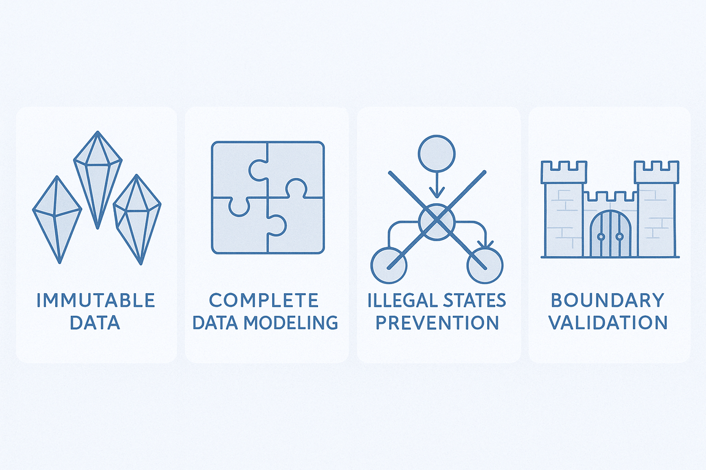

## A Arte de Simplificar a Complexidade

Os detalhes são importante, porém trazem o custo de transformarem as coisas mais complexas. É assim na vida. É assim no desenvolvimento de software. O processo de desenhar e construir sistemas de software depende indubitavelmente das linguagens, de software ou da linguagem natural. Essa última é por essência ambígua e ambiguidade gera complexidade.

Em seu livro *A Philosophy of Software Design,* John Ousterhout discute duas maneiras principais de lidar com a complexidade. A primeira é simplificar e tornar o código mais claro para reduzir a complexidade, por exemplo, removendo casos especiais e utilizando identificadores consistentes. A segunda abordagem é encapsular a complexidade por meio de um design modular, no qual um sistema de software é dividido em módulos, como classes em uma linguagem orientada a objetos, permitindo que os programadores trabalhem no sistema sem se sentirem sobrecarregados com toda a sua complexidade de uma só vez. Eu acrescentaria um terceiro que são os modelos.

Modelos são uma representação abstrata de um sistema (de software) que nos auxilia a compreender e simplificar a complexidade inerente. Eles nos permitem visualizar e comunicar as diferentes partes e interações do sistema, facilitando o processo de planejamento e construção. Ao fornecer uma estrutura clara e organizada, os modelos ajudam a reduzir a ambiguidade e a tornar o sistema mais compreensível.

Engana-se quem pensa que o uso de modelos é uma abordagem exclusiva do desenvolvimento de software para lidar com a complexidade. Imagine um artista de origami criando um cisne a partir de uma simples folha de papel. O resultado final captura a essência elegante da ave — seu pescoço curvado, suas asas dobradas, sua postura graciosa — mas deixa de lado detalhes desnecessários como a textura das penas ou a cor dos olhos. O origami não busca replicar perfeitamente a realidade, mas sim extrair e representar apenas os aspectos mais importantes e reconhecíveis.


O desenvolvimento de software deve considerar constantemente questões de design,
sendo minimizar a complexidade o principal aspecto do projeto de software.
(Ousterhout, 2021, p. 19). Em geral a primeira estratégia para reduzir a
complexidade é desenhar e construir um sistema que esteja aderente a determinado
paradigmas de programação. Os paradigmas foram criados para nos ajudar a reduzir
a complexidade do mundo real e mapeá-la em sistemas de software compreensíveis e
funcionais. Assim como o origami, cada paradigma oferece uma forma específica de
"transformar" a realidade em código, capturando os aspectos essenciais do
domínio que estamos modelando enquanto abstrai detalhes desnecessários.

Quando desenvolvemos software, não estamos tentando recriar o mundo real em sua
totalidade — isso seria impossível e improdutivo. Em vez disso, utilizamos
paradigmas como ferramentas conceituais que nos permitem focar nos elementos
mais relevantes para resolver problemas específicos, criando representações
elegantes e funcionais da complexidade que nos cerca.

## Panorama dos Paradigmas de Programação

Ao longo do tempo diferentes paradigmas de programação emergiram para abordar
distintos tipos de problemas e formas de pensar sobre software. Cada um oferece
uma perspectiva única sobre como organizar código, gerenciar estado e estruturar
soluções.

Um paradigma de programação determina uma linguagem de programação, e não o
contrário. Em outras palavras, um paradigma de programação define como os
problemas são resolvidos com código, e uma linguagem de programação é a
ferramenta que permite a implementação dessas soluções. Dado que uma linguagem
pode suportar um ou mais paradigmas, a partir da análise da adoção das
linguagens[^2] possível inferir quais são os paradigmas mais utilizados.
Independente da metodologia adotada é bem possível que o resultado dos
paradigmas mais utilizados será *procedural, orientado a objetos e funcional*,
não necessariamente nessa ordem.


### Comparação dos Principais Paradigmas

A tabela a seguir faz uma breve comparação entre os principais paradigmas
adotados pelo mercado, ao mesmo tempo que os compara com uma nova abordagem,
orientado a dados, ao que explicarei com mais detalhes um pouco mais a frente.

| Aspecto | Procedural | Orientado a Objetos | Funcional | Orientado a Dados |
|---------|------------|-------------------|-----------|------------------|
| **Foco Principal** | Sequência de procedimentos | Objetos e suas interações | Funções e transformações | Estrutura e fluxo de dados |
| **Gerenciamento de Estado** | Estado global/local mutável | Estado encapsulado em objetos | Estado imutável | Dados imutáveis |
| **Reutilização** | Funções e módulos | Herança e composição | Funções puras | Estruturas de dados |
| **Testabilidade** | Moderada (dependências) | Boa (isolamento) | Excelente (pureza) | Excelente (imutabilidade) |
| **Tratamento de Complexidade** | Decomposição em funções | Abstração e encapsulamento | Composição de funções | Separação dados/comportamento |

Para facilitar a discussão dos objetivos e limites da *Programação Orientada a
Dados (POD)* vamos utilizar como base a Programacao Orientada a Objetos (POO).
Entretanto, durante esse artigo você observará que a POD também bebe da fonte
dos paradigmas funcional e procedural.

## Fundamentos da Programação Orientada a Objetos

A Programação Orientada a Objetos (POO) deve a sua larga adoca a linguages como
Java e C++. É importante salientar que Java não é uma linguagem puramente
orientada a objetos principalmente por conta tipos primitivos e os métodos
estáticos (static) que pertencem à classe e não a um objeto. Um exemplo de uma
linguagem puramente orientada a objetos é o
[Smalltalk](https://www.gnu.org/software/smalltalk/), onde tudo é tratado como
objeto.

Apesar de Java não ser um linguagem orientada a objetos "puro-sangue" o seu uso
extensivo na indústria de software contribuiu para popularizar os princípios de
POO. Este paradigma de programação enfatiza a modelagem de sistemas por meio de
objetos que possuem propriedades e comportamentos, promovendo a reutilização de
código e o encapsulamento de dados. Os Seus princípios fundamentais incluem:

- **Encapsulamento**: Agrupa dados e métodos que operam sobre esses dados em uma única unidade (classe), controlando o acesso através de modificadores de visibilidade.
- **Herança**: Permite que classes derivem características de outras classes, promovendo reutilização de código.
- **Abstração**: Oculta detalhes de implementação complexos, expondo apenas interfaces necessárias.
- **Polimorfismo**: Permite que objetos de diferentes tipos sejam tratados através de uma interface comum.

### Exemplo Prático em Java

Para exemplificar o uso dos princípios da POO vamos modelar um sistema
responsável por gerenciar feriados (`Holiday`). Acredito que leito saiba o que é
um feriado, contudo, listarei algumas regras que serão importante no desenho da
solução.

- **Existem diferentes tipos de feriados**: Nacionais (Independência), religiosos (Natal, Ramadan), regionais (São João) e comerciais (Valentine's Day) `[1][2][3'`

- **Os feriados podem ser fixos ou móveis**: Fixos sempre na mesma data (25/12), móveis calculados por lua (Páscoa), dia da semana (Memorial Day) ou calendário lunar (Eid) `[4][5][6][7]`

- **Os feriados dependem de qual sistemas de calendário adotado**: Gregoriano (feriados ocidentais), lunar islâmico (Ramadan "roda" 11 dias/ano), luni-solar judaico (Rosh Hashanah varia mas mantém sazonalidade) `[8][9][7]`

- **Data agendada diferente da osbervada**: Feriado pode ter data oficial diferente da celebrada - "Mondayisation" move feriados de fim de semana para segunda-feira  `[10][11][12][13]`

- **Diferentes regras de observância**: Alguns começam no pôr do sol anterior (judaicos/islâmicos), têm duração variável (Chanukah 8 dias), só aplicam em dias úteis e não duplicam benefícios `[14][10][15][16]`

```java
// Traditional OOP modeling
```

## Programação Orientada a Dados: Uma Nova Perspectiva

A Programação Orientada a Dados (Data-Oriented Programming) representa uma
mudança fundamental na forma como pensamos sobre software. Em vez de focar em
objetos que encapsulam dados e comportamento, este paradigma prioriza a
estrutura e o fluxo dos dados, separando claramente informação de processamento.



### Os Quatro Princípios Fundamentais

#### 1. Dados são Imutáveis

A imutabilidade elimina uma classe inteira de bugs relacionados a modificações
inesperadas de estado. Em Java, podemos usar records para criar estruturas
imutáveis de forma concisa:

```java
// Immutable data with records

// Operations as pure functions
```

#### 2. Modele os Dados, Todos os Dados, e Nada Além dos Dados

Este princípio enfatiza que nossas estruturas de dados devem representar
fielmente o domínio, sem adicionar complexidade desnecessária ou omitir
informações importantes:

```java
```

#### 3. Torne Estados Ilegais Irrepresentáveis

Use o sistema de tipos para prevenir estados inválidos em tempo de compilação:

```java

```

#### 4. Valide nas Fronteiras

Mantenha validações nas bordas do sistema, permitindo que o núcleo trabalhe com
dados já validados:

```java

```

## Exemplo Prático: API de Feriados Públicos

Para demonstrar todos os conceitos da programação orientada a dados na prática,
desenvolvemos uma API REST completa para gerenciar feriados públicos. O projeto
completo está disponível no GitHub e pode ser executado localmente usando Docker
Compose.

📁 **Código Fonte Completo**: [github.com/vagnerclementino/odp-api-holiday](https://github.com/vagnerclementino/odp-api-holiday)

### Handler do AWS Lambda

```java
public class HolidayLambdaHandler implements RequestHandler<APIGatewayProxyRequestEvent, APIGatewayProxyResponseEvent> {
    
    private final HolidayService holidayService;
    private final ObjectMapper objectMapper;
    
    public HolidayLambdaHandler() {
        this.holidayService = new HolidayService(new DynamoDBHolidayRepository());
        this.objectMapper = new ObjectMapper()
            .registerModule(new JavaTimeModule())
            .disable(SerializationFeature.WRITE_DATES_AS_TIMESTAMPS);
    }
    
    @Override
    public APIGatewayProxyResponseEvent handleRequest(APIGatewayProxyRequestEvent request, Context context) {
        try {
            return switch (request.getHttpMethod()) {
                case "GET" -> handleGet(request);
                case "POST" -> handlePost(request);
                case "PUT" -> handlePut(request);
                case "DELETE" -> handleDelete(request);
                default -> createResponse(405, Map.of("error", "Method not allowed"));
            };
        } catch (Exception e) {
            context.getLogger().log("Error: " + e.getMessage());
            return createResponse(500, Map.of("error", "Internal server error"));
        }
    }
    
    private APIGatewayProxyResponseEvent handleGet(APIGatewayProxyRequestEvent request) throws Exception {
        var pathParameters = request.getPathParameters();
        
        if (pathParameters != null && pathParameters.containsKey("id")) {
            // GET /holidays/{id}
            var id = pathParameters.get("id");
            var holiday = holidayService.findById(id);
            
            return holiday
                .map(h -> createResponse(200, HolidayMapper.toResponse(h)))
                .orElse(createResponse(404, Map.of("error", "Holiday not found")));
        } else {
            // GET /holidays with filters
            var filter = extractFilters(request.getQueryStringParameters());
            var holidays = holidayService.findHolidays(filter);
            var responses = holidays.stream()
                .map(HolidayMapper::toResponse)
                .toList();
            
            return createResponse(200, responses);
        }
    }
    
    private APIGatewayProxyResponseEvent handlePost(APIGatewayProxyRequestEvent request) throws Exception {
        var holidayRequest = objectMapper.readValue(request.getBody(), CreateHolidayRequest.class);
        
        var validation = HolidayValidator.validateCreation(holidayRequest);
        if (validation instanceof ValidationResult.Failure failure) {
            return createResponse(400, Map.of("errors", failure.errors()));
        }
        
        var holiday = HolidayMapper.fromRequest(holidayRequest);
        var savedHoliday = holidayService.save(holiday);
        
        return createResponse(201, HolidayMapper.toResponse(savedHoliday));
    }
    
    private APIGatewayProxyResponseEvent handlePut(APIGatewayProxyRequestEvent request) throws Exception {
        var pathParameters = request.getPathParameters();
        if (pathParameters == null || !pathParameters.containsKey("id")) {
            return createResponse(400, Map.of("error", "ID is required"));
        }
        
        var id = pathParameters.get("id");
        var holidayRequest = objectMapper.readValue(request.getBody(), CreateHolidayRequest.class);
        
        var validation = HolidayValidator.validateCreation(holidayRequest);
        if (validation instanceof ValidationResult.Failure failure) {
            return createResponse(400, Map.of("errors", failure.errors()));
        }
        
        var updatedHoliday = HolidayMapper.fromRequest(holidayRequest);
        var result = holidayService.update(id, updatedHoliday);
        
        return result
            .map(h -> createResponse(200, HolidayMapper.toResponse(h)))
            .orElse(createResponse(404, Map.of("error", "Holiday not found")));
    }
    
    private APIGatewayProxyResponseEvent handleDelete(APIGatewayProxyRequestEvent request) {
        var pathParameters = request.getPathParameters();
        if (pathParameters == null || !pathParameters.containsKey("id")) {
            return createResponse(400, Map.of("error", "ID is required"));
        }
        
        var id = pathParameters.get("id");
        var deleted = holidayService.delete(id);
        
        return deleted 
            ? createResponse(204, null)
            : createResponse(404, Map.of("error", "Holiday not found"));
    }
    
    private HolidayFilter extractFilters(Map<String, String> queryParams) {
        if (queryParams == null) {
            return new HolidayFilter(
                Optional.empty(), Optional.empty(), Optional.empty(),
                Optional.empty(), Optional.empty(), Optional.empty()
            );
        }
        
        return new HolidayFilter(
            Optional.ofNullable(queryParams.get("country")),
            Optional.ofNullable(queryParams.get("state")),
            Optional.ofNullable(queryParams.get("city")),
            Optional.ofNullable(queryParams.get("startDate")).map(LocalDate::parse),
            Optional.ofNullable(queryParams.get("endDate")).map(LocalDate::parse),
            Optional.ofNullable(queryParams.get("type")).map(t -> HolidayType.valueOf(t.toUpperCase()))
        );
    }
    
    private APIGatewayProxyResponseEvent createResponse(int statusCode, Object body) {
        var response = new APIGatewayProxyResponseEvent();
        response.setStatusCode(statusCode);
        response.setHeaders(Map.of(
            "Content-Type", "application/json",
            "Access-Control-Allow-Origin", "*"
        ));
        
        if (body != null) {
            try {
                response.setBody(objectMapper.writeValueAsString(body));
            } catch (Exception e) {
                response.setStatusCode(500);
                response.setBody("{\"error\":\"Serialization error\"}");
            }
        }
        
        return response;
    }
}
```

#### Instruções de Uso

Para executar o projeto localmente:

```bash
# 1. Clone o repositório e navegue até o diretório
cd holidays-api

# 2. Configure o ambiente completo
make setup

# 3. Teste a API
make test

# 4. Para desenvolvimento contínuo
make build && make deploy

# 5. Visualizar logs
make logs

# 6. Limpar ambiente
make clean
```

### Benefícios da Abordagem Data-Oriented

O projeto demonstra como a programação orientada a dados oferece:

- **Previsibilidade**: Funções puras produzem sempre o mesmo resultado
- **Testabilidade**: Dados imutáveis facilitam testes unitários e de integração
- **Manutenibilidade**: Separação clara entre dados e comportamento
- **Performance**: Estruturas imutáveis podem ser otimizadas pela JVM
- **Concorrência**: Dados imutáveis são thread-safe por design

Esta configuração oferece um ambiente de desenvolvimento completo e isolado, permitindo testar todos os aspectos da programação orientada a dados sem custos de infraestrutura na nuvem.

## Conclusão

A Programação Orientada a Dados oferece uma perspectiva valiosa para o desenvolvimento de software moderno, especialmente em contextos onde a clareza dos dados, a imutabilidade e a testabilidade são prioritárias. Ao separar dados de comportamento e focar na estrutura das informações, conseguimos criar sistemas mais previsíveis, fáceis de testar e menos propensos a bugs relacionados a estado mutável.

O exemplo da API de feriados demonstra como esses princípios podem ser aplicados na prática, resultando em código mais limpo, estruturas de dados bem definidas e uma arquitetura que facilita tanto a manutenção quanto a evolução do sistema. Embora a Programação Orientada a Objetos continue sendo fundamental em Java, a incorporação de conceitos orientados a dados pode significativamente melhorar a qualidade e robustez de nossas aplicações.

A chave está em reconhecer que, assim como no origami, diferentes técnicas de "dobrar" o código podem revelar aspectos distintos da solução, e a escolha do paradigma adequado pode fazer toda a diferença na elegância e eficácia do resultado final.

```
[1] <https://en.wikipedia.org/wiki/Holiday>.
[2] <https://en.wikipedia.org/wiki/Lists_of_holidays>
[3] <https://www.xavier.edu/jesuitresource/online-resources/calendar-religious-holidays-and-observances/>
[4] <https://en.wikipedia.org/wiki/Moveable_feast>
[5] <https://en.as.com/latest_news/when-is-easter-this-year-this-is-how-the-date-determined-n/>
[6] <https://www.timeanddate.com/calendar/determining-easter-date.html>
[7] <https://en.wikipedia.org/wiki/Islamic_calendar>
[8] <https://www.aljazeera.com/opinions/2018/9/20/yom-kippur-and-ashoura-are-muslims-observing-a-jewish-holiday>
[9] <https://en.wikipedia.org/wiki/Hebrew_calendar>
[10] <https://www.employment.govt.nz/leave-and-holidays/public-holidays/when-a-public-holiday-falls-on-a-weekend>
[11] <https://www.predicthq.com/support/what-is-the-difference-between-an-observed-holiday-and-an-observance>
[12] <https://support.payhero.co.nz/hc/en-us/articles/360002666876-Mondayised-Public-Holidays>
[13] <https://www.davenportslaw.co.nz/mondayisation>
[14] <https://ing.org/when-the-muslim-and-jewish-new-years-collide/>
[15] <https://scl.cornell.edu/religiousholidays>
[16] <https://news.wisc.edu/religious-holidays-101-quick-start-guide-to-learning-about-holidays-beyond-christmas/>
```