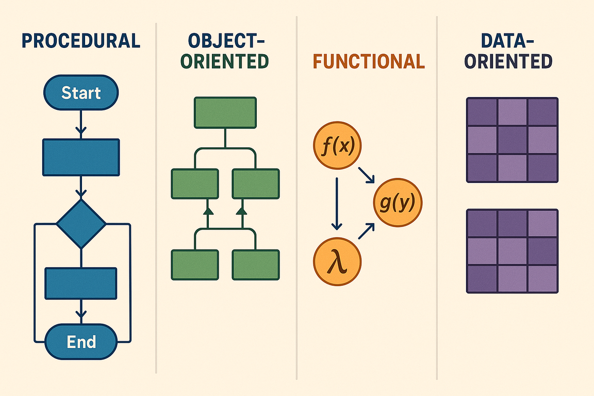
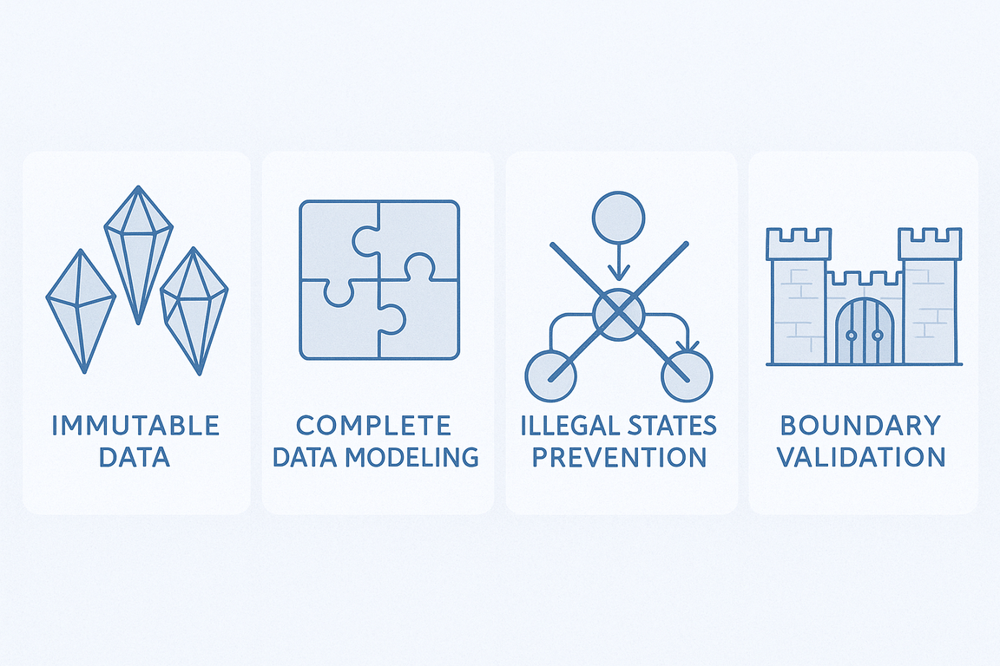
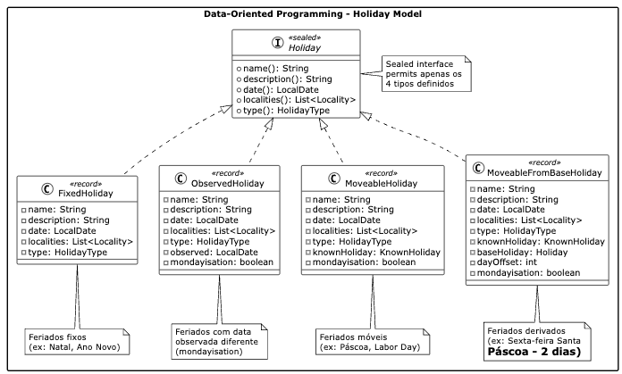

## A arte de Lidar com a Complexidade

Detalhes importam! É assim na vida ou no desenvolvimento de software. O processo
de desenhar e construir sistemas de software está condicionado indubitavelmente
ao uso de linguagens: de software ou natural. Essa última é, por essência,
ambígua.  Ambiguidade gera complexidade.

Em diferentes áreas do conhecimento o ser humano utiliza de diferentes
ferramentas para lidar com a complexidade, por exemplo: matemáticos usam
notações e fórmulas para expressar conceitos complexos de forma concisa, médicos
empregam classificações diagnósticas como CID-10 para categorizar doenças,
arquitetos criam plantas e blueprints para representar estruturas
tridimensionais em duas dimensões, e gestores utilizam organogramas e
fluxogramas para mapear processos e hierarquias organizacionais.

Em seu livro *A Philosophy of Software Design*[^24], John Ousterhout discute
duas maneiras principais de lidar com a complexidade no desenvolvimento de
software. A primeira consiste em *simplificar e tornar o código mais claro* por
meio da remoção de casos especiais e da utilização de identificadores
consistentes.

A segunda abordagem é *encapsular a complexidade por meio de um design modular*,
no qual um sistema de software é dividido em módulos, como classes em uma
linguagem orientada a objetos, permitindo que os programadores trabalhem no
sistema sem se sentirem sobrecarregados com toda a sua complexidade de uma só
vez. As abordagens proposta por Ousterhout estão relacionadas intrinsecamente
com o momento da escrita do código, contudo, se pensarmos para a fase de
desenho,  eu acrescentaria uma terceira abordagem para lidar com a complexidade:
os modelos.

Modelos são uma representação abstrata de um sistema (de software) que nos
auxilia a compreender e simplificar a complexidade inerente. Eles nos permitem
visualizar e comunicar as diferentes partes e interações do sistema, facilitando
o processo de planejamento e construção. Ao fornecer uma estrutura clara e
organizada, os modelos ajudam a reduzir a ambiguidade e a tornar o sistema mais
compreensível.

Engana-se quem pensa que o uso de modelos é uma abordagem exclusiva do
desenvolvimento de software. Imagine um artista origami criando um origami de
cisne. O resultado final captura a essência elegante da ave — seu pescoço
curvado, suas asas dobradas, sua postura graciosa — mas deixa de lado detalhes
desnecessários como a textura das penas ou a cor dos olhos. Um origami não busca
replicar perfeitamente a realidade, mas sim extrair e representar apenas os
aspectos mais importantes e reconhecíveis.


Nas linguagens de programação uma das maneiras para lidar com a complexidade é
ser aderente a um ou mais paradigma de programação. Os paradigmas foram pensados
para nos ajudar a reduzir a complexidade do mundo real e mapeá-la em sistemas de
software compreensíveis e funcionais. Assim como o origami, cada paradigma
oferece uma forma específica de "transformar" a realidade em código, capturando
os aspectos essenciais do domínio que estamos modelando enquanto abstrai
detalhes desnecessários.

Quando desenvolvemos software, não estamos tentando recriar o mundo real em sua
totalidade — isso seria impossível e improdutivo. Em vez disso, utilizamos
paradigmas como ferramentas conceituais que nos permitem focar nos elementos
mais relevantes para resolver determinado problema,  como um artista criando um
origami.

## Panorama dos Paradigmas de Programação

Ao longo do tempo diferentes paradigmas de programação emergiram para abordar
distintos tipos de problemas e formas de pensar sobre software. Cada um oferece
uma perspectiva única sobre como organizar código e estruturar soluções.

Um paradigma de programação determina uma linguagem de programação, e não o
contrário. Em outras palavras, um paradigma de programação define como os
problemas são resolvidos com código. Por outro lado, uma linguagem de
programação é a ferramenta que permite a implementação dessas soluções. Dado que
uma linguagem pode suportar um ou mais paradigma, a partir da análise da adoção
das linguagens[^17], é possível inferir quais são os paradigmas mais utilizados.
Independente da metodologia adotada, acredito que o resultado dos paradigmas
mais utilizados seria *procedural, orientado a objetos e funcional*, entretanto,
não necessariamente nessa ordem.



A tabela a seguir faz uma breve comparação entre os principais paradigmas
adotados pelo mercado, ao mesmo tempo que os compara com uma nova abordagem, de
uma programação orientada a dados, que explicarei com mais detalhes um pouco
mais a frente.

| Aspecto | Procedural | Orientado a Objetos | Funcional | Orientado a Dados |
|---------|------------|-------------------|-----------|------------------|
| **Foco Principal** | Sequência de procedimentos | Objetos e suas interações | Funções e transformações | Estrutura e fluxo de dados |
| **Gerenciamento de Estado** | Estado global/local mutável | Estado encapsulado em objetos | Estado imutável | Dados imutáveis |
| **Reutilização** | Funções e módulos | Herança e composição | Funções puras | Estruturas de dados |
| **Testabilidade** | Moderada (dependências) | Boa (isolamento) | Excelente (pureza) | Excelente (imutabilidade) |
| **Tratamento de Complexidade** | Decomposição em funções | Abstração e encapsulamento | Composição de funções | Separação dados/comportamento |

Existem diferentes formas para descrever e avaliar os diferentes paradigmas.
Todavia, muitas das vezes basta uma sentença: seja *"tudo é objeto"* ao falarmos
do paradigma orientados a objetos ou *"tudo é função"* ao tratar o paradigma
funcional. Por outro, quando apresentarmos o paradigma da *Programação Orientada
a Dados (POD)*  você observará que a POD também bebe da fonte dos paradigmas
funcional e orientado a objetos.

## Fundamentos da Programação Orientada a Objetos

A Programação Orientada a Objetos (POO) deve a sua ampla adoção a linguagens
como *Java* e *C++*. Cabe ressaltar que Java não é uma linguagem puramente
orientada a objetos principalmente por conta do seus tipos primitivos e os
métodos estáticos (*static*) que pertencem à classe e não a um objeto. Apesar de
não ser um linguagem estritamente orientada a objetos o seu uso extensivo na
indústria de software contribuiu para popularizar os princípios da POO. Um
exemplo de uma linguagem puramente orientada a objetos é o Smalltalk[^25], onde
tudo é tratado como objeto.

A POO enfatiza a modelagem de sistemas por meio de objetos que possuem
propriedades e comportamentos, promovendo a reutilização de código e o
encapsulamento de dados, dentre os seus princípios fundamentais podemos citar:

- **Encapsulamento**: Agrupa dados e métodos que operam sobre esses dados em uma única unidade (classe), controlando o acesso através de modificadores de visibilidade.
- **Herança**: Permite que classes derivem características de outras classes, promovendo reutilização de código.
- **Abstração**: Oculta detalhes de implementação complexos, expondo apenas interfaces necessárias.
- **Polimorfismo**: Permite que objetos de diferentes tipos sejam tratados através de uma interface comum.

Esses princípios permitem fazer uma analogia de uma classe na POO como um
organismo, onde o encapsulamento atua como a membrana celular que controla o que
entra e sai, a herança funciona como a transmissão genética de características,
e o polimorfismo se assemelha à capacidade de diferentes organismos responderem
de forma especializada aos mesmos estímulos ambientais.

### Feriados: uma modelagem orientada a objetos

Para exemplificar o uso dos princípios da POO vamos modelar um sistema
responsável por gerenciar feriados (`Holiday`). Acredito que leitor saiba o que
é um feriado, contudo, existem certas especificidades sobre o domínio que
entendo importante explicitar:

- **Existem diferentes tipos de feriados**: Nacionais (Independência), religiosos (Natal, Ramadan), regionais (São João) e comerciais (Dia das mães/pais)[^1]

- **Os feriados podem ser fixos ou móveis**: Fixos acontecem sempre na mesma data (25/12) e os móveis são calculados através do calendário lunar (Páscoa), dia da semana (Memorial Day) ou baseado em outros feriados (Sexta-Feira Santa)[^4]

- **Os feriados dependem de qual sistemas de calendário adotado**: Gregoriano (feriados ocidentais), lunar islâmico (Ramadan "roda" 11 dias/ano), luni-solar judaico (Rosh Hashanah varia mas mantém sazonalidade)[^7]

- **Data agendada diferente da observada**: Feriado pode ter data oficial diferente da celebrada, como por exemplo, na estratégia de *"Mondayisation"* que move feriados de fim de semana para a segunda-feira[^10]

- **Diferentes regras de observância**: Alguns começam no pôr do sol anterior (judaicos/islâmicos), têm duração variável (Chanukah 8 dias), só aplicam em dias úteis e não duplicam benefícios[^15]

Para simplificar vamos considerar feriados segundo o calendário Gregoriano e com
uma duração fixa, ou seja, o feriado inicia e finaliza em uma data específica.

A modelagem da classe `Holiday` - veja diagrama - adota uma abordagem
hierárquica típica da POO, onde uma classe abstrata define o contrato comum e as
características compartilhadas por todos os demais tipos de feriados. A classe
base encapsula propriedades essenciais como nome, descrição, localidades onde é
observado, tipo de feriado e regras de *"Mondayisation"* (ajuste para dias
úteis), além de comportamentos comuns como o cálculo de data observada.

Um aspecto fundamental da POO é que a classe `Holiday` encapsula seu estado
através da propriedade `date`, mantendo as regras de cálculo da data como
responsabilidade interna - a própria classe gerencia como calcular a data de um
feriado para cada ano, ocultando essa complexidade do código cliente. As
subclasses `FixedHoliday` e `MoveableHoliday` especializam a implementação do
método abstrato `getDate()`, onde feriados fixos simplesmente retornam a mesma
data anual, enquanto feriados móveis executam algoritmos complexos - desde
cálculos astronômicos para a Páscoa até regras baseadas em dias da semana ou
dependências de outros feriados.

```bash
                    ┌─────────────────────────────────┐
                    │           Holiday               │
                    │         (abstract)              │
                    ├─────────────────────────────────┤
                    │ - name: String                  │
                    │ - description: String           │
                    │ - day: int                      │
                    │ - month: Month                  │
                    │ - localities: List<Locality>    │
                    │ - type: HolidayType             │
                    │ - mondayisation: boolean        │
                    ├─────────────────────────────────┤
                    │ + getDate(year: int): LocalDate │
                    │ + getObserved(year: int):       │
                    │   LocalDate                     │
                    │ + getName(): String             │
                    │ + getType(): HolidayType        │
                    └─────────────────────────────────┘
                                    △
                                    │
                    ┌───────────────┴───────────────┐
                    │                               │
        ┌─────────────────────────┐     ┌─────────────────────────┐
        │     FixedHoliday        │     │   MoveableHoliday       │
        ├─────────────────────────┤     ├─────────────────────────┤
        │                         │     │ - moveableType:         │
        │                         │     │   MoveableHolidayType   │
        │                         │     │ - baseHoliday: Holiday  │
        │                         │     │ - dayOffset: int        │
        ├─────────────────────────┤     ├─────────────────────────┤
        │ + getDate(year: int):   │     │ + getDate(year: int):   │
        │   LocalDate             │     │   LocalDate             │
        └─────────────────────────┘     │ + calculateEasterSunday │
                                        │   (year: int): LocalDate│
                                        └─────────────────────────┘
```

A modelagem adota os princípios da programação orientada a objetos. O
**encapsulamento** é evidenciado pela classe abstrata `Holiday` que agrupa dados
(nome, descrição, localidades) e comportamentos (cálculo de datas, verificação
de fim de semana) em uma única unidade coesa, controlando o acesso através de
métodos públicos. A **herança** permite que `FixedHoliday` e `MoveableHoliday`
compartilhem características comuns da classe herdada, evitando duplicação de
código e estabelecendo uma hierarquia lógica entre os conceitos.

O **polimorfismo** é implementado através do método abstrato `getDate(int
year)`, onde cada subclasse fornece sua própria implementação específica -
feriados fixos retornam sempre a mesma data, enquanto feriados móveis executam
cálculos complexos, como o algoritmo astronômico para definir a data da Páscoa.
A **abstração** oculta a complexidade dos diferentes tipos de cálculo de datas
atrás de uma interface uniforme, permitindo que o código cliente trate todos os
feriados de forma consistente, independentemente de serem fixos ou móveis. A
seguir temos um código explicitando o uso de cada um dos princípios da POO.

```java
// Classe abstrata demonstrando encapsulamento e abstração
public abstract class Holiday {
    private String name;
    private String description;
    private List<Locality> localities;
    private HolidayType type;
    private boolean mondayisation;
    
    // Método abstrato para polimorfismo
    public abstract LocalDate getDate(int year);
    
    // Comportamento comum encapsulado
    public LocalDate getObserved(int year) {
        LocalDate actualDate = getDate(year);
        return mondayisation ? applyMondayisationRules(actualDate) : actualDate;
    }
    
    public boolean isWeekend(int year) {
        DayOfWeek dayOfWeek = getDate(year).getDayOfWeek();
        return dayOfWeek == DayOfWeek.SATURDAY || dayOfWeek == DayOfWeek.SUNDAY;
    }
}

// Herança: FixedHoliday especializa Holiday
public class FixedHoliday extends Holiday {
    @Override
    public LocalDate getDate(int year) {
        return LocalDate.of(year, getMonth(), getDay());
    }
}

// Herança: MoveableHoliday com lógica complexa
public class MoveableHoliday extends Holiday {
    private final MoveableHolidayType moveableType;
    private final Holiday baseHoliday;
    private final int dayOffset;
    
    @Override
    public LocalDate getDate(int year) {
        return switch (moveableType) {
            case LUNAR_BASED -> calculateEasterSunday(year);
            case RELATIVE_TO_HOLIDAY -> baseHoliday.getDate(year).plusDays(dayOffset);
            case WEEKDAY_BASED -> calculateWeekdayBasedDate(year);
        };
    }
}

// Uso polimórfico - mesmo código para diferentes tipos
List<Holiday> holidays = List.of(
    new FixedHoliday("Christmas", "Birth of Christ", 25, Month.DECEMBER, 
                     localities, HolidayType.RELIGIOUS, false),
    new MoveableHoliday("Easter", "Resurrection of Christ", 
                        localities, HolidayType.RELIGIOUS, 
                        MoveableHolidayType.LUNAR_BASED, false)
);

// Polimorfismo em ação
for (Holiday holiday : holidays) {
    LocalDate date = holiday.getDate(2024); // Cada tipo calcula diferentemente
    System.out.println(holiday.getName() + ": " + date);
}
```

Apesar dos benefícios da modelagem orientada a objetos, a implementação
apresenta limitações inerentes ao paradigma e que podem comprometer a
integridade dos dados e a previsibilidade do sistema:

- **Lista mutável exposta:** O método `getLocalities()` retorna uma referência
direta à lista interna, permitindo que código externo modifique o estado do
objeto sem o controle da classe, que podem levar a problemas difíceis de
rastrear

- **Estado mutável:** Os campos `date` e `observed` podem ser alterados após a
criação do objeto através dos métodos `setDate()` e `setObserved()`, violando a
expectativa de imutabilidade de um feriado

- **Herança frágil:** Mudanças na classe base podem quebrar classes filhas de
forma inesperada, criando dependências implícitas e dificultando a manutenção do
código

- **Acoplamento temporal:** Métodos podem depender da ordem de chamada (ex:
`setDate()` antes de `calculateObserved()`), criando contratos implícitos que
não são expressos no sistema de tipos

- **Estados ilegais representáveis:** O sistema de tipos permite criar objetos
em estados inconsistentes, como um `ObservedHoliday` onde a data observada é
anterior à data oficial

- **Concorrência problemática:** Objetos mutáveis compartilhados entre threads
requerem sincronização complexa, aumentando a possibilidade de deadlocks e
condições de corrida

Essas limitações são inerentes a POO, onde o foco no encapsulamento de dados e
comportamento (métodos) pode inadvertidamente criar pontos de mutabilidade não
controladas. A Programação Orientada a Dados emerge como uma alternativa que
aborda diretamente esses problemas, priorizando a imutabilidade, a transparência
dos dados e a separação clara entre dados e operações.

## Programação Orientada a Dados: Uma Nova Perspectiva

A *Programação Orientada a Dados (Data-Oriented Programming)* - POD representa
uma mudança na forma como pensamos sobre a modelagem de software. Em vez de
focar em objetos que encapsulam dados e comportamento, este paradigma prioriza a
estrutura e o fluxo dos dados, de forma imutável, separando *a informação do seu
processamento*.

A ideia de uma programacao orientada a dados foi proposta originalmente por
Brian Goetz[^16], posteriormente, Nicolai Parlogfoi[^17], refinou o conceito,
organizando melhor os princípios fundamentais e incorporando as funcionalidades
mais recentes de Java. Este artigo apresenta uma visão prática dos conceitos
propostos por Parlogfoi.

### Princípios Fundamentais

A Programação Orientada a Dados se baseia em quatro princípios fundamentais[^18]
que, quando aplicados em conjunto, criam sistemas robustos, previsíveis e
potencialmente mais fáceis de manter. Vamos explorar cada princípio usando nossa
implementação do sistema de gerenciamento de feriados.



#### 1. Dados são Imutáveis

A imutabilidade elimina uma fonte comum de bugs: objetos modificados por
diferentes subsistemas sem comunicação adequada[^19]. Um exemplo clássico é
armazenar um objeto em um `HashSet` e depois alterar um campo usado no cálculo
do hash code. Essa alteração torna o objeto "perdido" na estrutura, ou seja, não
será possível recuperar o objeto pelo seu *hash*. Este problema surge quando
dois subsistemas (o `HashSet` e o código que modifica o objeto) têm acesso ao
mesmo objeto, mas têm diferentes requisitos para modificá-lo e nenhuma forma de
comunicar essas necessidades.

```java
// Problema: objeto mutável em HashSet
var holidays = new HashSet<Holiday>();
var christmas = new MutableHoliday("Christmas", LocalDate.of(2024, 12, 25));
holidays.add(christmas);
christmas.setDate(LocalDate.of(2024, 12, 24)); // Quebra o HashSet!
holidays.contains(christmas); // Retorna false - objeto "perdido"
```

O remédio é simples: se nada pode mudar, tais erros não podem ocorrer. Quando
subsistemas se comunicam apenas com dados imutáveis, essa fonte comum de erros
desaparece completamente. Porém, mudança no estado interno das classes são
inevitáveis.  Logo os objetos devem ser **transparentes** - seu estado interno
deve ser acessível e construível uma interface bem definida. Na prática, ser
transparente significa que a classe deve haver um método de acesso para cada
campo e um construtor que aceita valores para todos os campos, permitindo
recriar uma instância indistinguível da original.

```java
// Solução: record imutável e transparente
public record FixedHoliday(
    String name, String description, LocalDate date, 
    List<Locality> localities, HolidayType type
) implements Holiday {
    
    public FixedHoliday {
        Objects.requireNonNull(name, "Holiday name cannot be null");
        if (name.isBlank()) {
            throw new IllegalArgumentException("Holiday name cannot be blank");
        }
        // Defensive copying para imutabilidade profunda
        localities = List.copyOf(localities);
    }
}
```

Em Java, *Records[^26]* foram projetados exatamente como portadores
transparentes de dados imutáveis. Eles atendem automaticamente aos requisitos de
transparência: campos final para cada componente, construtor canônico que aceita
e atribui valores, métodos de acesso que os retornam, e implementações de
`equals` e `hashCode` baseadas nos dados. O defensive copying no compact
constructor garante imutabilidade profunda, prevenindo modificações através de
referências a objetos mutáveis. Transformações retornam novas instâncias,
mantendo a imutabilidade.

```java
// Transformações retornam novas instâncias
public FixedHoliday withDate(LocalDate newDate) {
    return new FixedHoliday(name, description, newDate, localities, type);
}

// Uso seguro - impossível quebrar o HashSet
var holidays = new HashSet<Holiday>();
var christmas = new FixedHoliday("Christmas", "...", LocalDate.of(2024, 12, 25), localities, type);
holidays.add(christmas);
var christmasEve = christmas.withDate(LocalDate.of(2024, 12, 24)); // Nova instância
holidays.contains(christmas); // Sempre true - objeto original inalterado
```

**Benefícios da imutabilidade:**

- Thread-safety automática
- Caching seguro
- Debugging simplificado
- Testes mais simples

#### 2. Modele os Dados, Todos os Dados, e Nada Além dos Dados

Este princípio enfatiza criar **agregados sob medida** que representem fielmente o domínio[^20], evitando tipos genéricos com campos opcionais problemáticos. O mundo é caótico e toda regra parece ter uma exceção - "todo feriado tem uma data" rapidamente se torna "todo feriado fixo tem uma data fixa, mas feriados móveis têm algoritmos de cálculo, e feriados observados podem ter datas diferentes da oficial". Quando modelamos isso com um tipo genérico, acabamos com um `GenericHoliday` que tem campos que podem ser `null` a qualquer momento, e o fato de que diferentes tipos de feriados têm diferentes requisitos fica implícito no melhor dos casos.

```java
// ANTES - Tipo genérico problemático
public record GenericHoliday(
    String name, LocalDate date,
    LocalDate observed,        // null para feriados fixos
    KnownHoliday knownHoliday, // null para feriados fixos  
    Holiday baseHoliday,       // null para não-derivados
    int dayOffset,             // irrelevante para feriados fixos
    boolean mondayisation      // nem sempre aplicável
) {}
```

Com tal design, não estamos nos fazendo nenhum favor! Em qualquer sistema, mas especialmente em um com design focado em dados, você se beneficiará de tornar apenas estados legais representáveis. Se um feriado fixo não precisa de algoritmo de cálculo, o construtor deve garantir que isso seja o caso. Se nenhum feriado pode ter tanto uma data fixa quanto um algoritmo móvel, isso deve ser prevenido - idealmente modelando os dados de forma tão precisa que não existe tipo que tenha ambos os campos. Tipos precisos como esses não apenas têm a vantagem de que seu criador não precisa escrever construtores e testes que verificam que combinações ilegais não ocorram, mas também ajudam os desenvolvedores que os usam.

```java
// DEPOIS - Sealed interface com tipos específicos
public sealed interface Holiday
    permits FixedHoliday, ObservedHoliday, MoveableHoliday, MoveableFromBaseHoliday {

  String name();
  String description();
  LocalDate date();
  List<Locality> localities();
  HolidayType type();

  // Funcionalidade compartilhada
  default boolean isWeekend() {
    DayOfWeek dayOfWeek = date().getDayOfWeek();
    return dayOfWeek == DayOfWeek.SATURDAY || dayOfWeek == DayOfWeek.SUNDAY;
  }
}
```

A estratégia é usar sealed interfaces para modelar alternativas e records específicos para cada variação. Em vez de múltiplos campos com requisitos mutuamente exclusivos ou condicionais, criamos uma sealed interface para modelar as alternativas e a usamos como tipo para um campo obrigatório. Cada record implementa exatamente os dados necessários para seu tipo específico, eliminando campos irrelevantes e tornando o código mais claro. A funcionalidade compartilhada é implementada através de métodos default na interface, evitando repetição entre implementações.

```java
// Cada tipo contém exatamente os dados necessários
public record FixedHoliday(
    String name, String description, LocalDate date,
    List<Locality> localities, HolidayType type
) implements Holiday { }

public record MoveableHoliday(
    String name, String description, LocalDate date,
    List<Locality> localities, HolidayType type,
    KnownHoliday knownHoliday,    // Específico para feriados móveis
    boolean mondayisation         // Específico para feriados móveis
) implements Holiday { }

public record MoveableFromBaseHoliday(
    String name, String description, LocalDate date,
    List<Locality> localities, HolidayType type,
    KnownHoliday knownHoliday,    // Algoritmo base
    Holiday baseHoliday,          // Feriado de referência
    int dayOffset,                // Dias de diferença do base
    boolean mondayisation         // Regra de ajuste
) implements Holiday { }
```

**Resultado:** Cada record contém exatamente os dados necessários para seu tipo específico, eliminando campos irrelevantes e tornando o código mais claro e maintível.

```java
public sealed interface Holiday
    permits FixedHoliday, ObservedHoliday, MoveableHoliday, MoveableFromBaseHoliday {

  String name();
  String description();
  LocalDate date();
  List<Locality> localities();
**Resultado:** Cada record contém exatamente os dados necessários para seu tipo específico, eliminando campos irrelevantes e tornando o código mais claro e maintível.

```java
public sealed interface Holiday permits ... {
  
  // Matching hierárquico: feriado nacional aplica-se a estados e cidades
  default boolean appliesTo(Locality targetLocality) {
    return localities().stream()
        .anyMatch(holidayLocality -> localityMatches(holidayLocality, targetLocality));
  }
}
```

**Resultado:** Sistema que espelha fielmente o domínio de feriados com zero
*repetição, segurança de tipos e dados específicos para cada tipo.

#### 3. Torne Estados Ilegais Irrepresentáveis

Este princípio garante que apenas combinações legais de dados possam ser
representadas no sistema[^21]. Um sistema focado em dados deve assegurar que
apenas combinações legais dos dados possam ser representadas, e assim um
princípio orientador da programação orientada a dados é tornar estados ilegais
irrepresentáveis. O mundo é caótico e toda regra parece ter uma exceção - "todo
usuário tem um endereço de email" rapidamente se torna "todo usuário registrado
tem um endereço de email, mas pode estar ausente durante o processo de
registro". Quando modelamos isso, podemos ficar presos com um `User` que tem um
campo `String email` que pode ser `null` a qualquer momento, e o fato de que
usuários registrados devem ter um endereço de email fica implícito no melhor dos
casos, mas não é mais aplicado.

```java
// Nível 1: Sealed interface impede tipos inválidos
public sealed interface Holiday
    permits FixedHoliday, ObservedHoliday, MoveableHoliday, MoveableFromBaseHoliday {
    
    String name();
    LocalDate date();
    List<Locality> localities();
    HolidayType type();
}

// Nível 2: Enum previne valores inválidos
public enum KnownHoliday {
    NEW_YEAR("New Year's Day"),
    CHRISTMAS("Christmas Day"),
    EASTER("Easter Sunday");
    
    private final String displayName;
    KnownHoliday(String displayName) { this.displayName = displayName; }
    public String getDisplayName() { return displayName; }
}
```

A estratégia segue três níveis progressivos: primeiro, use tipos precisos (sealed interfaces + records) para descrever os dados; segundo, em situações de either/or, evite múltiplos campos com requisitos mutuamente exclusivos ou condicionais e, em vez disso, crie uma sealed interface para modelar as alternativas; terceiro, apenas se essas técnicas de design, ambas suportadas pelo compilador, não forem suficientes, recorra a verificações em tempo de execução no construtor. Quando uma propriedade dos dados não pode ser expressa de forma que o compilador a aplique, ela deve ser validada em tempo de execução, mas não a qualquer momento - geralmente deve acontecer o mais cedo possível, idealmente na fronteira entre o mundo externo e seu sistema.

```java
// Nível 3: Validação runtime para regras complexas
public record FixedHoliday(
    String name, String description, LocalDate date,
    List<Locality> localities, HolidayType type
) implements Holiday {
    
    public FixedHoliday {
        Objects.requireNonNull(name, "Holiday name cannot be null");
        if (name.isBlank()) {
            throw new IllegalArgumentException("Holiday name cannot be blank");
        }
        if (localities.isEmpty()) {
            throw new IllegalArgumentException("Holiday must have at least one locality");
        }
        localities = List.copyOf(localities);
    }
}
```

Validar os dados tão cedo garante que nenhum dado quebrado entre no sistema, mas também é importante garantir que o sistema não gere dados quebrados. Isso significa que as instâncias que ele cria que podem posteriormente ser mapeadas de volta para CSV, JSON, uma consulta SQL, etc., também devem ser validadas. Isso torna os construtores desses tipos o local ideal para a lógica de validação. Em casos mais complicados, métodos ou classes de factory podem estar envolvidos, caso em que eles precisam aplicar essas verificações, é claro.

```java
// Validate at the Boundary: validação na fronteira do sistema
public final class HolidayFactory {
    public static Holiday fromJson(String json) {
        var data = parseJson(json);
        // Validação acontece aqui, na entrada do sistema
        return new FixedHoliday(data.name(), data.description(), 
                               data.date(), data.localities(), data.type());
    }
    
    public static FixedHoliday createFixed(String name, int day, Month month, 
                                          List<Locality> localities, HolidayType type) {
        // Valida combinação dia/mês impossível
        LocalDate calculatedDate;
        try {
            calculatedDate = LocalDate.of(LocalDate.now().getYear(), month, day);
        } catch (DateTimeException e) {
            throw new IllegalArgumentException(
                "Invalid day/month combination: day=" + day + ", month=" + month, e);
        }
        return new FixedHoliday(name, "", calculatedDate, localities, type);
    }
}
```

**Resultado:** Impossível criar feriados inválidos - o compilador previne tipos incorretos, enums previnem valores inválidos, e validações runtime capturam regras complexas na fronteira do sistema.

**Resultado:** Impossível criar feriados inválidos - o compilador e validações runtime previnem todos os estados ilegais.

#### 4. Separe Operações dos Dados

Este princípio mantém dados e comportamentos separados[^22], com records contendo apenas estrutura e operações implementadas como funções puras em classes dedicadas. Não é surpreendente que a programação orientada a dados tenha um foco forte em dados - de fato, três dos quatro princípios orientadores da DOP aconselham como melhor modelar isso. Este quarto princípio diz respeito aos métodos que implementam a maior parte da lógica de domínio, aconselhando separar operações dos dados. Quando exploramos como modelar dados, basicamente excluímos todos os métodos que contêm lógica de domínio não trivial ou interagem com tipos que não representam dados - vamos chamá-los de operações.

```java
// Dados puros - apenas estrutura, sem comportamento
public record FixedHoliday(
    String name, String description, LocalDate date,
    List<Locality> localities, HolidayType type
) implements Holiday { }

public record MoveableHoliday(
    String name, String description, LocalDate date,
    List<Locality> localities, HolidayType type,
    KnownHoliday knownHoliday, boolean mondayisation
) implements Holiday { }
```

Em programação orientada a dados, operações não devem ser definidas em records, mas em outras classes. Adicionar um item ao carrinho de compras não seria nem `Item.addToCart(Cart)` nem `Cart.add(Item)` porque `Item` e `Cart` são dados e, portanto, imutáveis. Em vez disso, o sistema de pedidos `Orders` deve assumir essa tarefa, por exemplo, com `Orders.add(Cart, Item)`, que retorna uma nova instância `Cart` que reflete o resultado da operação. A comunicação entre subsistemas não é implementada implicitamente compartilhando estado mutável, mas sim explicitamente através de solicitações para o estado atual. Mudanças de estado ainda são possíveis, mas há restrições sobre onde devem ocorrer - idealmente apenas nos subsistemas responsáveis pelo subdomínio respectivo.

```java
// Operações separadas - funções puras que implementam dynamic dispatch manual
public final class HolidayOperations {
    
    // Em vez de holiday.calculateDate(year), usamos HolidayOperations.calculateDate(holiday, year)
    public static Holiday calculateDate(Holiday holiday, int year) {
        return switch (holiday) {
            case FixedHoliday fixed -> {
                LocalDate newDate = fixed.date().withYear(year);
                yield fixed.withDate(newDate);
            }
            case MoveableHoliday moveable -> {
                LocalDate newDate = calculateMoveableDate(moveable, year);
                yield moveable.withDate(newDate);
            }
            case ObservedHoliday observed -> {
                LocalDate newDate = observed.date().withYear(year);
                LocalDate newObserved = observed.mondayisation() 
                    ? applyMondayisationRules(newDate) 
                    : newDate;
                yield observed.withDate(newDate).withObserved(newObserved);
            }
            case MoveableFromBaseHoliday derived -> {
                LocalDate newDate = calculateDerivedDate(derived, year);
                yield derived.withDate(newDate);
            }
        };
    }
    
    // Comunicação entre subsistemas via estado atual, não estado mutável compartilhado
    public static List<Holiday> getHolidaysForYear(List<Holiday> holidays, int year) {
        return holidays.stream()
            .map(holiday -> calculateDate(holiday, year))
            .toList();
    }
}
```

Mas como essas operações são implementadas? À primeira vista, parece bastante difícil fazer algo útil com um `Holiday` se a interface não define nenhum método. É aqui que o pattern matching com `switch` entra em jogo. O switch implementa dynamic dispatch: selecionar qual pedaço de código deve ser executado para um determinado tipo. Se tivéssemos definido o método `calculateDate` na interface `Holiday` e então chamado `holiday.calculateDate(year)`, o runtime decidiria qual das implementações seria executada. Com `switch` fazemos isso manualmente, o que nos permite não definir os métodos na interface. Pattern matching é muito mais simples e direto que o visitor pattern, oferecendo a mesma funcionalidade com menos complexidade.

```java
// Pattern matching é mais simples que Visitor Pattern
// Em vez de: holiday.accept(new ProcessingVisitor())
// Usamos: switch com pattern matching direto
public static String getHolidayInfo(Holiday holiday) {
    return switch (holiday) {
        case FixedHoliday(var name, var description, var date, var localities, var type) -> 
            "Fixed: " + name + " on " + date;
        case MoveableHoliday(var name, var description, var date, var localities, var type, var known, var monday) -> 
            "Moveable: " + name + " (" + known + ") on " + date;
        case ObservedHoliday(var name, var description, var date, var localities, var type, var observed, var monday) -> 
            "Observed: " + name + " (observed on " + observed + ")";
        case MoveableFromBaseHoliday(var name, var description, var date, var localities, var type, var known, var base, var offset, var monday) -> 
            "Derived: " + name + " (from " + base.name() + ", " + offset + " days)";
    };
}

// Métodos auxiliares privados
private static LocalDate calculateMoveableDate(MoveableHoliday moveable, int year) {
    return moveable.date().withYear(year); // Implementação simplificada
}

private static LocalDate applyMondayisationRules(LocalDate date) {
    return date; // Implementação simplificada
}

private static LocalDate calculateDerivedDate(MoveableFromBaseHoliday derived, int year) {
    return derived.date().withYear(year); // Implementação simplificada
}
```

**Resultado:** Dados simples e operações poderosas com total separação de responsabilidades. Pattern matching oferece dynamic dispatch manual mais simples que o Visitor Pattern, e record patterns (Java 21) tornam o código ainda mais expressivo.

### Quando e Por Que Usar Programação Orientada a Dados

A Programação Orientada a Dados não pretende substituir completamente a Programação Orientada a Objetos, mas oferece uma abordagem complementar que pode ser aplicada em situações específicas onde seus benefícios são mais evidentes[^23].

#### Por Que Usar DOP?

DOP posiciona-se entre a Programação Funcional (FP) e a Programação Orientada a Objetos (OOP), mas mais próxima da primeira. Enquanto a programação funcional propõe que todas as operações sejam funções puras sem efeitos colaterais, isso pode ser difícil de alcançar ou manter em muitos projetos reais. DOP aproveita os benefícios da pureza funcional onde possível e isola os desvios necessários nos subsistemas responsáveis pela lógica correspondente.

A força da DOP, similar à programação funcional, é que sua abordagem funciona muito bem mesmo em pequena escala. Qualquer pedaço de lógica de domínio representado como função - seja um pipeline de stream simples ou uma cadeia de funções escritas à mão - torna a base de código mais confiável e geralmente mais maintível também. O uso de records, a prevenção de mutação, evitar colocar operações complexas nos dados, e a clareza do `switch` sobre o visitor pattern - qualquer pedaço de código que use essas técnicas no ambiente certo será mais claro e maintível.

#### Quando Usar DOP?

Similar à programação funcional, as vantagens da programação orientada a dados podem ser sentidas mesmo em pequena escala. Não é necessário desenvolver sistemas inteiros de forma orientada a dados. Se você quiser começar em pequena escala, deve procurar duas situações específicas:

**1. Sistemas de Processamento de Dados**
Sistemas que diretamente ingerem e produzem dados são candidatos ideais para DOP. Exemplos incluem:
- Jobs de processamento em lote (batch jobs)
- Ferramentas de análise de dados  
- Sistemas de processamento de eventos (onde os eventos são "os dados")
- APIs que modelam estruturas existentes para permitir sua manipulação

**2. Problemas Pequenos que Não Requerem Modularização Adicional**
Problemas parciais ou subsistemas que podem ser resolvidos de forma relativamente isolada se beneficiam da clareza e simplicidade da DOP.

#### Exemplo Prático: Sistema de Feriados

O sistema de feriados que desenvolvemos é um exemplo perfeito de quando usar DOP:

```java
// Dados claramente definidos com tipos específicos
public sealed interface Holiday permits FixedHoliday, MoveableHoliday, ObservedHoliday {}

// Operações como funções puras
public final class HolidayOperations {
    public static List<Holiday> getHolidaysForYear(List<Holiday> holidays, int year) {
        return holidays.stream()
            .map(holiday -> calculateDate(holiday, year))
            .toList();
    }
}
```

Este sistema processa dados (feriados), transforma-os (calcula datas para anos específicos), e produz resultados sem efeitos colaterais. A separação clara entre dados e operações torna o código fácil de entender, testar e manter.

#### Requisitos Técnicos

Para implementar DOP efetivamente em Java, você precisa de **Java 21 ou superior**[^24]. Embora records e sealed types estejam presentes no JDK 17, os patterns essenciais em `switch` não foram finalizados até o JDK 21, tornando-o o requisito mínimo para programação orientada a dados.

#### Benefícios Observados na Prática

Da experiência prática com DOP, os benefícios incluem:
- **Código legível** graças à separação de dados e operações
- **Facilidade de verificação e teste** individual de dados e operações
- **Arquitetura compreensível** com responsabilidades claras
- **Manutenibilidade** através de funções puras e dados imutáveis

Uma vez que você experimenta a programação orientada a dados na prática, logo começará a ver casos de uso pequenos e grandes em todos os lugares, e os resultados tendem a ser consistentemente positivos.

### Feriados: uma modelagem orientada a dados

A modelagem DOP apresenta uma estrutura fundamentalmente diferente da POO. A
*sealed interface* `Holiday` define apenas o contrato de dados (métodos de
acesso), enquanto cada record implementa exatamente os dados necessários para
seu tipo específico. Observe como não há herança de implementação - cada record
é independente e contém apenas os dados relevantes para seu contexto, eliminando
campos desnecessários e garantindo que estados ilegais sejam irrepresentáveis
pelo sistema de tipos.



### Programação orientada a dados em Java

Java evoluiu significativamente para suportar melhor os princípios da
Programação Orientada a Dados. As funcionalidades modernas da linguagem
facilitam a implementação dos quatro princípios fundamentais:

| Funcionalidade | Versão Java | Descrição | Uso em DOP |
|---|---|---|---|
| **Records**[^26] | Java 14 (Preview) Java 16 (Final) | Classes imutáveis concisas com equals, hashCode e toString automáticos | Modelagem de dados imutáveis |
| **Sealed Classes/Interfaces**[^27] | Java 15 (Preview) Java 17 (Final) | Controle sobre quais classes podem estender/implementar | Estados ilegais irrepresentáveis |
| **Pattern Matching (instanceof)**[^28] | Java 14 (Preview) Java 16 (Final) | Verificação de tipo e cast em uma operação | Operações sobre dados |
| **Pattern Matching (switch)**[^29] | Java 17 (Preview) Java 21 (Final) | Switch expressions com pattern matching | Processamento de tipos selados |
| **Text Blocks**[^30] | Java 13 (Preview) Java 15 (Final) | Strings multilinha mais legíveis | Documentação e exemplos |


```java
// Records + Sealed Interface + Pattern Matching
public sealed interface Holiday permits FixedHoliday, MoveableHoliday {
    String name();
    LocalDate date();
    HolidayType type();
}

public record FixedHoliday(String name, LocalDate date, HolidayType type) 
    implements Holiday { }

public record MoveableHoliday(String name, LocalDate date, HolidayType type, 
                             KnownHoliday knownHoliday) implements Holiday { }

// Pattern Matching em Switch (Java 21)
public class HolidayProcessor {
    public String processHoliday(Holiday holiday) {
        return switch (holiday) {
            case FixedHoliday(var name, var date, var type) -> 
                "Fixed: " + name + " on " + date;
            case MoveableHoliday(var name, var date, var type, var known) -> 
                "Moveable: " + name + " (" + known + ") on " + date;
        };
    }
    
    public List<Holiday> getGovernmentalHolidays(List<Holiday> holidays) {
        return holidays.stream()
            .filter(this::isGovernmental)
            .sorted(Comparator.comparing(Holiday::date))
            .toList();
    }
    
    private boolean isGovernmental(Holiday holiday) {
        return switch (holiday.type()) {
            case NATIONAL, STATE, MUNICIPAL -> true;
            case RELIGIOUS, COMMERCIAL -> false;
        };
    }
}
```

Essas funcionalidades trabalham em conjunto para tornar a implementação de DOP
em Java mais natural e expressiva, reduzindo significativamente o boilerplate
code e aumentando a segurança de tipos.

## Vantagens da programacao orientada a dadosj

O projeto demonstra como a programação orientada a dados oferece:

- **Previsibilidade**: Funções puras produzem sempre o mesmo resultado
- **Testabilidade**: Dados imutáveis facilitam testes unitários e de integração
- **Manutenibilidade**: Separação clara entre dados e comportamento
- **Performance**: Estruturas imutáveis podem ser otimizadas pela JVM
- **Concorrência**: Dados imutáveis são thread-safe por design

## Casos de uso

Para demonstrar todos os conceitos da programação orientada a dados na prática,
desenvolvemos uma API REST completa para gerenciar feriados públicos. O projeto
completo está disponível no GitHub e pode ser executado localmente usando Docker
Compose.

📁 **Código Fonte Completo**: [github.com/vagnerclementino/api-holiday](https://github.com/vagnerclementino/api-holiday)

### Handler do AWS Lambda

```java
public class HolidayLambdaHandler implements RequestHandler<APIGatewayRequest, APIGatewayResponse> {
    
    @Override
    public APIGatewayProxyResponseEvent handleRequest(APIGatewayRequest request, Context context) {
        try {
            return switch (request.getHttpMethod()) {
                case "GET" -> handleGet(request);
                case "POST" -> handlePost(request);
                case "PUT" -> handlePut(request);
                case "DELETE" -> handleDelete(request);
                default -> createResponse(405, Map.of("error", "Method not allowed"));
            };
        } catch (Exception e) {
            context.getLogger().log("Error: " + e.getMessage());
            return createResponse(500, Map.of("error", "Internal server error"));
        }
    }
}
```

O projeto demonstra como a programação orientada a dados oferece:

- **Previsibilidade**: Funções puras produzem sempre o mesmo resultado
- **Testabilidade**: Dados imutáveis facilitam testes unitários e de integração
- **Manutenibilidade**: Separação clara entre dados e comportamento
- **Performance**: Estruturas imutáveis podem ser otimizadas pela JVM
- **Concorrência**: Dados imutáveis são thread-safe por design

## Conclusão

A Programação Orientada a Dados oferece uma perspectiva valiosa para o
desenvolvimento de software moderno, especialmente em contextos onde a clareza
dos dados, a imutabilidade e a testabilidade são prioritárias. Ao separar dados
de comportamento e focar na estrutura das informações, conseguimos criar
sistemas mais previsíveis, fáceis de testar e menos propensos a bugs
relacionados a estado mutável.

O exemplo da API de feriados demonstra como esses princípios podem ser aplicados
na prática, resultando em código mais limpo, estruturas de dados bem definidas e
uma arquitetura que facilita tanto a manutenção quanto a evolução do sistema.
Embora a Programação Orientada a Objetos continue sendo fundamental em Java, a
incorporação de conceitos orientados a dados pode significativamente melhorar a
qualidade e robustez de nossas aplicações.

A chave está em reconhecer que, assim como no origami, diferentes técnicas de
"dobrar" o código podem revelar aspectos distintos da solução, e a escolha do
paradigma adequado pode fazer toda a diferença na elegância e eficácia do
resultado final.

[^1]: [Holiday](https://en.wikipedia.org/wiki/Holiday)
[^4]: [Moveable feast](https://en.wikipedia.org/wiki/Moveable_feast)
[^7]: [Islamic calendar](https://en.wikipedia.org/wiki/Islamic_calendar)
[^10]: [When a public holiday falls on a weekend](https://www.employment.govt.nz/leave-and-holidays/public-holidays/when-a-public-holiday-falls-on-a-weekend)
[^15]: [Religious Holidays](https://scl.cornell.edu/religiousholidays)
[^16]: [Data-Oriented Programming in Java](https://www.infoq.com/articles/data-oriented-programming-java/) - Brian Goetz
[^17]: [Data-Oriented Programming in Java - Version 1.1](https://inside.java/2024/05/23/dop-v1-1-introduction/) - Nicolai Parlog
[^18]: [Data-Oriented Programming in Java - Version 1.1](https://inside.java/2024/05/23/dop-v1-1-introduction/) - Nicolai Parlog
[^19]: [Model data immutably and transparently - DOP v1.1](https://inside.java/2024/05/27/dop-v1-1-immutable-transparent-data/) - Nicolai Parlog
[^20]: [Model the data, the whole data, and nothing but the data - DOP v1.1](https://inside.java/2024/05/29/dop-v1-1-model-data/) - Nicolai Parlog
[^21]: [Make illegal states unrepresentable - DOP v1.1](https://inside.java/2024/06/03/dop-v1-1-illegal-states/) - Nicolai Parlog
[^22]: [Separate operations from data - DOP v1.1](https://inside.java/2024/06/05/dop-v1-1-separate-operations/) - Nicolai Parlog
[^23]: [When to use Data-Oriented Programming v1.1](https://inside.java/2024/06/10/dop-v1-1-wrap-up/) - Nicolai Parlog
[^24]: [When to use Data-Oriented Programming v1.1](https://inside.java/2024/06/10/dop-v1-1-wrap-up/) - Nicolai Parlog
[^25]: [Stack Overflow Developer Survey 2025 - Most Popular Technologies](https://survey.stackoverflow.co/2025/technology#most-popular-technologies)
[^26]: [JEP 395: Records](https://openjdk.org/jeps/395)
[^27]: [JEP 409: Sealed Classes](https://openjdk.org/jeps/409)
[^28]: [JEP 394: Pattern Matching for instanceof](https://openjdk.org/jeps/394)
[^29]: [JEP 441: Pattern Matching for switch](https://openjdk.org/jeps/441)
[^30]: [JEP 378: Text Blocks](https://openjdk.org/jeps/378)
[^31]: [A Philosophy of Software Design - Book Review](https://blog.pragmaticengineer.com/a-philosophy-of-software-design-review/)
[^32]: [GNU Smalltalk](https://www.gnu.org/software/smalltalk/)
