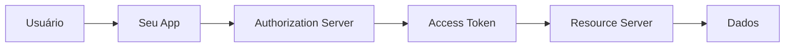

## Introdução: o dia em que quase vazei tokens em produção

2015. Minha primeira implementação de OAuth. Segui um tutorial, copiei código, funcionou. "Login com Google" — check.

Uma semana depois, revisando logs: `access_token` em query strings. `refresh_token` em localStorage sem HTTP-only. Redirect URIs mal configuradas.

Não foi um breach. Mas foi um susto que me fez perceber: OAuth não é sobre fazer login. É sobre entender **confiança delegada**.

Este artigo não é outro tutorial de "como implementar OAuth". É sobre entender por que OAuth existe, como pensa, e que problemas tenta resolver — além do óbvio "não pedir senha ao usuário".

---

## O problema fundamental: a senha como anti-padrão

### O mundo antes do OAuth

Ano 2000. Você tem um serviço A que precisa acessar dados do serviço B.

**Solução 1:** Senha do usuário
```bash
# "Me dá sua senha do Gmail que eu busco seus emails"
usuário → senha → serviço A → serviço B
```
Problema: Serviço A vê tudo. Usuário não pode revogar acesso sem mudar senha.

**Solução 2:** Senha de aplicação
```bash
# Senha especial só para serviço A
usuário → senha-app → serviço A → serviço B
```
Melhor, mas ainda: acesso total, revogação difícil.

**Solução 3:** API keys
```bash
# Chave que identifica serviço A
service A → api-key → service B
```
Mas: não identifica usuário, permissões granulares limitadas.

### O insight do OAuth

OAuth nasce em 2006 no Twitter (como OAuth 1.0) com uma ideia radical: **não compartilhe credenciais, compartilhe autorização**.

Traduzindo: "Não me dê sua chave do apartamento. Me dê uma chave temporária que só abre a sala que eu preciso, e só quando você estiver presente."

---

## Os quatro papéis do OAuth (e por que importam)

### 1. Resource Owner (Dono do Recurso)
**Quem:** O usuário final.
**O que:** Tem dados no serviço (fotos no Google, tweets no Twitter).
**Analogia:** Dono do apartamento.

### 2. Client (Cliente)
**Quem:** Aplicação que quer acessar os dados.
**O que:** Seu app web/mobile.
**Analogia:** Amigo que quer visitar.

### 3. Resource Server (Servidor de Recurso)
**Quem:** API que guarda os dados protegidos.
**O que:** Google Photos API, Twitter API.
**Analogia:** O apartamento em si.

### 4. Authorization Server (Servidor de Autorização)
**Quem:** Serviço que emite tokens.
**O que:** Google OAuth, GitHub OAuth.
**Analogia:** Porteiro que dá chaves temporárias.

### Por que essa separação importa?



Cada papel tem responsabilidades distintas. Misturá-los é receita para vulnerabilidades.

---

## OAuth 2.0 vs OAuth 1.0: uma guerra de filosofias

### OAuth 1.0 (2006): segurança acima de tudo
- **Assinatura complexa:** HMAC-SHA1 em cada request
- **Token secreto:** Client tem secret, assina requests
- **Pro:** Não precisa HTTPS (em teoria)
- **Contra:** Complexo de implementar

```python
# OAuth 1.0 signature (simplificado)
signature = hmac_sha1(
    base_string = method + url + params,
    key = consumer_secret + "&" + token_secret
)
```

### OAuth 2.0 (2012): praticidade acima de perfeição
- **Bearer tokens:** "Portador apresenta, tem acesso"
- **HTTPS obrigatório:** Sem criptografia no token
- **Pro:** Simples de implementar
- **Contra:** Depende totalmente de HTTPS

```http
GET /api/photos HTTP/1.1
Authorization: Bearer ya29.a0AfH6SMB...
```

### A polêmica

OAuth 2.0 é mais simples, mas alguns dizem: "OAuth 2.0 não é OAuth". É verdade — são filosofias diferentes. OAuth 1.0 era protocolo de segurança. OAuth 2.0 é framework de autorização.

---

## Os grants (fluxos): escolha a ferramenta certa

### 1. Authorization Code (o mais comum)

**Para:** Aplicações web com backend.
**Fluxo:**
```
1. Usuário → /auth?client_id=...&redirect_uri=...
2. Login + consent
3. → redirect_uri?code=...
4. Backend troca code por token (com client_secret)
```

**Por que seguro?** `code` é inútil sem `client_secret`. Token nunca expõe ao browser.

### 2. Implicit (deprecated, mas ainda visto)

**Para:** SPA (Single Page Apps) - **⚠️ Não use mais!**
**Fluxo:**
```
1. Usuário → /auth?response_type=token
2. Login + consent  
3. → redirect_uri#access_token=...
```

**Problema:** Token no URL fragment → JavaScript acessa → risco XSS.

### 3. Client Credentials

**Para:** Machine-to-machine (sem usuário).
**Fluxo:**
```
1. Client → /token (com client_id + client_secret)
2. → access_token
```

**Exemplo:** Seu backend acessando API de pagamento.

### 4. Resource Owner Password Credentials

**Para:** Aplicações trusted (ex: app oficial).
**Fluxo:**
```
1. Usuário dá username/password ao client
2. Client → /token (com credenciais)
3. → access_token
```

**⚠️ Cuidado:** Só use se você controla client E resource server.

### 5. Device Code

**Para:** TVs, consoles, IoT.
**Fluxo:**
```
1. Device mostra código
2. Usuário vai para site em outro device
3. Insere código, autoriza
4. Device poll por token
```

### 6. Refresh Token

**Não é grant, mas crucial:**
```json
{
  "access_token": "eyJ...",
  "refresh_token": "def...",
  "expires_in": 3600
}
```
`access_token` vive pouco (minutos/horas). `refresh_token` vive muito (dias/anos), mas só troca por novo `access_token`.

---

## O fluxo Authorization Code com PKCE (o padrão ouro)

PKCE (Proof Key for Code Exchange) corrige problemas do Authorization Code para apps nativos/SPA.

### O problema
App nativo não tem `client_secret` seguro (pode ser extraído do binário). Como prevenir code interception attack?

### A solução PKCE

```javascript
// 1. Client gera code_verifier (random)
const code_verifier = generateRandomString(64);

// 2. Deriva code_challenge
const code_challenge = sha256(code_verifier);

// 3. Inicia auth com challenge
redirectTo(`/auth?client_id=...&code_challenge=...`);

// 4. Recebe code
const code = getCodeFromRedirect();

// 5. Troca code por token, enviando verifier
fetch('/token', {
  method: 'POST',
  body: `code=${code}&code_verifier=${code_verifier}`
});
```

**Segurança:** Mesmo que atacante intercepte `code`, sem `code_verifier` é inútil.

---

## Tokens: JWT vs. Opaco

### JWT (JSON Web Token)

```json
{
  "alg": "RS256",
  "typ": "JWT"
}
.
{
  "sub": "1234567890",
  "name": "John Doe",
  "iat": 1516239022,
  "exp": 1516242622
}
.
[signature]
```

**Vantagens:**
- Autocontido (claims no próprio token)
- Verificação offline (com chave pública)
- Padrão ubíquo

**Desvantagens:**
- Tamanho (cada request carrega payload)
- Revogação complexa
- Se vazado, válido até expirar

### Token opaco

```http
GET /introspect HTTP/1.1
Authorization: Bearer abc123...

HTTP/1.1 200 OK
{
  "active": true,
  "sub": "1234567890",
  "scope": "read write"
}
```

**Vantagens:**
- Revogação instantânea
- Controle total pelo auth server
- Tamanho pequeno

**Desvantagens:**
- Request extra para validação
- Latência
- Dependency no auth server

### Escolha
- **JWT:** Microserviços, offline validation, high throughput
- **Opaco:** Centralized control, instant revocation, sensitive apps

---

## Scopes: a arte da granularidade

Scopes definem "o que" o token permite, não "quem".

```http
GET /auth?scope=read:photos+write:photos
```

### Boas práticas

**Ruim:**
```http
scope=all  # Muito amplo
scope=user  # Ambiguo
```

**Bom:**
```http
scope=photos.read photos.write profile.email
```

**Melhor:**
```http
# Namespaced
scope=https://photos.google.com/read https://photos.google.com/write
```

### Scopes vs. Roles vs. Permissions

- **Scopes:** O que a aplicação CLIENTE pode fazer
- **Roles:** O que o USUÁRIO é no RESOURCE SERVER  
- **Permissions:** O que o USUÁRIO pode fazer no RESOURCE SERVER

Exemplo:
- Scope: `photos.read` (app pode ler fotos)
- Role: `admin` (usuário é admin no sistema)
- Permission: `delete_photos` (usuário pode deletar fotos)

---

## Os 10 erros mais comuns (e como evitar)

### 1. Token em localStorage
```javascript
// ❌
localStorage.setItem('token', response.access_token);

// ✅ HTTP-only cookie
fetch('/api/set-token-cookie', {
  method: 'POST',
  body: JSON.stringify({ token: response.access_token }),
  credentials: 'include'
});
```

### 2. Redirect URI não validada
```javascript
// ❌ Aceita qualquer redirect
redirect_uri = req.query.redirect_uri;

// ✅ Lista branca
const allowedUris = ['https://app.com/callback', 'https://localhost:3000/callback'];
if (!allowedUris.includes(redirect_uri)) throw Error();
```

### 3. State parameter ausente
```javascript
// ❌ CSRF vulnerability
`/auth?client_id=abc&redirect_uri=...`

// ✅ Com state
const state = generateRandomString();
storeStateInSession(state);
`/auth?client_id=abc&redirect_uri=...&state=${state}`
```

### 4. Client secret no frontend
```javascript
// ❌ SPA com client_secret
const client_secret = 'abc123'; // Expoẽ!

// ✅ PKCE sem secret
const code_verifier = generateRandomString();
const code_challenge = sha256(code_verifier);
```

### 5. Token sem expiration
```json
// ❌
{ "access_token": "abc", "expires_in": null }

// ✅
{ "access_token": "abc", "expires_in": 3600 }
```

### 6. Logs com tokens
```javascript
// ❌
console.log(`Token: ${token}`);

// ✅
console.log(`Token length: ${token.length}`);
```

### 7. Scope demasiado amplo
```http
# ❌
scope=*

# ✅  
scope=read:profile write:profile
```

### 8. Não usar refresh tokens
```javascript
// ❌ Usuário refaz login a cada hora
// ✅ Refresh token silencioso
```

### 9. Validar token apenas uma vez
```javascript
// ❌ Cache validation forever
// ✅ Validar a cada request (JWT) ou cache curto
```

### 10. Ignorar spec updates
OAuth 2.1 (2023) já corrige vários problemas do 2.0. Esteja atualizado.

---

## OAuth 2.1: o que mudou

### Removidos
- Implicit grant (usar Authorization Code + PKCE)
- Resource Owner Password Credentials (quase sempre)
- `token` response_type

### Adicionados/Reforçados
- PKCE obrigatório para todos clients públicos
- Redirect URIs must be exact match (não mais prefix)
- Bearer token usage recommendations

### Migração
Se implementa OAuth 2.0 hoje, já implemente como 2.1.

---

## Além do OAuth: OpenID Connect

OAuth é autorização ("pode acessar?"). OpenID Connect (OIDC) é identidade ("quem é?").

### ID Token (JWT especial)
```json
{
  "iss": "https://accounts.google.com",
  "sub": "1234567890",
  "aud": "client-id",
  "exp": 1516239022,
  "iat": 1516239022,
  "email": "user@example.com",
  "name": "John Doe"
}
```

### OIDC sobre OAuth
```
OAuth 2.0 + ID Token + UserInfo Endpoint = OpenID Connect
```

Use OIDC quando precisa saber quem é o usuário, não apenas se pode acessar recursos.

---

## Implementação prática: o mínimo viável seguro

### Backend (Node.js + Express)
```javascript
const express = require('express');
const crypto = require('crypto');

const app = express();

// 1. Iniciar auth
app.get('/auth', (req, res) => {
  const state = crypto.randomBytes(16).toString('hex');
  const codeVerifier = crypto.randomBytes(32).toString('base64url');
  
  req.session.state = state;
  req.session.codeVerifier = codeVerifier;
  
  const codeChallenge = crypto
    .createHash('sha256')
    .update(codeVerifier)
    .digest('base64url');
    
  const authUrl = new URL('https://accounts.google.com/o/oauth2/v2/auth');
  authUrl.searchParams.set('client_id', process.env.CLIENT_ID);
  authUrl.searchParams.set('redirect_uri', process.env.REDIRECT_URI);
  authUrl.searchParams.set('response_type', 'code');
  authUrl.searchParams.set('scope', 'email profile');
  authUrl.searchParams.set('state', state);
  authUrl.searchParams.set('code_challenge', codeChallenge);
  authUrl.searchParams.set('code_challenge_method', 'S256');
  
  res.redirect(authUrl.toString());
});

// 2. Callback
app.get('/callback', async (req, res) => {
  // Validar state
  if (req.query.state !== req.session.state) {
    return res.status(400).send('Invalid state');
  }
  
  // Trocar code por token
  const tokenResponse = await fetch('https://oauth2.googleapis.com/token', {
    method: 'POST',
    headers: { 'Content-Type': 'application/x-www-form-urlencoded' },
    body: new URLSearchParams({
      code: req.query.code,
      client_id: process.env.CLIENT_ID,
      client_secret: process.env.CLIENT_SECRET,
      redirect_uri: process.env.REDIRECT_URI,
      code_verifier: req.session.codeVerifier,
      grant_type: 'authorization_code'
    })
  });
  
  const tokens = await tokenResponse.json();
  
  // Armazenar token seguro (HTTP-only cookie, session, etc.)
  req.session.accessToken = tokens.access_token;
  
  res.redirect('/dashboard');
});
```

### Frontend (React)
```jsx
function LoginButton() {
  const login = () => {
    // Sempre via backend para SPA também
    window.location.href = '/auth';
  };
  
  return <button onClick={login}>Login with Google</button>;
}
```

---

## Quando NÃO usar OAuth

### 1. Aplicações internas (empresa)
**Melhor:** SAML, LDAP, Active Directory.

### 2. Machine-to-machine sem usuário
**Melhor:** API keys com escopo, mTLS.

### 3. Aplicação single-tenant
**Melhor:** Seu próprio sistema de login.

### 4. Performance crítica (milhões de req/s)
**Melhor:** Tokens opacos com cache agressivo ou JWT.

---

## O futuro: além do OAuth

### 1. WebAuthn / Passkeys
Login sem senha, com biometria/security keys.

### 2. OAuth 2.1 + DPoP
Demonstrated Proof-of-Possession: token vinculado a chave do client.

### 3. GNAP (Grant Negotiation and Authorization Protocol)
Sucessor em discussão, mais flexível que OAuth.

### 4. Zero Trust Architecture
OAuth como componente de confiança zero: "never trust, always verify".

---

## Conclusão: OAuth como filosofia de design

Voltando ao susto de 2015. Hoje entendo que o problema não era OAuth. Era meu modelo mental.

Via OAuth como "ferramenta para login". Era código a copiar, endpoints a chamar.

OAuth é mais que isso. É uma **filosofia de confiança delegada**. É sobre:

1. **Minimizar confiança:** Dê o mínimo acesso necessário
2. **Explicitar consentimento:** Usuário sabe o que está concedendo
3. **Permitir revogação:** Acesso pode ser removido granularmente
4. **Separar preocupações:** Autenticação ≠ Autorização ≠ Identidade

Quando você implementa OAuth, não está apenas adicionando "login com Google". Está adotando um modelo de segurança que diz:

- "Não confie em mim com suas credenciais"
- "Eu só quero fazer X, não Y e Z"
- "Você pode me tirar esse acesso a qualquer momento"
- "Eu prove quem sou, não quem digo ser"

É uma mudança de poder: do serviço para o usuário.

E isso, no final, é o que separa sistemas que coletam dados de sistemas que respeitam pessoas.

---

## Checklist de implementação

Antes de dizer "implementei OAuth", verifique:

- [ ] Usa Authorization Code flow (não Implicit)
- [ ] PKCE para clients públicos
- [ ] State parameter contra CSRF
- [ ] Redirect URIs validadas exatamente
- [ ] Tokens com expiration razoável
- [ ] Refresh tokens (quando apropriado)
- [ ] Scopes granulares
- [ ] Tokens nunca em logs
- [ ] HTTPS everywhere
- [ ] Considera OAuth 2.1

Se faltar algum, não é OAuth seguro. É "algo parecido com OAuth".

---

```javascript
// Sua implementação atual
app.get('/oauth/callback', (req, res) => {
  const code = req.query.code;
  // ... troca por token
  
  // Pergunte: está seguindo a filosofia ou só o fluxo?
  // 
  // OAuth não é sobre fazer requests funcionarem.
  // É sobre construir confiança.
  // 
  // E confiança não se implementa com código.
  // Se constrói com design.
});
```

A próxima vez que implementar OAuth, lembre: você não está adicionando um botão de login. Está construindo um sistema de confiança.

E confiança, bem implementada, é a feature mais valiosa que qualquer software pode ter.