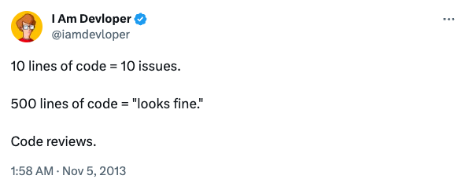
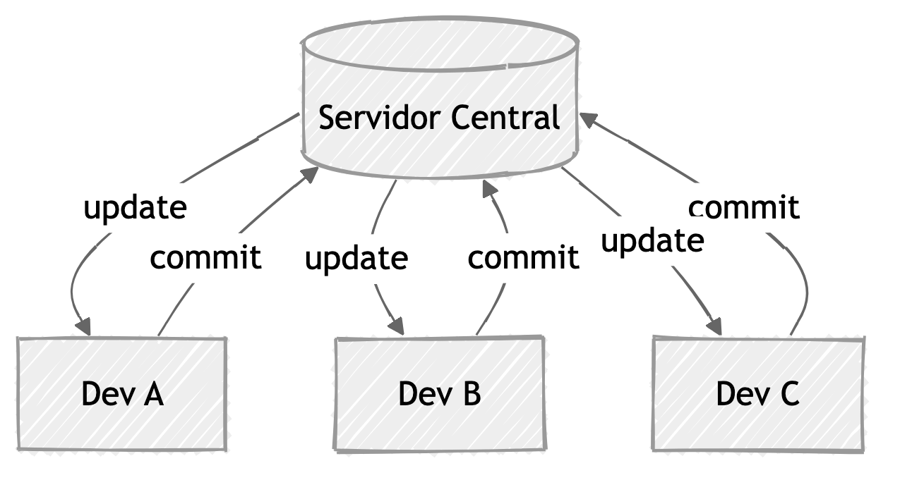
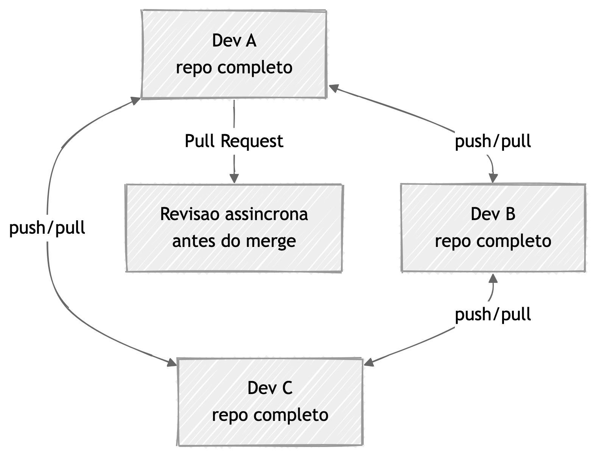
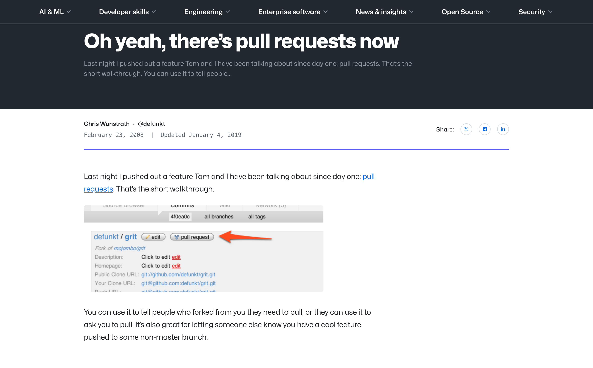
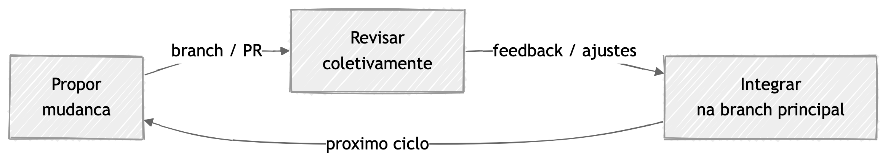
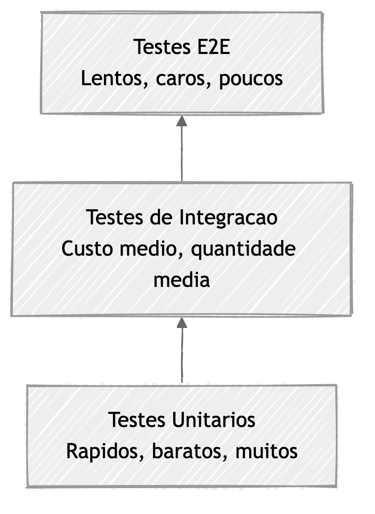
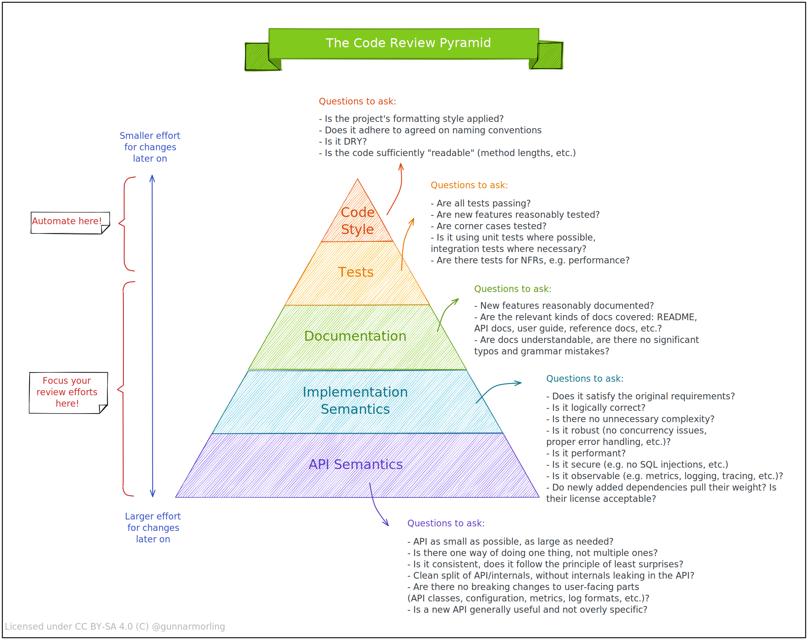

## Introdução

A Liturgia, do grego λειτουργία ("serviço público" ou "serviço do culto"), pode
se referir as ações pré-definidas realizadas de acordo com uma tradição ou
religião. Em suma, é repetir um rito sem questionar o porquê. Entretanto,
é errado minimizar a liturgia: o rito preserva a tradição, cria identidade e dá
estrutura ao sagrado. A forma é tão importante quanto o conteúdo.

Em muitos times, a revisão de código virou exatamente isso: liturgia
corporativa. Um item na descrição de cargo. Uma etapa obrigatória do fluxo de
trabalho.

O desenvolvedor abre o pedido de mudança, outro aprova com _"LGTM"_ (sigla para
_"Looks Good To Me"_, ou "parece bom para mim"), e o código vai para produção.
Ninguém questiona design. Ninguém aponta risco. O código segue porque passou
por uma série de etapas pré-definidas. Sejamos honestos: **isso é claramente
uma má prática.**

A etapa de revisão de código não deveria ser uma formalidade vazia. Se trata,
na sua essência, de um momento para uma discussão técnica sobre qualidade,
riscos e evolução do sistema. Quando vira uma etapa protocolar, perde o valor.
Pior: cria uma falsa sensação de segurança.

No processo de desenvolvimento atual, todo time faz code review. Todavia,
poucos fazem com consistência e profundidade. E parte da razão é simples:
gasta-se energia humana no que é mecânico e sobra pouco para o que realmente
importa.

Nesse ponto, uma pergunta inevitável é: **"o que dá para automatizar sem
esvaziar o valor humano da revisão?"**

A resposta que mais funciona para mim é o que ficou conhecido como **Pirâmide
de Code Review**. Base automatizada. Topo humano. Antes dela, porém, vale um
passo para trás: qual é origem da prática ao qual chamamos de revisão de
código? E como chegamos a funcionalidade conhecida como _Pull Request_?

## De onde vem o code review

A revisão de artefatos de software não começou no GitHub. Nessa história, um
marco importante é o trabalho de **Michael Fagan (IBM, 1976)**, que formalizou
as inspeções de software como um processo estruturado para encontrar defeitos
cedo[^1][^2]. Estudos posteriores confirmaram que a revisão de código é uma das
formas mais eficazes de encontrar defeitos antes que cheguem a produção[^32].

Todavia, o que viabilizou a transição de inspeções formais para revisões
assíncronas e distribuídas foi a evolução dos sistemas de controle de versão.
Ferramentas centralizadas como CVS e Subversion (SVN) já permitiam colaboração,
mas com um modelo linear e dependente de um servidor central[^30][^31].

A virada veio com sistemas distribuídos como **Git** (2005) e Mercurial[^53],
que deram a cada desenvolvedor uma cópia completa do repositório[^12].
A criação de ramos de desenvolvimento (_branch_) virou operação barata.
A criação de _"forks"_ virou fluxo natural.

Esse modelo distribuído casou perfeitamente com o crescimento do open source.
Projetos como o kernel Linux já usavam revisão por e-mail com patches[^33].
Quando plataformas como **GitHub** (2008) e depois GitLab e Bitbucket
transformaram esse fluxo em algo visual e assíncrono, o padrão se consolidou:
`branch`, `diff`, `revisão`, `merge`[^3][^11]. Pesquisas sobre práticas
modernas de code review em larga escala, incluindo estudos no Google e na
Microsoft, confirmam que esse modelo é amplamente adotado e eficaz, **quando
bem executado**[^35][^36].

Um marco importante aqui é o lançamento público da feature de _Pull Request_ no
GitHub, em **fevereiro de 2008**, no post _"Oh yeah, there's pull requests
now"_[^11]. Esse momento ajudou a consolidar o review assíncrono baseado em
branch/fork como um padrão da indústria.

Com plataformas modernas de colaboração, a revisão passou a acontecer em um
objeto único com `diff`, comentários, checks automáticos e avaliação de merge.
Esse objeto recebeu nomes diferentes ao longo do ecossistema:

- **Pull Request (PR)**: popularizado por GitHub e Bitbucket[^3][^4]
- **Merge Request (MR)**: nomenclatura adotada pelo GitLab[^5]
- **Change / Patch Set**: fluxo tradicional no Gerrit[^6]
- **Change List (CL)**: termo usado em ferramentas como Perforce[^17] e em processos internos de grandes empresas
- **Differential Revision**: termo associado ao Phabricator[^18]

Mudou o nome, não a essência: _propor uma mudança, revisar coletivamente e só
então integrar na branch principal_.

Com o fluxo consolidado, a pergunta mudou. Já não era mais "como revisar
código", mas "o que olhar primeiro". Quando tudo passa pelo mesmo funil
— estilo, segurança, testes, design, decisão de produto — o revisor se perde.
É aí que entra a pirâmide de code review.

## A Pirâmide de Code Review

A ideia de organizar práticas em formato de pirâmide não é nova. Mike Cohn
propôs a **Pirâmide de Testes** em 2009[^39]: muitos testes unitários na base
(rápidos e baratos), menos testes de integração no meio, e poucos testes
end-to-end no topo (lentos e caros). A lógica é simples: quanto mais perto da
base, mais barato automatizar; quanto mais perto do topo, mais caro e difícil.

A Pirâmide de Code Review segue a mesma intuição aplicada à revisão. Na base,
o que é mecânico e determinístico — automatize sem pensar duas vezes. No topo,
o que exige contexto, julgamento e experiência — preserve para o humano.

A base visual deste artigo é inspirada no trabalho original de **Gunnar
Morling**, no post _The Code Review Pyramid_[^9]. Abaixo, estou usando a imagem
original de como uma pirâmide funciona[^10]:

A pirâmide ajuda a responder três perguntas:

1. O que **deve** ser automatizado?
2. O que **pode** ser parcialmente automatizado?
3. O que **não deveria** ser automatizado (ou ainda depende de análise humana)?

### Nível 1 — Estilo e formatação

Aqui moram regras sem subjetividade. Se é determinístico, não deve consumir
tempo de revisor humano.

Pense em formatação: tabs vs. espaços, ponto e vírgula, ordem de imports. Em um
projeto React com TypeScript, o Prettier[^13] resolve isso com um comando. Em
Java ou Kotlin, o Spotless[^40] ou ktlint[^41] fazem o mesmo. Ninguém deveria
gastar um comentário de review para dizer _"faltou ponto e vírgula na linha 42"_.

O mesmo vale para `lint`. O ESLint[^19] em um projeto JavaScript pega variáveis
não usadas, imports desnecessários e padrões inseguros antes de qualquer humano
olhar o código. Em Java, o Checkstyle[^42] e o PMD[^43] cumprem papel
semelhante. Em Kotlin, temos o Detekt[^44].

Segredos em commit? Ferramentas como GitLeaks[^45] ou TruffleHog[^46] detectam
chaves de API e tokens que escaparam para o repositório. Dead code,
dependências não usadas, arquivos sem newline — tudo isso é (deveria ser) um
consenso mecânico.

O objetivo desse nível é remover ruído. Quando a base está automatizada,
o revisor abre o PR e já encontra um código limpo, padronizado e livre de
problemas triviais. Sobra atenção para o que importa.

### Nível 2 — Segurança e integridade

Ainda bastante automatizável, mas com contexto um pouco maior. Aqui o foco
é barrar regressões graves antes de qualquer discussão subjetiva.

Em um projeto TypeScript, o CodeQL[^22] ou o Semgrep[^21] conseguem detectar
padrões de injeção, uso inseguro de `eval()`, ou chamadas `HTTP` sem validação.
Em Java, o SpotBugs[^47] identifica `null pointer`, vazamentos de memória `resource leaks`
e padrões de serialização perigosos. Em Kotlin com Spring, o Trivy[^23] escaneia
dependências e avisa quando uma biblioteca tem uma _CVE_ (vulnerabilidade pública
catalogada) conhecida.

As política de branch protection[^16] também mora aqui. Exigir aprovação
mínima, bloquear push direto na `main`, obrigar que checks de CI passem antes
do merge — tudo isso é configuração de repositório, não esforço humano.

A validação de `CODEOWNERS`[^48], permissões de arquivos sensíveis (como
`application.yml` ou `.env`) e checks obrigatórios de CI completam esse nível.
O ponto é simples: se uma vulnerabilidade conhecida ou uma quebra de política
pode ser detectada por automações, não faz sentido desperdiçar atenção humana.

### Nível 3 — Comportamento e contrato

Aqui entram testes e evidências de comportamento. Trata-se de uma automação
forte, mas exige bom design de suíte de testes e disciplina de manutenção.

Em um projeto React, isso significa testes com Testing Library[^49] que validam
se o componente renderiza corretamente, se o estado muda como esperado e se os
`callbacks` disparam. Em Java com Spring Boot, são testes de integração que
sobem o contexto e validam endpoints. Em Kotlin, testes com MockK[^50] que
verificam contratos entre camadas.

Cobertura mínima por módulo crítico também entra aqui. Não como métrica por
vaidade ("90% de cobertura!"), mas como proteção: se o módulo de pagamento tem
menos de 80% de cobertura, o CI bloqueia. Verificação de compatibilidade de API
— como testes de contrato com Pact[^51] — garante que uma mudança no _backend_
não quebra o _frontend_ silenciosamente.

O objetivo desse nível é responder a uma pergunta: "essa mudança ainda faz
o que deveria fazer?" Se a resposta vem dos testes automatizados, o revisor
humano pode focar em outra coisa.

### Nível 4 — Design e arquitetura

Agora começa a zona cinza. Ferramentas ajudam com sinais, mas não substituem o
julgamento técnico.

Imagine um PR em um projeto Java que adiciona uma dependência direta entre o
módulo de notificação e o módulo de pagamento. O ArchUnit[^52] pode detectar essa
violação de fronteira arquitetural automaticamente. Mas e se o PR introduz um
Service com 15 métodos públicos em um projeto Kotlin? Ou um componente React
com 400 linhas que mistura lógica de negócio, chamada de API e renderização?
Nenhuma ferramenta vai dizer com certeza que isso está errado — mas um revisor
experiente reconhece o problema.

Legibilidade, coesão, nomes e modelagem moram aqui. Um `UserManager` que faz
tudo é um code smell, mas não é algo que um _linter_ detecta. Um hook
customizado em React que esconde efeitos colaterais complexos pode funcionar
perfeitamente nos testes e ainda assim ser uma armadilha para quem mantém
o código depois.

Os _trade-offs_ de performance também entram nesse nível. Usar `useEffect` com
dependências erradas em React, fazer N+1 queries em um endpoint Spring, ou
criar coroutines sem controle de concorrência em Kotlin — são decisões que
exigem contexto do sistema, não apenas análise estática.

É possível automatizar parcialmente? Sim. Métricas de complexidade ciclomática,
detectores de acoplamento e até assistentes de IA ajudam a levantar sinais. Mas
a decisão final — "isso é aceitável para o nosso contexto?" — **ainda
é humana**.

### Nível 5 — Produto, risco e estratégia

No topo da pirâmide, a pergunta deixa de ser técnica e vira decisão de negócio.

Um PR que refatora o fluxo de checkout em React pode estar tecnicamente
impecável — testes passando, código limpo, sem vulnerabilidades. Mas será que
faz sentido refatorar o checkout agora, quando o time está focado em reduzir
_churn_? Um endpoint novo em Java que expõe dados de usuário pode estar bem
implementado, mas o risco regulatório foi avaliado?

Esse é o nível onde se pergunta: isso resolve o problema certo? O risco
operacional é aceitável para o momento? A mudança está alinhada à estratégia do
time? O custo de manter essa solução compensa o ganho?

Aqui, automação apoia contexto — dashboards de observabilidade, métricas de
impacto, histórico de incidentes. Mas não decide prioridade nem
responsabilidade. Esse julgamento é humano, e deveria ser.

## Sim, vamos falar sobre IA

Quando Gunnar Morling publicou a Pirâmide de Code Review, o cenário era outro.
Ferramentas de IA generativa ainda não faziam parte do fluxo de
desenvolvimento. O papel da automação se limitava a _linters_, _scanners_
e pipelines de CI. O humano entrava do nível 3 para cima, e ninguém questionava
isso.

Hoje, o cenário mudou. Agentes de código como GitHub Copilot[^27], Amazon
CodeWhisperer[^29] e CodeRabbit[^28] não apenas geram código — eles também
revisam. Um agente consegue analisar um PR, sumarizar as mudanças, apontar
possíveis bugs, sugerir melhorias de legibilidade e até questionar decisões de
design. Isso era impensável quando a pirâmide foi proposta.

Na prática, a IA está subindo na pirâmide. Nos níveis 1 e 2, ela já substitui
boa parte do trabalho humano com eficácia. No nível 3, ajuda a identificar
testes ausentes e sugerir cenários de borda. No nível 4, consegue levantar
sinais sobre acoplamento, complexidade e padrões questionáveis. Não com
a precisão de um desenvolvedor experiente, mas com velocidade suficiente para
funcionar como um primeiro filtro.

Mas há um limite claro. Com a geração de código assistida por IA, uma coisa
mudou rápido: o volume de alteração. Você produz mais alterações por unidade de
tempo. Às vezes, muito mais. E isso torna o papel humano **mais importante**.

O code agent é ótimo para acelerar implementação, boilerplate, testes iniciais,
refatorações repetitivas e documentação de apoio. Mas ele não responde sozinho
a perguntas centrais de engenharia: essa escolha faz sentido para o contexto do
produto? Esse trade-off operacional é aceitável para o nosso cenário? A mudança
é segura para quem já usa a API em produção?

Em outras palavras: o agente acelera a execução; o humano responde pela direção,
coerência e risco. A pirâmide continua válida — o que mudou é que a fronteira
entre o que é automatizável e o que exige julgamento humano subiu alguns
andares. E vai continuar subindo.

A recomendação prática é usar a IA para reduzir trabalho mecânico e ampliar
a cobertura de análise, sem terceirizar a decisão técnica final.

## Boas práticas para review de verdade (não só checklist)

No meu dia-a-dia, a revisão de código é a atividade que eu julgo mais
importante. Para realizá-la de forma satisfatória é importante seguir algumas
práticas. Separe blocos de tempo para revisar. Um _review_ fragmentado entre
reuniões tende a perder profundidade. Evite PRs gigantes — quanto maior o diff,
pior a qualidade da revisão. Leia o contexto antes do código: entenda
o problema, a decisão e o impacto esperado. Quando necessário, rode o código
localmente — baixar a branch e executar ajuda a formar uma visão sistêmica da
alteração, além do que está sendo alterado.

Faça duas passadas: primeiro um entendimento global da mudança, depois uma
leitura detalhada por arquivo. E registre decisões, não só correções.
O comentário de review também é memória técnica do time.

## Por onde começar a automação

Se o seu time está começando agora, a sequência mais eficiente costuma ser:

1. **Nível 1** (estilo e formatação) — ganho imediato de tempo
2. **Nível 2** (segurança e integridade) — redução de incidentes
3. **Nível 3** (comportamento) — confiança para deploy
4. **Níveis 4 e 5** — evolução de maturidade e cultura técnica

Uma regra simples: **automatize tudo que é consenso mecânico** e preserve
a energia humana para análise de contexto, risco e design.

## Checklist prático por camada

Você pode adaptar este checklist para PR, MR ou Change:

- **Base (automação)**: lint, format, SAST, segredos, dependências
- **Comportamento**: testes relevantes e evidência de resultado
- **Design**: impacto em fronteiras, acoplamento, legibilidade
- **Negócio**: risco, rollout, observabilidade e plano de rollback

Quanto mais consistente esse checklist, menos a qualidade depende da memória
individual.

## Conclusão

Code review não é um carimbo para "liberar o merge". É uma conversa técnica
sobre qualidade, risco e evolução do sistema.

A **Pirâmide de Code Review** funciona porque separa bem as responsabilidades:
automação para aquilo que é repetitivo, objetivo e escalável; julgamento humano
para aquilo que é contextual, ambíguo e estratégico.

No fim do dia, a meta não é revisar mais PRs. A meta é tomar melhores decisões
de engenharia com menos ruído, menos retrabalho e mais previsibilidade.

---

[^1]: [Michael E. Fagan (1976) - Design and Code Inspections to Reduce Errors in Program Development](https://doi.org/10.1147/sj.153.0182)
[^2]: [Fagan inspection (visão geral)](https://en.wikipedia.org/wiki/Fagan_inspection)
[^3]: [GitHub Docs - About pull requests](https://docs.github.com/en/pull-requests/collaborating-with-pull-requests/proposing-changes-to-your-work-with-pull-requests/about-pull-requests)
[^4]: [Atlassian - Pull request workflow](https://www.atlassian.com/git/tutorials/making-a-pull-request)
[^5]: [GitLab Docs - Merge requests](https://docs.gitlab.com/user/project/merge_requests/)
[^6]: [Gerrit - Code review workflow](https://gerrit-review.googlesource.com/Documentation/intro-user.html)
[^9]: [Gunnar Morling - The Code Review Pyramid](https://www.morling.dev/blog/the-code-review-pyramid/)
[^10]: [Code Review Pyramid (SVG original)](https://www.morling.dev/images/code_review_pyramid.svg)
[^11]: [GitHub Blog (2008) - "Oh yeah, there's pull requests now"](https://github.blog/news-insights/the-library/oh-yeah-there-s-pull-requests-now/)
[^12]: [Git - About (git-scm.com)](https://git-scm.com/about)
[^13]: [Prettier - Opinionated Code Formatter](https://prettier.io/)
[^16]: [GitHub Docs - About protected branches](https://docs.github.com/en/repositories/configuring-branches-and-merges-in-your-repository/managing-protected-branches/about-protected-branches)
[^17]: [Perforce Helix Core - Version Control](https://www.perforce.com/products/helix-core)
[^18]: [Phabricator - Software Development Platform](https://www.phacility.com/phabricator/)
[^19]: [ESLint - Pluggable JavaScript linter](https://eslint.org/)
[^21]: [Semgrep - Static analysis tool](https://semgrep.dev/)
[^22]: [CodeQL - Semantic code analysis engine](https://codeql.github.com/)
[^23]: [Trivy - Comprehensive security scanner](https://trivy.dev/)
[^27]: [GitHub Copilot - AI pair programmer](https://github.com/features/copilot)
[^28]: [CodeRabbit - AI code review assistant](https://www.coderabbit.ai/)
[^29]: [Amazon CodeWhisperer - AI coding companion](https://aws.amazon.com/codewhisperer/)
[^30]: [CVS - Concurrent Versions System](https://cvs.nongnu.org/)
[^31]: [Apache Subversion (SVN)](https://subversion.apache.org/)
[^32]: [Capers Jones (2008) - Applied Software Measurement: Global Analysis of Productivity and Quality](https://dl.acm.org/doi/abs/10.5555/2823929)
[^33]: [Rigby, P. C. & Storey, M. (2011) - Understanding Broadcast Based Peer Review on Open Source Software Projects](https://dl.acm.org/doi/10.1145/1985793.1985867)
[^35]: [Sadowski, C. et al. (2018) - Modern Code Review: A Case Study at Google](https://dl.acm.org/doi/10.1145/3183519.3183525)
[^36]: [Bacchelli, A. & Bird, C. (2013) - Expectations, Outcomes, and Challenges of Modern Code Review](https://doi.org/10.1109/ICSE.2013.6606617)
[^39]: [Mike Cohn (2009) - Succeeding with Agile: Software Development Using Scrum (Test Pyramid)](https://martinfowler.com/articles/practical-test-pyramid.html)
[^40]: [Spotless - Code formatter for Gradle and Maven](https://github.com/diffplug/spotless)
[^41]: [ktlint - Kotlin linter and formatter](https://pinterest.github.io/ktlint/)
[^42]: [Checkstyle - Java static analysis tool](https://checkstyle.org/)
[^43]: [PMD - Source code analyzer](https://pmd.github.io/)
[^44]: [Detekt - Static code analysis for Kotlin](https://detekt.dev/)
[^45]: [GitLeaks - Secret detection tool](https://gitleaks.io/)
[^46]: [TruffleHog - Secret scanning tool](https://trufflesecurity.com/trufflehog)
[^47]: [SpotBugs - Static analysis tool for Java](https://spotbugs.github.io/)
[^48]: [GitHub Docs - About code owners](https://docs.github.com/en/repositories/managing-your-repositorys-settings-and-features/customizing-your-repository/about-code-owners)
[^49]: [Testing Library - Simple and complete testing utilities](https://testing-library.com/)
[^50]: [MockK - Mocking library for Kotlin](https://mockk.io/)
[^51]: [Pact - Contract testing framework](https://pact.io/)
[^52]: [ArchUnit - Unit test architecture for Java](https://www.archunit.org/)
[^53]: [Mercurial - Distributed version control system](https://www.mercurial-scm.org/)
