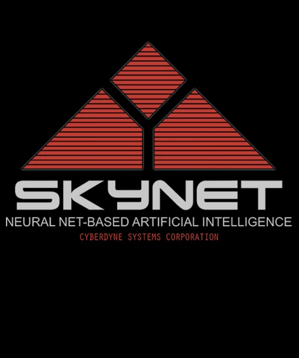

## O dia do julgamento

A cultura pop é recheada de histórias de um momento na história humana em que a
evolução tecnológica permitiria que as máquinas se tornam conscientes. Nesse
processo evolucionário, o próximo passo seria os das máquinas iniciassem a
perceber a humanidade como uma ameaça. Esse é o enredo, por exemplo, da franquia
_Exterminador do Futuro (Terminator)_ que nos apresenta a
[Skynet](https://terminator.fandom.com/wiki/Skynet), uma inteligência artificial
criada pela _Cyberdyne Systems_ e que decidiu que a raça humana deveria ser
exterminada.

Nessa ficção, após os cientistas perceberem os riscos envolvidos no projeto da
_Skynet_ e decidiram por desligá-la. Como forma de retaliação, ou defesa, o
sistema autônomo disparou mísseis nucleares americanos contra alvos na Rússia. A
Rússia revidou, iniciando assim um holocausto nuclear conhecido como o _Dia do
Julgamento_. 

A estória descrita anteriormente tem elementos de diversas produções que tem a
Guerra Fria como pano de fundo. Trata-se de um período de tensão geopolítica
entre a União Soviética e os Estados Unidos, após a Segunda Guerra Mundial.
Contudo, voltemos exatamente para o período da Segunda Guerra, especialmente nos
dias em que muitos homens e mulheres buscavam o pioneirismo em desenvolver uma
nova tecnologia chamada bomba nuclear.

## O início do fim

Em 2023 foi lançada a filme-biografia de [J. Robert
Oppenheimer](https://blogs.pucpr.br/eeh/2023/08/29/oppenheimer-pai-da-bomba-atomica-e-dos-buracos-negros/)
que foi um físico nuclear que liderou o [Projeto
Manhattan](https://en.wikipedia.org/wiki/Manhattan_Project). O objetivo do
projeto era dominar a tecnologia de construção de uma arma nuclear antes dos
alemães. **Para aqueles que não tenham assistido ao filme, os próximos
parágrafos podem conter _spoilers_**.

Em 1942, Edward Teller, um dos pesquisadores do Projeto Manhattan, fez uma
apresentação na qual observou que uma explosão atômica poderia criar as
condições sob as quais reações de fusão poderiam ocorrer. Em teoria, haveria uma
chance remota de uma bomba atômica iniciar uma ignição de toda a atmosfera[^1].

Na época, dado o pouco conhecimento sobre a fissão nuclear, tal teoria apenas
poderia ser descartada com um teste real, ou seja, disparando um protótipo da
bomba e analisando os resultados. Esse teste ficou conhecido como _Trinity_.
Apesar do risco, a justificativa ética em prosseguir com o projeto era evitar
que os nazistas tivesse a bomba antes. É importante dizer que em julho de 1945,
época do fatídico teste Trinity, a Alemanha nazista já havia se rendido.

Nesse momento, meu caro leitor, precisamos nos fazer a seguinte pergunta:
**Qual é o limite (ético/moral) para o teste/evolução de uma nova tecnologia?**

Trazendo para o tema central desse texto, _qual deveria ser a nossa atitude se
a próxima geração de ferramentas de IA, pudesse incendiar o nosso mundo_?!

## Ferramentas de IA não são mais o futuro

O ano de 2023 pode ser considerado como um ponto de inflexão no uso das IAs
generativas, pelo menos em alguns nichos, como o desenvolvimento de software.
Soluções como [Github Copilot](https://github.com/features/copilot), [AWS Code
Whisperer](https://aws.amazon.com/pt/codewhisperer/) e [AI Assistant da
JetBrains](https://blog.jetbrains.com/idea/2023/06/ai-assistant-in-jetbrains-ides/)
já fazem parte do ecossistemas de muitos desenvolvedores, com o objetivo de
acelerar a codificação, reduzir tarefas repetitivas e ajudar na escrita de
testes.

Apesar de certa desconfiança de alguns (inclusive minha), o uso de ferramentas
de inteligência artificial me parece um caminho sem volta. Todavia, a discussão
sobre os parâmetros éticos que governam esse tipo de ferramenta necessitam ser
discutidos. Vamos a alguns exemplos recentes.

### Frankenstein e a AI Generativa

O [Prêmio Jabuti](https://www.premiojabuti.com.br/) é o mais tradicional prêmio
literário do Brasil, concedido pela Câmara Brasileira do Livro (CBL). Na edição
de 2023, a ilustração do clássico _Frankenstein_, de Mary Shelley, foi
desclassificado por ter utilizado o suporte de ferramentas de IA. A
justificativa foi que _“as regras da premiação estabelecem que casos não
previstos no regulamento sejam deliberados pela curadoria, e a avaliação de
obras que utilizam IA em sua produção não estava contemplada nessas
regras”_[^2]. Coincidência ou não, chega ser irônico que essa discussão tenha
ocorrido a partir de ilustrações de um livro cujo ponto central seja a relação
entre criador e criatura e seus limites éticos.

Em alguns processo seletivos para vagas de tecnologia é comum que o candidato
possa "_levar uma tarefa para casa_". No papel de avaliador, deveríamos
considerar válidas soluções que utilizem algum suporte de IA? Seria possível
separar a contribuição da "máquina" na solução proposta pelo candidato? 

Se definir os limites de propriedade intelectual está cada vez mais complexo,
imagine quando o uso da inteligência artificial pode definir entre vida e morte.

### O Evangelho: massificando ataques a bomba com IA

O jornal _The Guardian_ relevou a existência de um sistema israelense chamado de
_The Gospel_ (O Evangelho). Trata-se de um sistema orientado à dados
(_data-driven_) que utiliza IA para definir alvos a serem bombardeados em Gaza.
O objetivo do sistema é acelerar o processo de definição de alvos militares ao
mesmo tempo que mitigue o número de vítimas civis[^3]. No contexto de uma
guerra, uma visão tecnocrata poderia encontrar valor em um procedimento técnico
e "não enviesado" para definição de alvos de guerra. **O ponto é que justamente
essas ferramentas possuem vieses".

Para aqueles que conhecem um pouco sobre o desenho de sistemas de inteligência
artificial sabe que é pouco provável construí-los sem algum tipo de viés. Nesse
sentido, um sistema que define alvo militares, necessita ser configurado com
parâmetros que traz em si todo enviesamento/pré-conceitos intrínseco ao ser
humano. O fato de um sistema de software fazer parte do fluxo de decisão de quem
vive ou quem morre é assustador. Bem mais do uma eventual Skynet. Existe o real
perigo de consideramos tais tomadas de decisão como neutras e percamos a
capacidade de termos uma visão crítica sobre os resultados.

## Conclusão

Considerando a tecnologia atual, sistemas como a _Skynet_ ainda são obras de
ficção. Contudo, exemplos como o _The Gospel_ apenas reforça a importância de
discutimos a abrangências dos sistemas de IA na nossa sociedade, especialmente
em tomadas de decisão sobre vida e morte. Se partirmos da premissa que os
resultados fornecidos por esse tipo de ferramenta são uma verdade absoluta e
neutra, podemos nos tornar mera engrenagens em decisões humanas complexas por
natureza. Pode ser que dessa vez a atmosfera vai incendiar, de vez...

---
**PS**: Esse texto foi escrito sem suporte de ferramentas de inteligência
artificial. Trata-se de uma opção e não um diferencial. Pode ser que no futuro
esse tipo de conteúdo se torne um nicho, em que as produções intelectuais
humanas, tais como textos, músicas, videos e etc recebem a etiqueta de
"artesanal". 

[^1]:
    Na vida real, equipe de Oppenheimer temia destruir mundo com 1ª bomba atômica.
    https://gizmodo.uol.com.br/na-vida-real-equipe-de-oppenheimer-temia-destruir-mundo-com-1a-bomba-atomica.
[^2]:
    Livro ilustrado por IA é retirado da lista do Prêmio Jabuti.
    https://agenciabrasil.ebc.com.br/geral/noticia/2023-11/livro-ilustrado-por-ia-e-retirado-da-lista-do-premio-jabuti
[^3]:
    'The Gospel': how Israel uses AI to select bombing targets in Gaza.
    https://www.theguardian.com/world/2023/dec/01/the-gospel-how-israel-uses-ai-to-select-bombing-targets