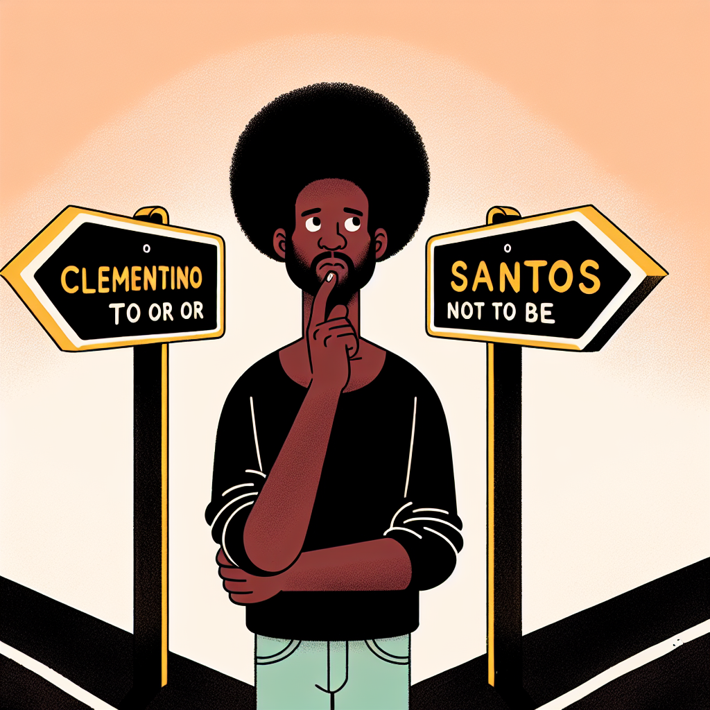

## Origens

Meu nome é Vagner, sou filho de uma mineira com um italiano, ou talvez
baiano... Para ser honesto eu sempre me confundo pois são tão poucas as sílabas
de diferença. Gentílicos à parte, caso você tenha lido um artigo, assistido a
uma palestra ou recebido um e-mail meu, deve ter percebido que eu assino com
**Vagner Clementino**. No entanto, meu nome de registro é Vagner Clementino,
dos Santos, "e por que não dos orixás também?"[^3]. E a partir dessa última
frase não dá para negar a minha origem baiana. E sejamos honestos, como um
afro-brasileiro, a determinação das minhas origens é tão frágil quanto
acreditar em meritocracia.

No início, o sobrenome "Clementino" não me agradava: achava estranho e um tanto
quanto incomum. Meu desconforto aumentou quando, em 1996, foi lançado um
clássico do cancioneiro brasileiro conhecido como "Florentina", escrito e
interpretado por Francisco Everardo Oliveira Silva, também conhecido como
Tiririca[^1].

`youtube:https://www.youtube.com/embed/uiem5_bJRLM`

Se você está se questionando qual é a relação entre a discografia do Tiririca e
o meu nome, bem-vindo ao clube, pois é algo que eu me questiono desde então.
Não sei se por sorte, destino ou delírio coletivo, as pessoas relacionam o
refrão da música "Florentina" com o meu sobrenome. Por favor, acreditem em mim,
inúmeras vezes, ao dizer o meu nome, eu era surpreendido com "🎵Clementino,
Clementino, Clementino de Jesus (...)", desde em encontros sociais ou mesmo em
recepções de hotel.

Por essas e muitas outras razões, passei a assinar como _Vagner Santos_ e me
tornei mais um na multidão de pessoas da família 'Santos' brasileira. Seja
Sílvio, Lulu ou Alberto, são vários os 'Santos' deste país, tantos que em
novembro temos um dia dedicado a todos eles.

E desde então carrego essa dúvida: deveria ser Santo(s), disputando uma
improvável devoção na multidão, ou Clementino, e viver ignorando as pessoas
cantando refrões de qualidade duvidosa? Como foi dito no primeiro parágrafo,
optei por _Clementino_, mas sigo com as bênçãos dos Santos e dos Orixás.

## Carreira

Eu concluí o Ensino Médio com louvor: professores e funcionários louvaram aos
anjos e santos por eu não precisar frequentar a escola no próximo ano. Naquela
época, a única certeza que eu tinha era a de estar perdido. Meu plano era
apenas conseguir um emprego e não ter uma profissão. Passar no vestibular e
fazer um curso superior eram símbolos sem significado para mim.

E naqueles longos meses após o término do Ensino Médio, o desejo era de mudar o
mundo através da arte. Quem saber ser um escritor ou mesmo participar de uma
banda de punk rock. Eram sonhos de uma formiga que, mesmo sabendo cantar, teve
que trabalhar diante da inevitável chegada do inverno da vida adulta. E assim,
fui destilar minha arte como operador de telemarketing, meu primeiro trabalho
registrado, que me proporcionou os recursos necessários para o próximo passo:
um curso superior.

As pessoas me diziam sobre uma facilidade natural em ensinar, especialmente
Matemática. Então, por lógica, fazia sentido que eu tentasse algum curso de
licenciatura na Ciência do Rigor. Para ser sincero, eu não tinha muita certeza
de qual carreira eu gostaria de seguir, mas o requisito era que o curso fosse
gratuito. Com livros emprestados e estudando por conta própria, consegui passar
na primeira etapa da Universidade Federal de Minas Gerais[^2]. Foi tão
impressionante quanto qualquer exceção que comprova uma regra.

O _talvez_ se transforma em _certeza_ para quem nunca teve oportunidades.
Apesar de não ter conseguido passar no vestibular estudando por conta própria,
entendia que aquilo estava muito mais próximo do que nunca. No próximo ano, eu
tinha conseguido entrar na graduação em Matemática. A partir daquele momento, o
plano era que em pouco tempo eu estaria recebendo o título de _professor_.

A vida é feita muito mais de _"poréns"_, _"todavias"_ e _"entretantos"_ do que
de linearidades. Com o passar dos dias, eu me via cada vez mais interessado em
Computação. Talvez por ter conseguido meu primeiro computador aos 20 e poucos
anos, ou ainda pela habilidade que eu tinha de formatá-lo rapidamente a cada
software com vírus que eu baixava, para evitar brigas com meu irmão mais velho,
que comprou o computador junto comigo. Motivos à parte, consegui alterar minha
graduação para Sistemas de Informação e, se tudo desse certo, em alguns anos
receberia o título de "desenvolvedor", "programador", "menino do computador" e
assim por diante.

## Títulos

Entre idas e vindas, o tão sonhado título chegou: Bacharel em Sistemas de
Informação, seguido pelo de Mestre em Ciência da Computação. No âmbito
profissional, embora não acadêmico, o tempo me conferiu os títulos de
desenvolvedor pleno, sênior, Tech Leader e Staff Engineering. Essas conquistas
foram fruto de muito esforço e dedicação, e me permitiram ascender a posições
de destaque e liderança em minha área de atuação. Porém, foram apenas títulos,
algo para ser colocado em um quadro na parede ou descrito em um currículo,
contudo, nunca algo que seja capaz de nos resumir.

## Sobre Nomes

Nomes e/ou sobrenomes dão às pessoas o sentimento de pertencimento ou origem, e
em alguns casos até mesmo de liberdade e recomeço, como no caso dos nomes
sociais. Mas, em essência, os nomes existem para nos diferenciar, nos conceder
um papel e nunca para nos resumir. Sejam os nomes que já tive (marido, amigo,
irmão, filho, tio, padrinho, colega, desenvolvedor ou professor) ou aqueles que
por ventura ainda terei (pai, avó ou doutor), serão apenas recortes de algo que
é muito maior que é a nossa própria existência.

Acredito que é importante lembrar que somos muito mais do que nossos nomes e
rótulos, somos seres em constante transformação e evolução, e não devemos nos
limitar ou nos definir apenas por essas identificações. É preciso olhar para
além dos rótulos e enxergar a complexidade e singularidade de cada indivíduo.

Em resumo, nomes e rótulos são importantes para nos identificar e nos
diferenciar, mas não devem nos limitar ou definir completamente.

[^1]:
    Tiririca.
    https://pt.wikipedia.org/wiki/Tiririca

[^2]:
    Vestibular da UFMG.
    Antes da adoção do Enem como forma de ingresso na UFMG, o vestibular era
    composto por duas etapas: a primeira etapa consistia em uma prova de
    múltipla escolha abrangendo várias disciplinas, e a segunda etapa era
    composta por provas discursivas específicas de acordo com o curso
    escolhido. Os candidatos precisavam ser aprovados nas duas etapas para
    conseguir uma vaga na universidade.
[^3]:
    até sua alma (part. Tasha e Tracie).
    https://www.letras.mus.br/djonga/ate-sua-alma/
