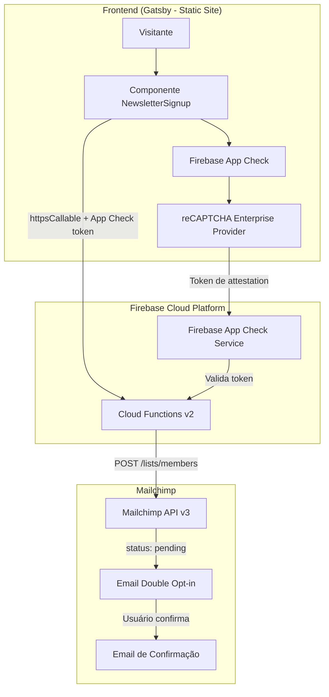
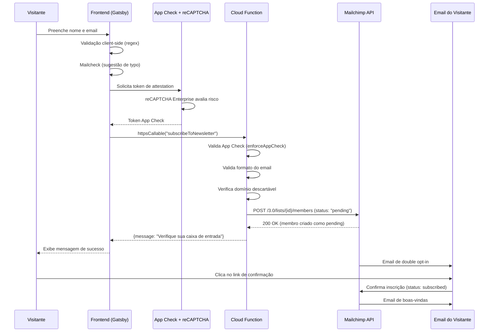
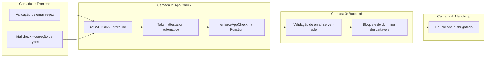
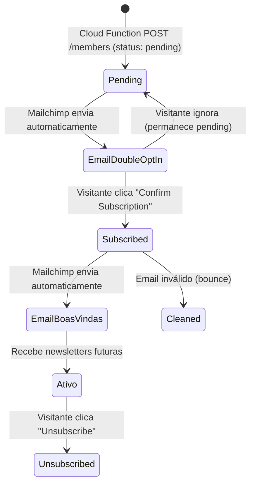

# 2. Newsletter serverless com Firebase Functions e reCAPTCHA Enterprise

Date: 2026-06-01

## Status

Accepted

## Context

O blog precisava de uma funcionalidade de newsletter para permitir que visitantes se inscrevam e recebam atualizações por email. Os requisitos eram:

- Formulário simples com nome e email
- Proteção contra bots e abuso automatizado
- Integração com serviço de email marketing para gerenciar assinantes
- Double opt-in para conformidade com boas práticas de email
- Custo zero ou mínimo para um blog pessoal
- Sem necessidade de manter servidor próprio

Alternativas consideradas:

1. **Backend próprio (Express/Node)**: Requer servidor 24/7, custo fixo, manutenção de infraestrutura
2. **Serviço terceiro (Buttondown, Substack)**: Dependência total de terceiro, menos controle, possível custo
3. **Firebase Functions + Mailchimp (escolhido)**: Serverless, pay-per-use (free tier generoso), controle total do fluxo

## Decision

Implementar a newsletter usando **Firebase Cloud Functions (v2)** como backend serverless, **reCAPTCHA Enterprise via Firebase App Check** para proteção contra abuso, e **Mailchimp API (plano gratuito)** para gerenciamento de assinantes e envio de emails.

### Arquitetura Geral



### Fluxo de Inscrição



### Camadas de Segurança



### Componentes

| Componente | Tecnologia | Responsabilidade |
|---|---|---|
| Frontend | Gatsby + React | Formulário, validação client-side, UX |
| Proteção anti-bot | Firebase App Check + reCAPTCHA Enterprise | Attestation invisível, bloqueia requisições não-humanas |
| Backend | Firebase Cloud Functions v2 (Node 20) | Validação server-side, integração com Mailchimp |
| Email Marketing | Mailchimp API v3 (plano gratuito) | Gerenciamento de lista, double opt-in, envio de emails |
| CI/CD | GitHub Actions | Lint, testes, deploy automático |

### Mailchimp API (Plano Gratuito)

O Mailchimp é utilizado no **plano gratuito** (até 500 contatos, 1.000 envios/mês) através da **API v3 REST**. A integração utiliza um único endpoint para adicionar membros à lista (audience):

```
POST https://{dc}.api.mailchimp.com/3.0/lists/{audience_id}/members
Authorization: apikey {MAILCHIMP_API_KEY}
```

O corpo da requisição enviado pela Cloud Function:

```json
{
  "email_address": "visitante@email.com",
  "status": "pending",
  "merge_fields": {
    "FNAME": "Nome",
    "LNAME": "Sobrenome"
  }
}
```

O campo `status: "pending"` é a chave para acionar o fluxo de double opt-in. Se fosse `"subscribed"`, o membro seria adicionado diretamente sem confirmação.

#### Fluxo de Emails Gerenciados pelo Mailchimp



#### Email de Double Opt-in (automático)

Enviado automaticamente pelo Mailchimp quando um membro é criado com `status: "pending"`. O email contém:
- Mensagem pedindo confirmação da inscrição
- Link único de confirmação (gerenciado pelo Mailchimp)
- Expiração automática se não confirmado

O template deste email é configurado no painel do Mailchimp em **Audience → Settings → Manage contacts → Opt-in confirmation email**.

#### Email de Boas-vindas/Confirmação (automático)

Após o visitante clicar no link de confirmação, o Mailchimp:
1. Altera o status do membro de `"pending"` para `"subscribed"`
2. Envia um email de boas-vindas (configurável em **Audience → Settings → Welcome email**)
3. O membro passa a receber campanhas futuras

#### Tratamento de Erros da API

| Resposta Mailchimp | Ação da Cloud Function |
|---|---|
| `200 OK` | Retorna mensagem de sucesso ao frontend |
| `400` com `title: "Member Exists"` | Retorna "Este e-mail já está inscrito!" |
| Outros erros `4xx/5xx` | Retorna "Erro interno no servidor." + log |

#### Configuração

A integração requer três variáveis de ambiente (armazenadas como secrets no Firebase):
- `MAILCHIMP_API_KEY`: Chave de API gerada em Account → Extras → API keys
- `MAILCHIMP_SERVER_PREFIX`: Datacenter (ex: `us5`), extraído da URL da API
- `MAILCHIMP_AUDIENCE_ID`: ID da lista, encontrado em Audience → Settings

Essa abordagem delega ao Mailchimp toda a responsabilidade de:
- Envio e gerenciamento do email de double opt-in
- Envio do email de confirmação/boas-vindas
- Gerenciamento de bounces e unsubscribes
- Conformidade com CAN-SPAM e GDPR
- Infraestrutura de envio de email (SPF, DKIM, reputação de IP)

### Estrutura de Arquivos

```
blog/
├── src/
│   ├── firebase.js              # Inicialização Firebase + App Check
│   └── components/
│       └── newsletterSignup.js  # Componente React do formulário
├── functions/
│   └── src/
│       ├── index.ts             # Cloud Function (subscribeToNewsletter)
│       ├── utils.ts             # Validações (isValidEmail, isDisposableEmail)
│       ├── utils.test.ts        # Testes unitários das validações
│       ├── index.test.ts        # Testes de integração do handler
│       └── types.d.ts           # Tipos TypeScript
├── .env.production              # Firebase config + reCAPTCHA site key
└── .env.development             # Firebase config (sem reCAPTCHA)
```

## Consequences

### Positivas

- **Custo zero**: Firebase Functions free tier (2M invocações/mês) + Mailchimp free tier (500 contatos)
- **Sem servidor**: Não há infraestrutura para manter; escala automaticamente
- **Segurança em camadas**: reCAPTCHA Enterprise + App Check + validação server-side + domínios descartáveis + double opt-in
- **Double opt-in via Mailchimp**: Conformidade com boas práticas sem implementar lógica de envio de email
- **Deploy independente**: Functions têm CI/CD separado, deploy apenas quando `functions/` muda
- **Testável**: Testes unitários e de integração com Jest, sem dependência de serviços externos

### Negativas

- **Vendor lock-in**: Dependência do ecossistema Firebase (App Check, Functions)
- **Cold start**: Functions serverless podem ter latência na primeira invocação (~1-2s)
- **Limite do Mailchimp gratuito**: Máximo 500 contatos; necessário upgrade se crescer
- **reCAPTCHA invisível**: Pode bloquear usuários legítimos em casos raros (falsos positivos)
